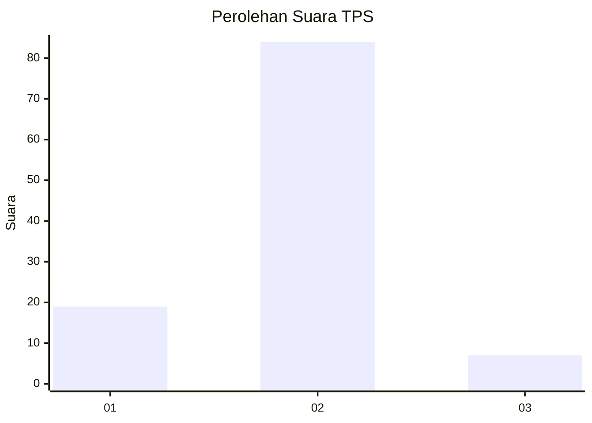
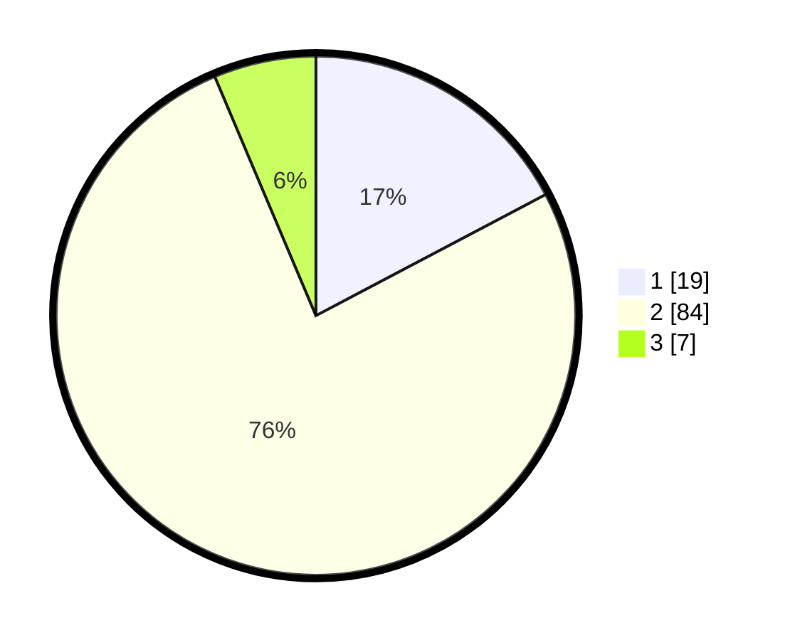

# Hasil

## Grafik

## Tabel

| No. | Nama Paslon    | Suara | Suara (raw) | Persentase |
|:--- |:-------------- | -----:| -----------:| ----------:|
| 1   | ANIES MUHAIMIN | 19    | [19][p-1]   | 17,27      |
| 2   | PRABOWO GIBRAN | 84    | [84][p-2]   | 76,36      |
| 3   | GANJAR MAHFUD  | 7     | [7][p-3]    | 6,36       |

[p-1]: https://github.com/gigit-pemilu/pemilu-2024-16-sumatera-selatan/blob/main/pilpres/hitung-suara/sub/16-sumatera-selatan/sub/06-musi-banyuasin/sub/06-babat-toman/sub/2042-pangkalan-jaya/sub/001-tps/sub/paslon-1.txt
[p-2]: https://github.com/gigit-pemilu/pemilu-2024-16-sumatera-selatan/blob/main/pilpres/hitung-suara/sub/16-sumatera-selatan/sub/06-musi-banyuasin/sub/06-babat-toman/sub/2042-pangkalan-jaya/sub/001-tps/sub/paslon-2.txt
[p-3]: https://github.com/gigit-pemilu/pemilu-2024-16-sumatera-selatan/blob/main/pilpres/hitung-suara/sub/16-sumatera-selatan/sub/06-musi-banyuasin/sub/06-babat-toman/sub/2042-pangkalan-jaya/sub/001-tps/sub/paslon-3.txt

## Foto C Plano

https://sirekap-obj-formc.kpu.go.id/45e8/pemilu/ppwp/16/06/06/20/42/1606062042001-20240220-162758--3b5a58d2-68fb-4f4f-84ee-1e517ce178a1.jpg

https://sirekap-obj-formc.kpu.go.id/45e8/pemilu/ppwp/16/06/06/20/42/1606062042001-20240220-162913--b804ff95-9120-4003-aeb4-58ebd8ee222a.jpg

https://sirekap-obj-formc.kpu.go.id/45e8/pemilu/ppwp/16/06/06/20/42/1606062042001-20240220-163345--426f4560-f160-42c3-b8ea-b4d741d1f3f1.jpg

## Metadata

| Key        | Value               |
| ---------- | ------------------- |
| Time Stamp | 2024-02-20 17:00:00 |

## DATA PEMILIH TETAP

Jumlah pemilih dalam DPT: **713**.
 * L: **626**.
 * P: **312**.

## DATA PENGGUNA HAK PILIH

Jumlah pengguna hak pilih dalam DPT: **220**.
 * L: **103**.
 * P: **117**.

Jumlah pengguna hak pilih dalam DPTb: **2**.
 * L: **2**.
 * P: **0**.

Jumlah pengguna hak pilih dalam DPK: **0**.
 * L: **0**.
 * P: **0**.

Jumlah pengguna hak pilih: **222**.
 * L: **105**.
 * P: **117**.

## JUMLAH SUARA SAH DAN TIDAK SAH

JUMLAH SELURUH SUARA SAH: **200**.

JUMLAH SUARA TIDAK SAH: **252**.

JUMLAH SELURUH SUARA SAH DAN SUARA TIDAK SAH: **0**.

