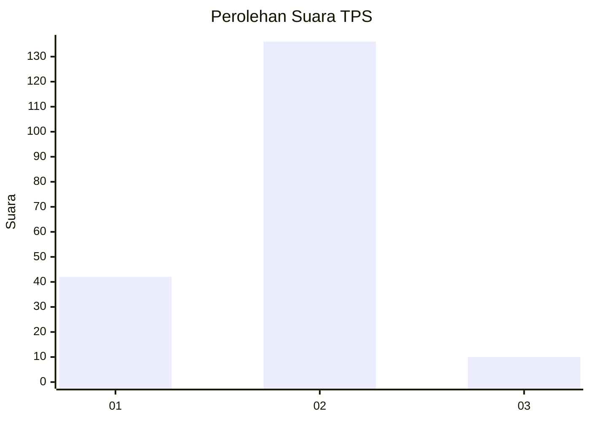
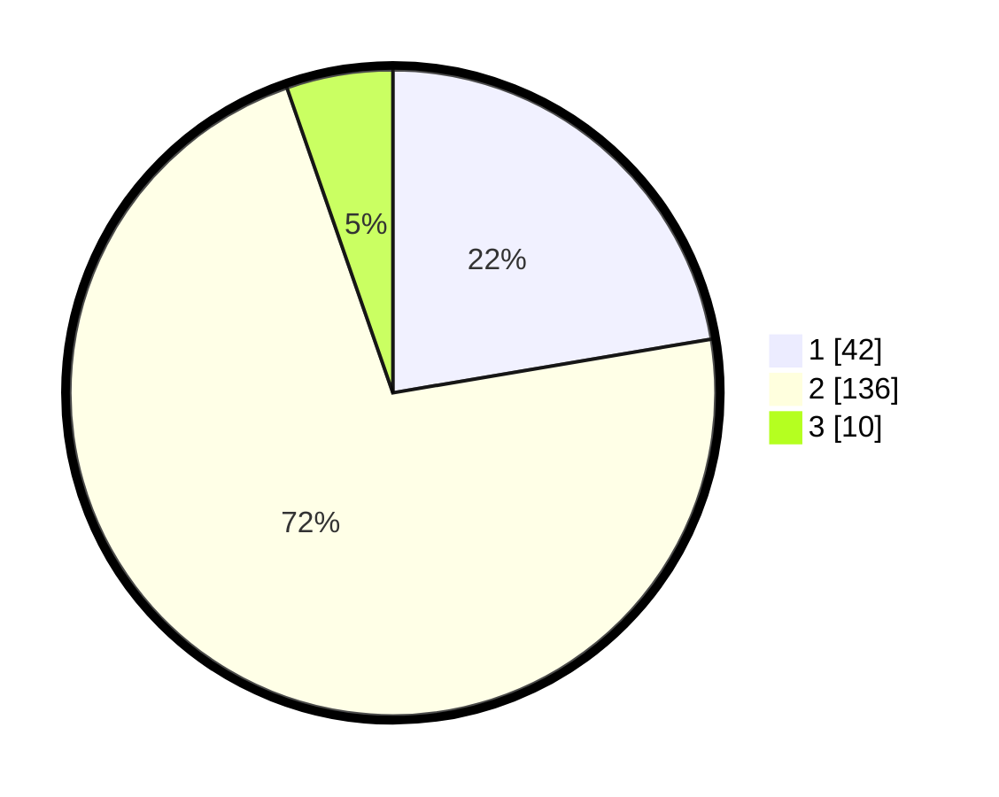

# Hasil

## Grafik

## Tabel

| No. | Nama Paslon    | Suara | Suara (raw) | Persentase |
|:--- |:-------------- | -----:| -----------:| ----------:|
| 1   | ANIES MUHAIMIN | 42    | [42][p-1]   | 22,34      |
| 2   | PRABOWO GIBRAN | 136   | [136][p-2]  | 72,34      |
| 3   | GANJAR MAHFUD  | 10    | [10][p-3]   | 5,32       |

[p-1]: https://github.com/gigit-pemilu/pemilu-2024-16-sumatera-selatan/blob/main/pilpres/hitung-suara/sub/16-sumatera-selatan/sub/06-musi-banyuasin/sub/07-sungai-lilin/sub/1020-sungai-lilin/sub/001-tps/sub/paslon-1.txt
[p-2]: https://github.com/gigit-pemilu/pemilu-2024-16-sumatera-selatan/blob/main/pilpres/hitung-suara/sub/16-sumatera-selatan/sub/06-musi-banyuasin/sub/07-sungai-lilin/sub/1020-sungai-lilin/sub/001-tps/sub/paslon-2.txt
[p-3]: https://github.com/gigit-pemilu/pemilu-2024-16-sumatera-selatan/blob/main/pilpres/hitung-suara/sub/16-sumatera-selatan/sub/06-musi-banyuasin/sub/07-sungai-lilin/sub/1020-sungai-lilin/sub/001-tps/sub/paslon-3.txt

## Foto C Plano

https://sirekap-obj-formc.kpu.go.id/cb6e/pemilu/ppwp/16/06/07/10/20/1606071020001-20240220-114157--e3c125e5-1af7-4f55-a079-22ace7db81ff.jpg

https://sirekap-obj-formc.kpu.go.id/cb6e/pemilu/ppwp/16/06/07/10/20/1606071020001-20240220-114235--438f6a11-acad-4fdf-8e84-d4388865d806.jpg

https://sirekap-obj-formc.kpu.go.id/cb6e/pemilu/ppwp/16/06/07/10/20/1606071020001-20240220-114307--edd4df66-b00e-4c47-89d3-2a7a5bfde1eb.jpg

## Metadata

| Key        | Value               |
| ---------- | ------------------- |
| Time Stamp | 2024-02-25 11:00:00 |

