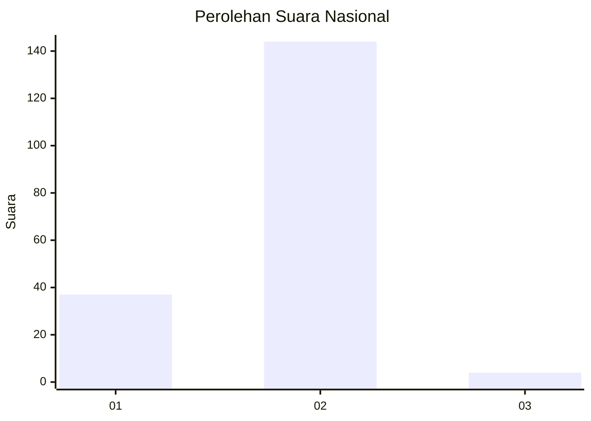
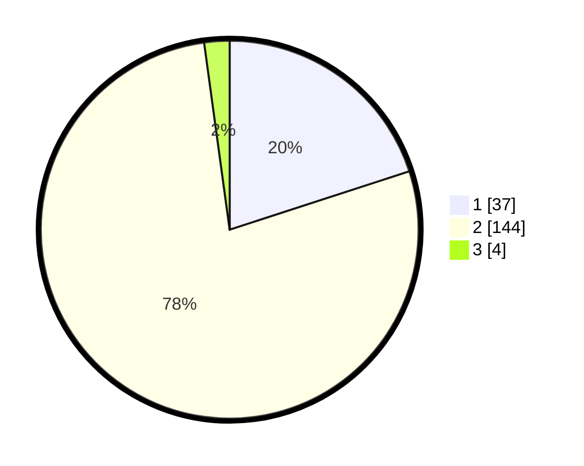

# Hasil

## Grafik

## Tabel

| No. | Nama Paslon    | Suara | Suara (raw) | Persentase |
|:--- |:-------------- | -----:| -----------:| ----------:|
| 1   | ANIES MUHAIMIN | 37    | [37][p-1]   | 20,00      |
| 2   | PRABOWO GIBRAN | 144   | [144][p-2]  | 77,84      |
| 3   | GANJAR MAHFUD  | 4     | [4][p-3]    | 2,16       |

[p-1]: https://github.com/gigit-pemilu/pemilu-2024/blob/main/pilpres/hitung-suara/sub/16-sumatera-selatan/sub/06-musi-banyuasin/sub/07-sungai-lilin/sub/1020-sungai-lilin/sub/003-tps/sub/paslon-1.txt
[p-2]: https://github.com/gigit-pemilu/pemilu-2024/blob/main/pilpres/hitung-suara/sub/16-sumatera-selatan/sub/06-musi-banyuasin/sub/07-sungai-lilin/sub/1020-sungai-lilin/sub/003-tps/sub/paslon-2.txt
[p-3]: https://github.com/gigit-pemilu/pemilu-2024/blob/main/pilpres/hitung-suara/sub/16-sumatera-selatan/sub/06-musi-banyuasin/sub/07-sungai-lilin/sub/1020-sungai-lilin/sub/003-tps/sub/paslon-3.txt

## Foto C Plano

https://sirekap-obj-formc.kpu.go.id/6c0d/pemilu/ppwp/16/06/07/10/20/1606071020003-20240215-014238--ce3ba2da-d545-48bd-9630-8f159e450080.jpg

https://sirekap-obj-formc.kpu.go.id/6c0d/pemilu/ppwp/16/06/07/10/20/1606071020003-20240215-084236--0967863b-12dc-4cea-8b5f-b9f15ecae5a4.jpg

https://sirekap-obj-formc.kpu.go.id/6c0d/pemilu/ppwp/16/06/07/10/20/1606071020003-20240215-015010--bba76f06-370d-44a2-9e5d-8d72a6e5faca.jpg

## Metadata

| Key        | Value               |
| ---------- | ------------------- |
| Time Stamp | 2024-02-17 09:00:02 |

