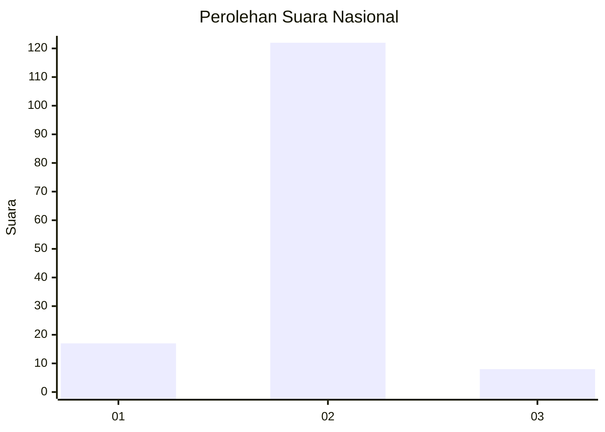
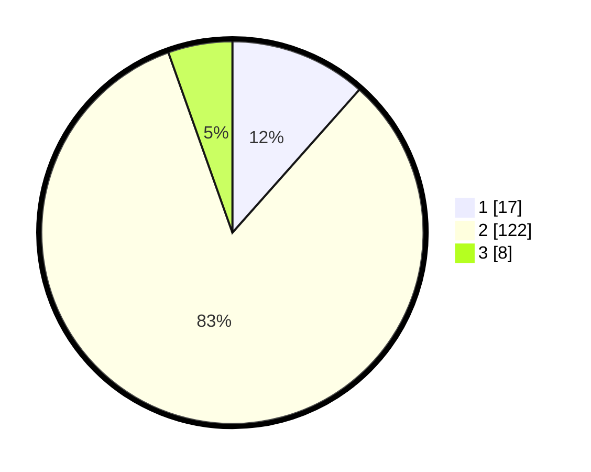

# Hasil

## Grafik

## Tabel

| No. | Nama Paslon    | Suara | Suara (raw) | Persentase |
|:--- |:-------------- | -----:| -----------:| ----------:|
| 1   | ANIES MUHAIMIN | 17    | [17][p-1]   | 11,56      |
| 2   | PRABOWO GIBRAN | 122   | [122][p-2]  | 82,99      |
| 3   | GANJAR MAHFUD  | 8     | [8][p-3]    | 5,44       |

[p-1]: https://github.com/gigit-pemilu/pemilu-2024/blob/main/pilpres/hitung-suara/sub/16-sumatera-selatan/sub/06-musi-banyuasin/sub/07-sungai-lilin/sub/1020-sungai-lilin/sub/026-tps/sub/paslon-1.txt
[p-2]: https://github.com/gigit-pemilu/pemilu-2024/blob/main/pilpres/hitung-suara/sub/16-sumatera-selatan/sub/06-musi-banyuasin/sub/07-sungai-lilin/sub/1020-sungai-lilin/sub/026-tps/sub/paslon-2.txt
[p-3]: https://github.com/gigit-pemilu/pemilu-2024/blob/main/pilpres/hitung-suara/sub/16-sumatera-selatan/sub/06-musi-banyuasin/sub/07-sungai-lilin/sub/1020-sungai-lilin/sub/026-tps/sub/paslon-3.txt

## Foto C Plano

https://sirekap-obj-formc.kpu.go.id/8703/pemilu/ppwp/16/06/07/10/20/1606071020026-20240215-033425--1998f893-074e-4cce-8c78-d07aecc3accd.jpg

https://sirekap-obj-formc.kpu.go.id/8703/pemilu/ppwp/16/06/07/10/20/1606071020026-20240215-032127--2952e7d8-a2f3-4dbe-a270-b91c599ab35a.jpg

https://sirekap-obj-formc.kpu.go.id/8703/pemilu/ppwp/16/06/07/10/20/1606071020026-20240215-010040--9f7680b5-2844-4387-919e-f82081b0fd07.jpg

## Metadata

| Key        | Value               |
| ---------- | ------------------- |
| Time Stamp | 2024-02-17 10:00:02 |

