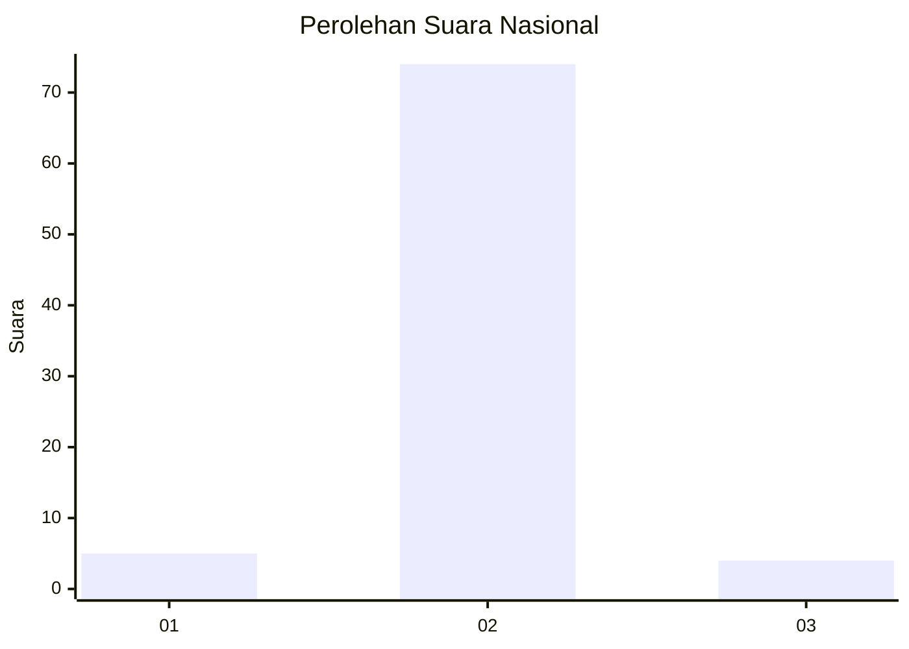
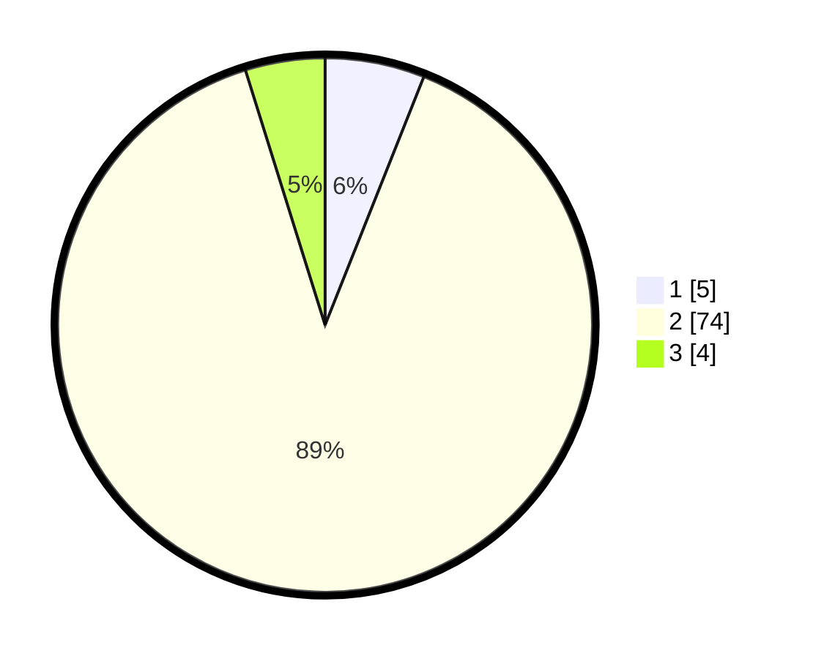

# Hasil

## Grafik

## Tabel

| No. | Nama Paslon    | Suara | Suara (raw) | Persentase |
|:--- |:-------------- | -----:| -----------:| ----------:|
| 1   | ANIES MUHAIMIN | 5     | [5][p-1]    | 6,02       |
| 2   | PRABOWO GIBRAN | 74    | [74][p-2]   | 89,16      |
| 3   | GANJAR MAHFUD  | 4     | [4][p-3]    | 4,82       |

[p-1]: https://github.com/gigit-pemilu/pemilu-2024/blob/main/pilpres/hitung-suara/sub/16-sumatera-selatan/sub/06-musi-banyuasin/sub/07-sungai-lilin/sub/1030-sungai-lilin-jaya/sub/013-tps/sub/paslon-1.txt
[p-2]: https://github.com/gigit-pemilu/pemilu-2024/blob/main/pilpres/hitung-suara/sub/16-sumatera-selatan/sub/06-musi-banyuasin/sub/07-sungai-lilin/sub/1030-sungai-lilin-jaya/sub/013-tps/sub/paslon-2.txt
[p-3]: https://github.com/gigit-pemilu/pemilu-2024/blob/main/pilpres/hitung-suara/sub/16-sumatera-selatan/sub/06-musi-banyuasin/sub/07-sungai-lilin/sub/1030-sungai-lilin-jaya/sub/013-tps/sub/paslon-3.txt

## Foto C Plano

https://sirekap-obj-formc.kpu.go.id/ce02/pemilu/ppwp/16/06/07/10/30/1606071030013-20240218-161510--bd85d6d3-3ca8-48fb-af64-3288168c733f.jpg

https://sirekap-obj-formc.kpu.go.id/ce02/pemilu/ppwp/16/06/07/10/30/1606071030013-20240218-161618--166050fd-019d-4f8b-b00b-d3549b6ce682.jpg

https://sirekap-obj-formc.kpu.go.id/ce02/pemilu/ppwp/16/06/07/10/30/1606071030013-20240218-161740--9041af96-8f6b-487d-8fbc-697b0c157b85.jpg

## Metadata

| Key        | Value               |
| ---------- | ------------------- |
| Time Stamp | 2024-02-26 11:00:00 |

