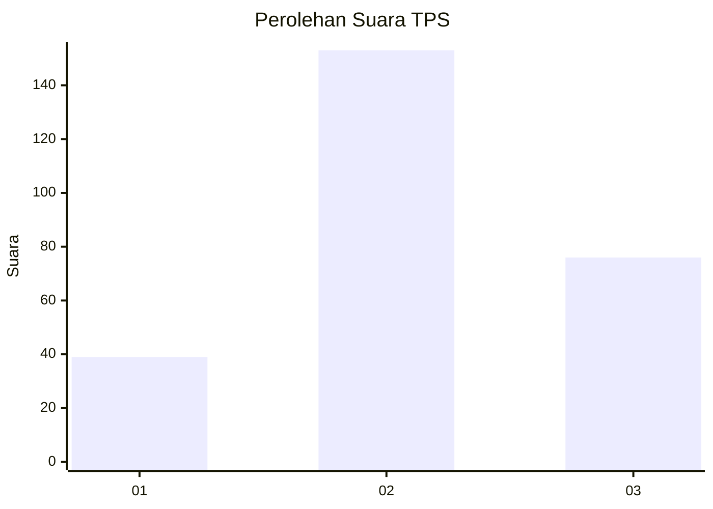
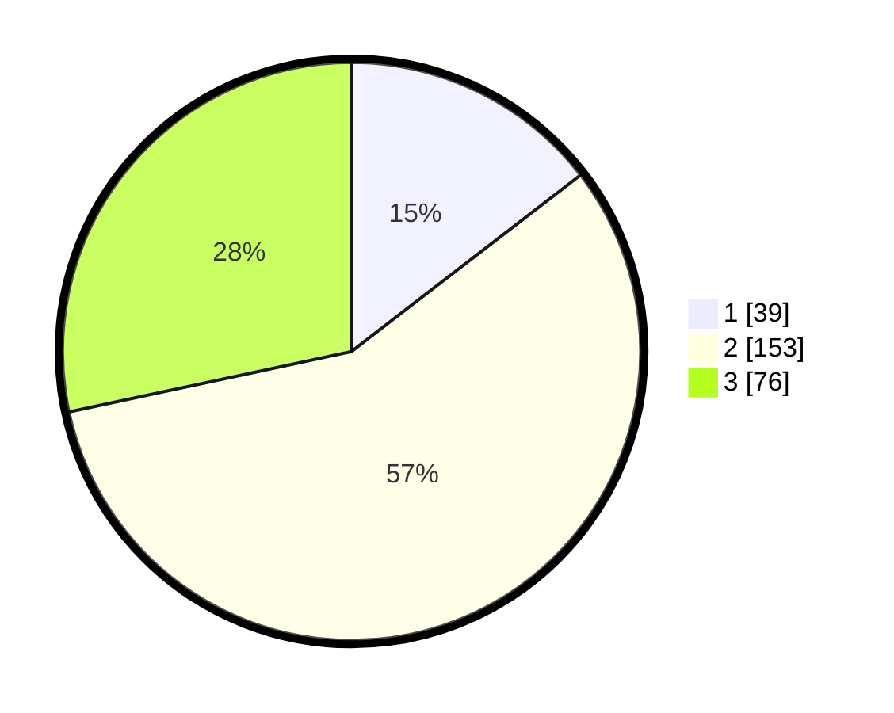

# Hasil

## Grafik

## Tabel

| No. | Nama Paslon    | Suara | Suara (raw) | Persentase |
|:--- |:-------------- | -----:| -----------:| ----------:|
| 1   | ANIES MUHAIMIN | 39    | [39][p-1]   | 14,55      |
| 2   | PRABOWO GIBRAN | 153   | [153][p-2]  | 57,09      |
| 3   | GANJAR MAHFUD  | 76    | [76][p-3]   | 28,36      |

[p-1]: https://github.com/gigit-pemilu/pemilu-2024-16-sumatera-selatan/blob/main/pilpres/hitung-suara/sub/16-sumatera-selatan/sub/06-musi-banyuasin/sub/07-sungai-lilin/sub/2008-sumber-rejeki/sub/006-tps/sub/paslon-1.txt
[p-2]: https://github.com/gigit-pemilu/pemilu-2024-16-sumatera-selatan/blob/main/pilpres/hitung-suara/sub/16-sumatera-selatan/sub/06-musi-banyuasin/sub/07-sungai-lilin/sub/2008-sumber-rejeki/sub/006-tps/sub/paslon-2.txt
[p-3]: https://github.com/gigit-pemilu/pemilu-2024-16-sumatera-selatan/blob/main/pilpres/hitung-suara/sub/16-sumatera-selatan/sub/06-musi-banyuasin/sub/07-sungai-lilin/sub/2008-sumber-rejeki/sub/006-tps/sub/paslon-3.txt

## Foto C Plano

https://sirekap-obj-formc.kpu.go.id/467c/pemilu/ppwp/16/06/07/20/08/1606072008006-20240218-171727--a59e1983-6f13-4b15-a3e7-78b078f655df.jpg

https://sirekap-obj-formc.kpu.go.id/467c/pemilu/ppwp/16/06/07/20/08/1606072008006-20240218-171825--e381faab-4468-4a4d-8915-20855d68ac3d.jpg

https://sirekap-obj-formc.kpu.go.id/467c/pemilu/ppwp/16/06/07/20/08/1606072008006-20240218-172055--50a9ea3e-f24e-44b1-a46f-3e484e6c8240.jpg

## Metadata

| Key        | Value               |
| ---------- | ------------------- |
| Time Stamp | 2024-02-24 22:31:28 |

