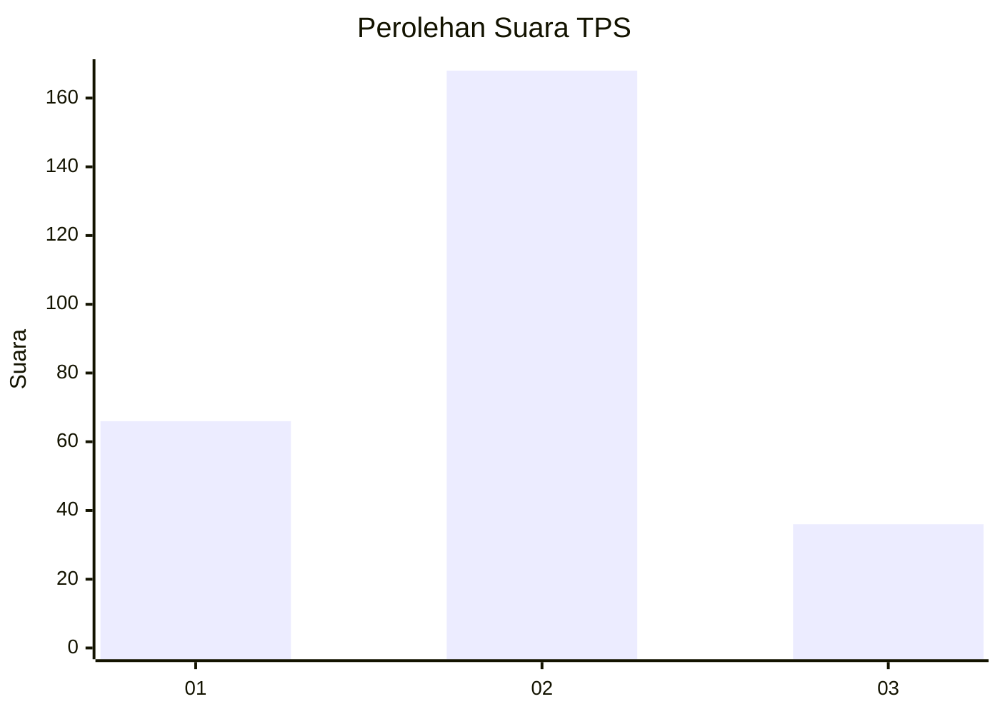
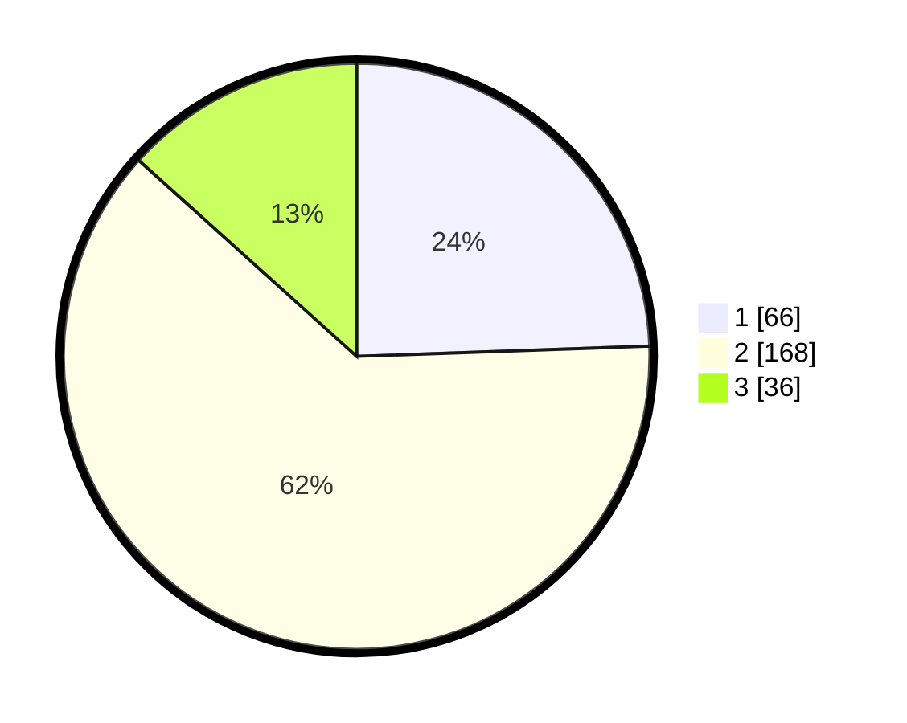

# Hasil

## Grafik

## Tabel

| No. | Nama Paslon    | Suara | Suara (raw) | Persentase |
|:--- |:-------------- | -----:| -----------:| ----------:|
| 1   | ANIES MUHAIMIN | 66    | [66][p-1]   | 24,44      |
| 2   | PRABOWO GIBRAN | 168   | [168][p-2]  | 62,22      |
| 3   | GANJAR MAHFUD  | 36    | [36][p-3]   | 13,33      |

[p-1]: https://github.com/gigit-pemilu/pemilu-2024-16-sumatera-selatan/blob/main/pilpres/hitung-suara/sub/16-sumatera-selatan/sub/06-musi-banyuasin/sub/07-sungai-lilin/sub/2009-linggo-sari/sub/001-tps/sub/paslon-1.txt
[p-2]: https://github.com/gigit-pemilu/pemilu-2024-16-sumatera-selatan/blob/main/pilpres/hitung-suara/sub/16-sumatera-selatan/sub/06-musi-banyuasin/sub/07-sungai-lilin/sub/2009-linggo-sari/sub/001-tps/sub/paslon-2.txt
[p-3]: https://github.com/gigit-pemilu/pemilu-2024-16-sumatera-selatan/blob/main/pilpres/hitung-suara/sub/16-sumatera-selatan/sub/06-musi-banyuasin/sub/07-sungai-lilin/sub/2009-linggo-sari/sub/001-tps/sub/paslon-3.txt

## Foto C Plano

https://sirekap-obj-formc.kpu.go.id/3b1c/pemilu/ppwp/16/06/07/20/09/1606072009001-20240218-162700--fed4052c-3dd6-497c-ac0c-66a0f2d80a32.jpg

https://sirekap-obj-formc.kpu.go.id/3b1c/pemilu/ppwp/16/06/07/20/09/1606072009001-20240218-162755--47d9686a-d838-494d-9680-e8019e1af1a9.jpg

https://sirekap-obj-formc.kpu.go.id/3b1c/pemilu/ppwp/16/06/07/20/09/1606072009001-20240218-162840--7dba86db-9777-4911-a9c1-7d2a6b1ef12d.jpg

## Metadata

| Key        | Value               |
| ---------- | ------------------- |
| Time Stamp | 2024-02-25 17:00:00 |

