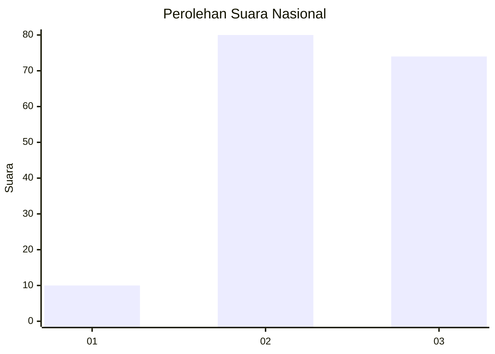
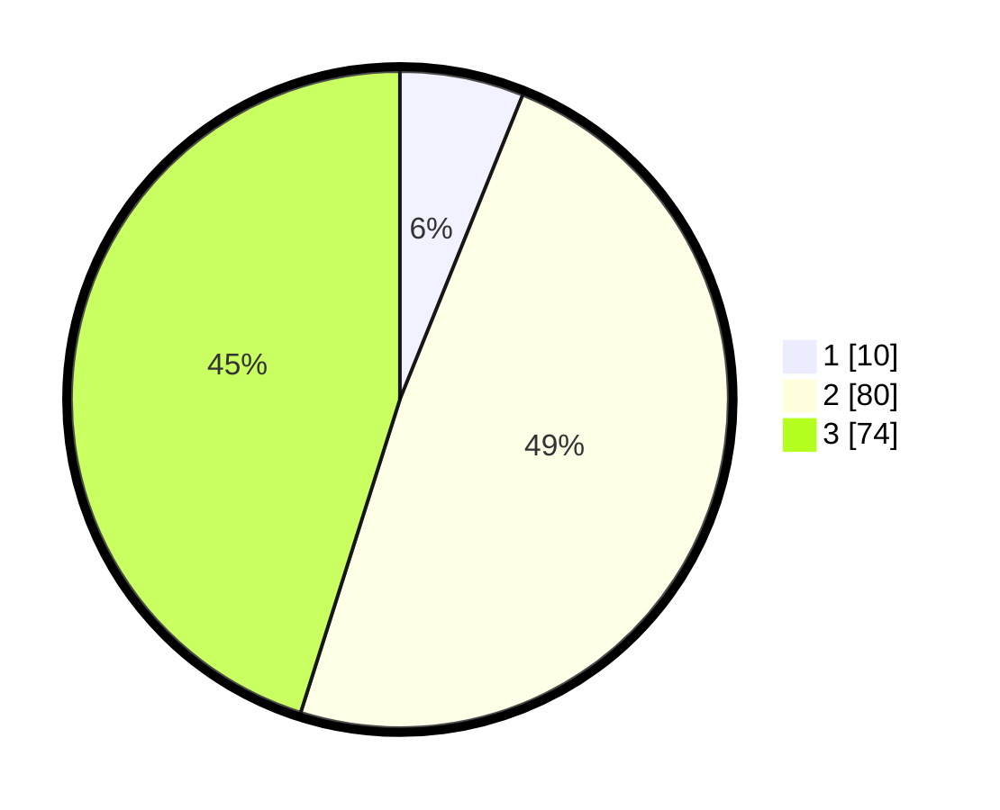

# Hasil

## Grafik

## Tabel

| No. | Nama Paslon    | Suara | Suara (raw) | Persentase |
|:--- |:-------------- | -----:| -----------:| ----------:|
| 1   | ANIES MUHAIMIN | 10    | [10][p-1]   | 6,10       |
| 2   | PRABOWO GIBRAN | 80    | [80][p-2]   | 48,78      |
| 3   | GANJAR MAHFUD  | 74    | [74][p-3]   | 45,12      |

[p-1]: https://github.com/gigit-pemilu/pemilu-2024/blob/main/pilpres/hitung-suara/sub/16-sumatera-selatan/sub/06-musi-banyuasin/sub/07-sungai-lilin/sub/2010-mulyo-rejo/sub/002-tps/sub/paslon-1.txt
[p-2]: https://github.com/gigit-pemilu/pemilu-2024/blob/main/pilpres/hitung-suara/sub/16-sumatera-selatan/sub/06-musi-banyuasin/sub/07-sungai-lilin/sub/2010-mulyo-rejo/sub/002-tps/sub/paslon-2.txt
[p-3]: https://github.com/gigit-pemilu/pemilu-2024/blob/main/pilpres/hitung-suara/sub/16-sumatera-selatan/sub/06-musi-banyuasin/sub/07-sungai-lilin/sub/2010-mulyo-rejo/sub/002-tps/sub/paslon-3.txt

## Foto C Plano

https://sirekap-obj-formc.kpu.go.id/9d43/pemilu/ppwp/16/06/07/20/10/1606072010002-20240218-154349--eec61df5-1c1b-4963-91fe-9c4be97aa38f.jpg

https://sirekap-obj-formc.kpu.go.id/9d43/pemilu/ppwp/16/06/07/20/10/1606072010002-20240218-154428--51585efb-5ba2-4ec6-9e6b-e0508b662c0a.jpg

https://sirekap-obj-formc.kpu.go.id/9d43/pemilu/ppwp/16/06/07/20/10/1606072010002-20240218-154500--c286c47c-1863-49b0-b74a-14a11ee25a76.jpg

## Metadata

| Key        | Value               |
| ---------- | ------------------- |
| Time Stamp | 2024-02-25 22:00:00 |

