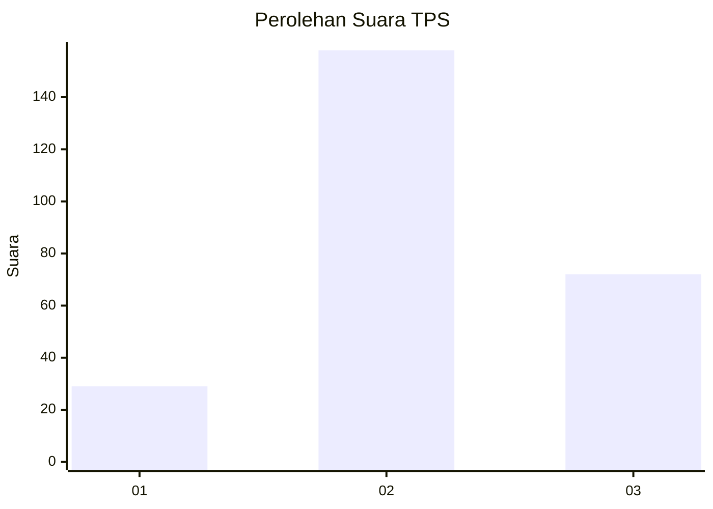
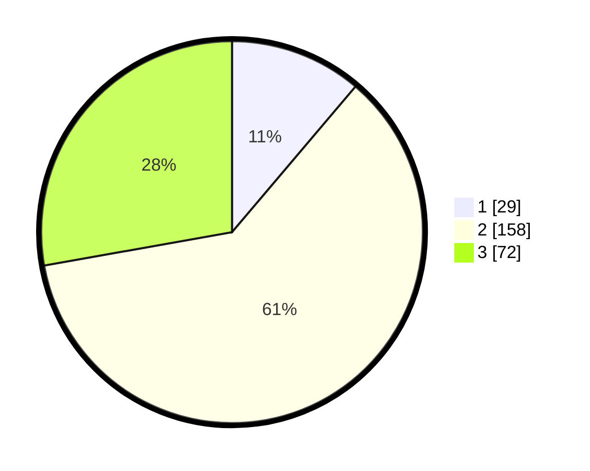

# Hasil

## Grafik

## Tabel

| No. | Nama Paslon    | Suara | Suara (raw) | Persentase |
|:--- |:-------------- | -----:| -----------:| ----------:|
| 1   | ANIES MUHAIMIN | 29    | [29][p-1]   | 11,20      |
| 2   | PRABOWO GIBRAN | 158   | [158][p-2]  | 61,00      |
| 3   | GANJAR MAHFUD  | 72    | [72][p-3]   | 27,80      |

[p-1]: https://github.com/gigit-pemilu/pemilu-2024-16-sumatera-selatan/blob/main/pilpres/hitung-suara/sub/16-sumatera-selatan/sub/06-musi-banyuasin/sub/07-sungai-lilin/sub/2010-mulyo-rejo/sub/004-tps/sub/paslon-1.txt
[p-2]: https://github.com/gigit-pemilu/pemilu-2024-16-sumatera-selatan/blob/main/pilpres/hitung-suara/sub/16-sumatera-selatan/sub/06-musi-banyuasin/sub/07-sungai-lilin/sub/2010-mulyo-rejo/sub/004-tps/sub/paslon-2.txt
[p-3]: https://github.com/gigit-pemilu/pemilu-2024-16-sumatera-selatan/blob/main/pilpres/hitung-suara/sub/16-sumatera-selatan/sub/06-musi-banyuasin/sub/07-sungai-lilin/sub/2010-mulyo-rejo/sub/004-tps/sub/paslon-3.txt

## Foto C Plano

https://sirekap-obj-formc.kpu.go.id/b111/pemilu/ppwp/16/06/07/20/10/1606072010004-20240218-155316--7d242f84-bfa9-4d95-b419-a7ff540ed2c1.jpg

https://sirekap-obj-formc.kpu.go.id/b111/pemilu/ppwp/16/06/07/20/10/1606072010004-20240218-155344--3d648ebe-1144-4e89-9f62-394811fbc1a6.jpg

https://sirekap-obj-formc.kpu.go.id/b111/pemilu/ppwp/16/06/07/20/10/1606072010004-20240218-155412--61b624ec-5978-4058-820e-e5f5792b0daf.jpg

## Metadata

| Key        | Value               |
| ---------- | ------------------- |
| Time Stamp | 2024-02-25 19:00:00 |

