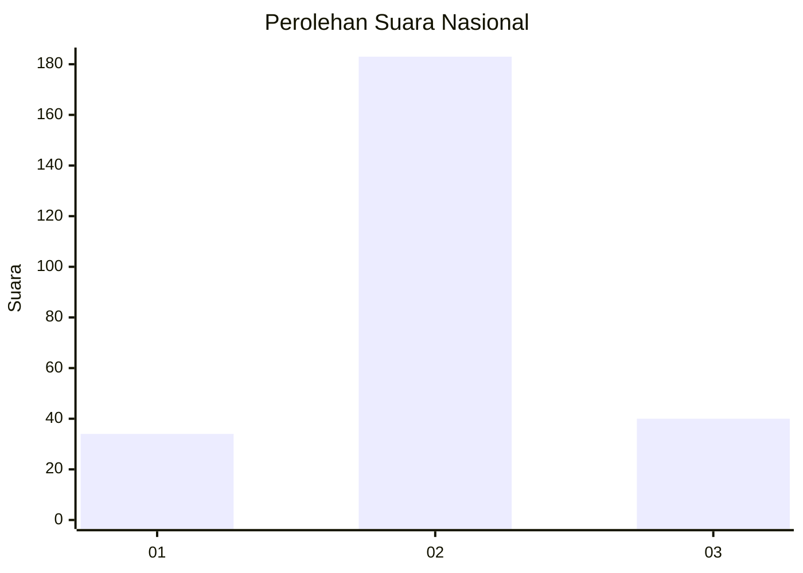

# Hasil

## Grafik

## Tabel

| No. | Nama Paslon    | Suara | Suara (raw) | Persentase |
|:--- |:-------------- | -----:| -----------:| ----------:|
| 1   | ANIES MUHAIMIN | 34    | [34][p-1]   | 13,23      |
| 2   | PRABOWO GIBRAN | 183   | [183][p-2]  | 71,21      |
| 3   | GANJAR MAHFUD  | 40    | [40][p-3]   | 15,56      |

[p-1]: https://github.com/gigit-pemilu/pemilu-2024/blob/main/pilpres/hitung-suara/sub/16-sumatera-selatan/sub/06-musi-banyuasin/sub/07-sungai-lilin/sub/2010-mulyo-rejo/sub/005-tps/sub/paslon-1.txt
[p-2]: https://github.com/gigit-pemilu/pemilu-2024/blob/main/pilpres/hitung-suara/sub/16-sumatera-selatan/sub/06-musi-banyuasin/sub/07-sungai-lilin/sub/2010-mulyo-rejo/sub/005-tps/sub/paslon-2.txt
[p-3]: https://github.com/gigit-pemilu/pemilu-2024/blob/main/pilpres/hitung-suara/sub/16-sumatera-selatan/sub/06-musi-banyuasin/sub/07-sungai-lilin/sub/2010-mulyo-rejo/sub/005-tps/sub/paslon-3.txt

## Foto C Plano

https://sirekap-obj-formc.kpu.go.id/0278/pemilu/ppwp/16/06/07/20/10/1606072010005-20240218-155657--db1ed9a8-8065-41c6-bc73-fb02810bb092.jpg

https://sirekap-obj-formc.kpu.go.id/0278/pemilu/ppwp/16/06/07/20/10/1606072010005-20240218-155722--58fd33b2-8da6-4212-9582-41f6c8a600d7.jpg

https://sirekap-obj-formc.kpu.go.id/0278/pemilu/ppwp/16/06/07/20/10/1606072010005-20240218-155803--37785483-0d72-4936-99b5-08d4cb959c3a.jpg

## Metadata

| Key        | Value               |
| ---------- | ------------------- |
| Time Stamp | 2024-02-25 12:00:00 |

