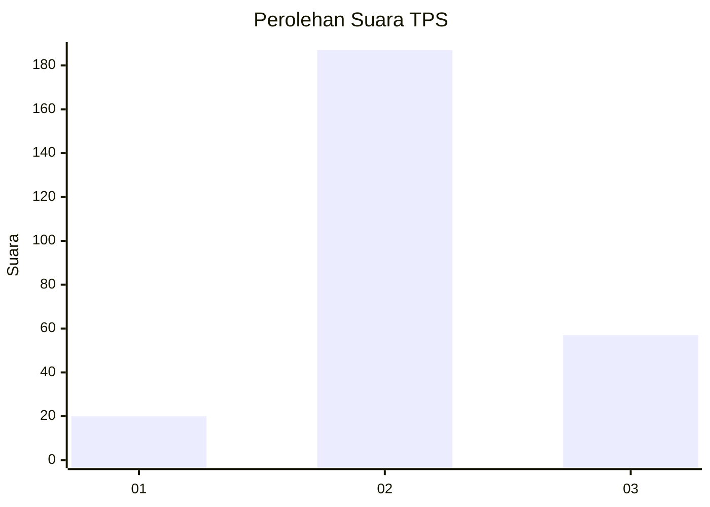
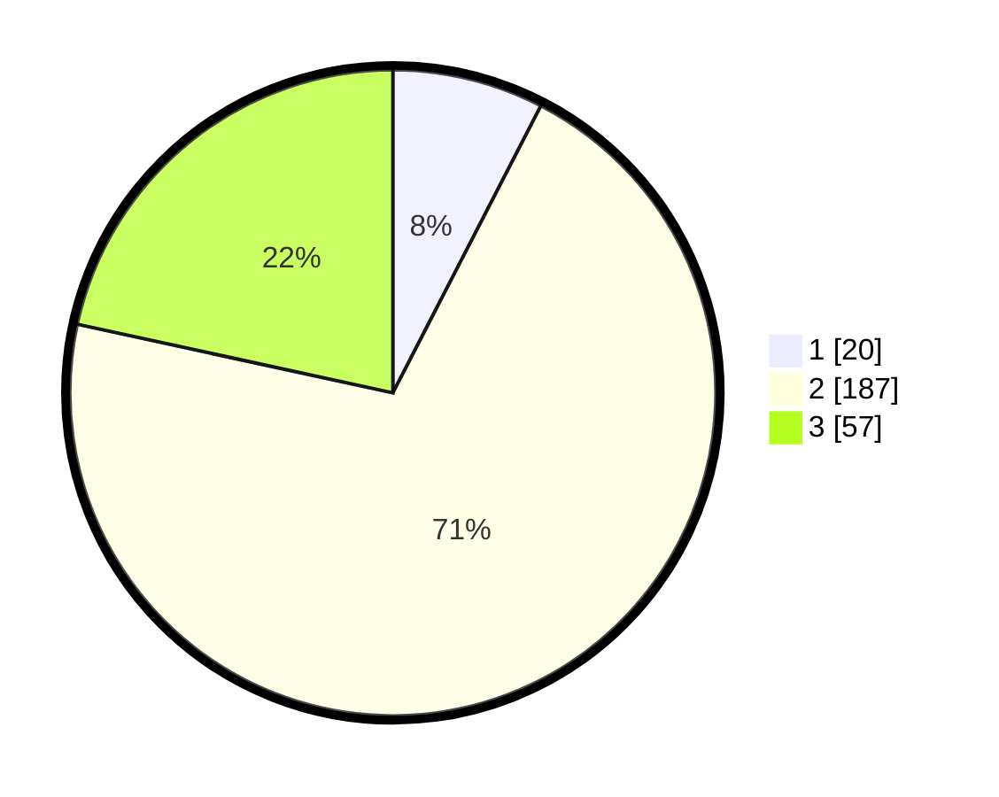

# Hasil

## Grafik

## Tabel

| No. | Nama Paslon    | Suara | Suara (raw) | Persentase |
|:--- |:-------------- | -----:| -----------:| ----------:|
| 1   | ANIES MUHAIMIN | 20    | [20][p-1]   | 7,58       |
| 2   | PRABOWO GIBRAN | 187   | [187][p-2]  | 70,83      |
| 3   | GANJAR MAHFUD  | 57    | [57][p-3]   | 21,59      |

[p-1]: https://github.com/gigit-pemilu/pemilu-2024-16-sumatera-selatan/blob/main/pilpres/hitung-suara/sub/16-sumatera-selatan/sub/06-musi-banyuasin/sub/07-sungai-lilin/sub/2010-mulyo-rejo/sub/007-tps/sub/paslon-1.txt
[p-2]: https://github.com/gigit-pemilu/pemilu-2024-16-sumatera-selatan/blob/main/pilpres/hitung-suara/sub/16-sumatera-selatan/sub/06-musi-banyuasin/sub/07-sungai-lilin/sub/2010-mulyo-rejo/sub/007-tps/sub/paslon-2.txt
[p-3]: https://github.com/gigit-pemilu/pemilu-2024-16-sumatera-selatan/blob/main/pilpres/hitung-suara/sub/16-sumatera-selatan/sub/06-musi-banyuasin/sub/07-sungai-lilin/sub/2010-mulyo-rejo/sub/007-tps/sub/paslon-3.txt

## Foto C Plano

https://sirekap-obj-formc.kpu.go.id/8155/pemilu/ppwp/16/06/07/20/10/1606072010007-20240218-160610--57360a78-7cb7-42d9-8681-491a91912c5f.jpg

https://sirekap-obj-formc.kpu.go.id/8155/pemilu/ppwp/16/06/07/20/10/1606072010007-20240218-160647--2ea33daa-e68f-4a6b-9c7f-314087200b6e.jpg

https://sirekap-obj-formc.kpu.go.id/8155/pemilu/ppwp/16/06/07/20/10/1606072010007-20240218-160723--b85c23c1-de28-414c-9b13-6f75ec16f5e9.jpg

## Metadata

| Key        | Value               |
| ---------- | ------------------- |
| Time Stamp | 2024-02-25 01:00:00 |

