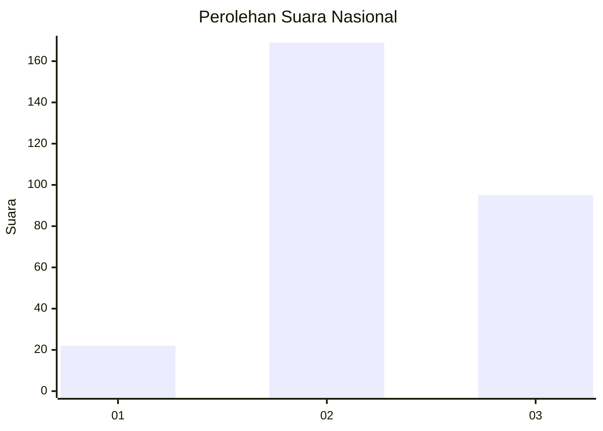
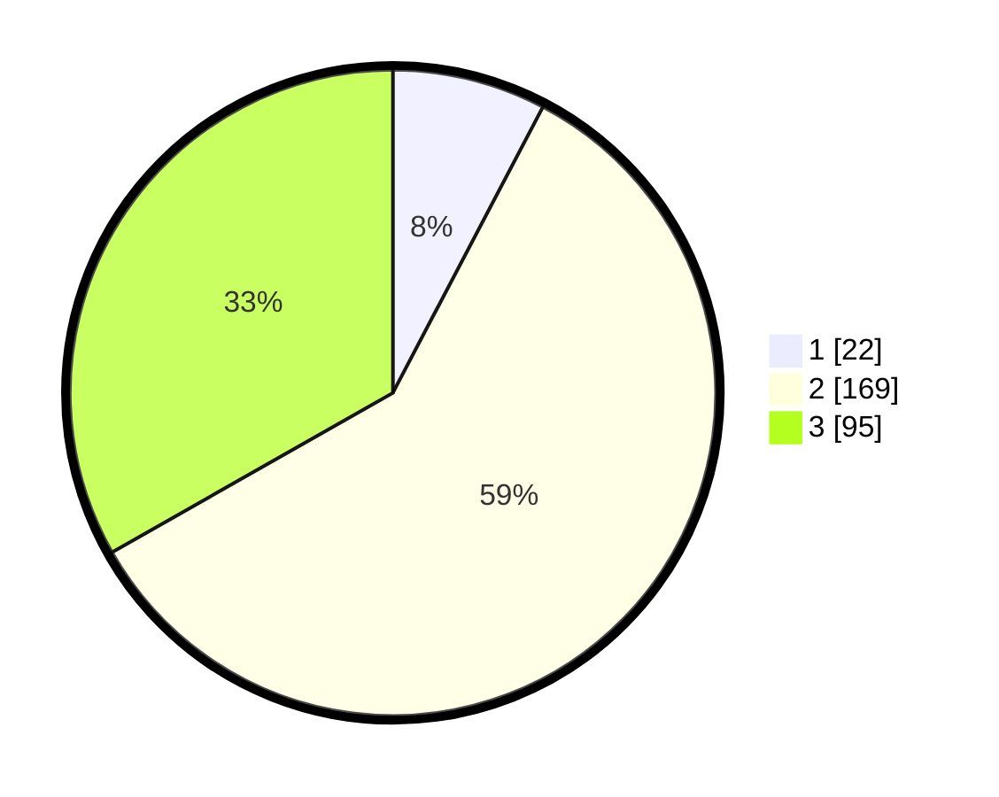

# Hasil

## Grafik

## Tabel

| No. | Nama Paslon    | Suara | Suara (raw) | Persentase |
|:--- |:-------------- | -----:| -----------:| ----------:|
| 1   | ANIES MUHAIMIN | 22    | [22][p-1]   | 7,69       |
| 2   | PRABOWO GIBRAN | 169   | [169][p-2]  | 59,09      |
| 3   | GANJAR MAHFUD  | 95    | [95][p-3]   | 33,22      |

[p-1]: https://github.com/gigit-pemilu/pemilu-2024/blob/main/pilpres/hitung-suara/sub/16-sumatera-selatan/sub/06-musi-banyuasin/sub/07-sungai-lilin/sub/2011-suka-damai-baru/sub/004-tps/sub/paslon-1.txt
[p-2]: https://github.com/gigit-pemilu/pemilu-2024/blob/main/pilpres/hitung-suara/sub/16-sumatera-selatan/sub/06-musi-banyuasin/sub/07-sungai-lilin/sub/2011-suka-damai-baru/sub/004-tps/sub/paslon-2.txt
[p-3]: https://github.com/gigit-pemilu/pemilu-2024/blob/main/pilpres/hitung-suara/sub/16-sumatera-selatan/sub/06-musi-banyuasin/sub/07-sungai-lilin/sub/2011-suka-damai-baru/sub/004-tps/sub/paslon-3.txt

## Foto C Plano

https://sirekap-obj-formc.kpu.go.id/cd00/pemilu/ppwp/16/06/07/20/11/1606072011004-20240218-144923--d2cf578a-b2aa-459b-80b4-6bad1c4e0780.jpg

https://sirekap-obj-formc.kpu.go.id/cd00/pemilu/ppwp/16/06/07/20/11/1606072011004-20240218-144955--3dcee829-9b86-46d5-85d4-3102a846e2ca.jpg

https://sirekap-obj-formc.kpu.go.id/cd00/pemilu/ppwp/16/06/07/20/11/1606072011004-20240218-145031--71f03c07-3ab9-49ee-a622-bc6b86b476bc.jpg

## Metadata

| Key        | Value               |
| ---------- | ------------------- |
| Time Stamp | 2024-02-25 16:00:00 |

