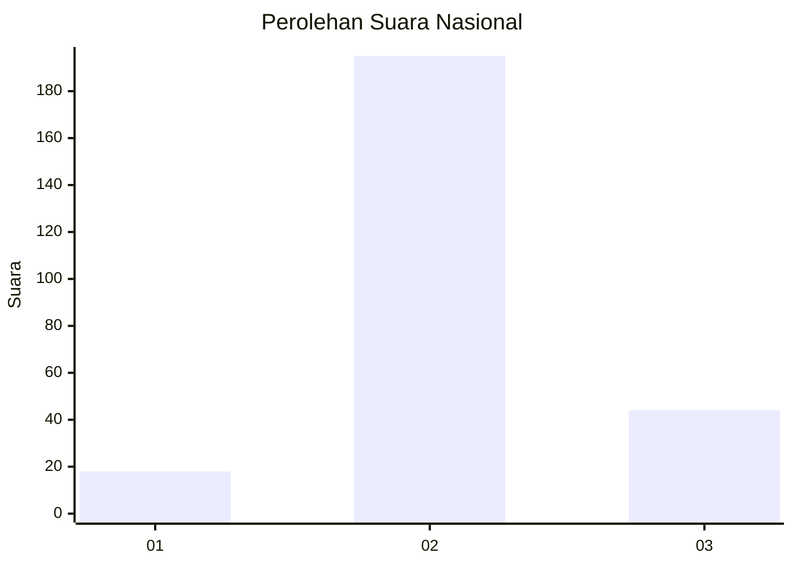

# Hasil

## Grafik

## Tabel

| No. | Nama Paslon    | Suara | Suara (raw) | Persentase |
|:--- |:-------------- | -----:| -----------:| ----------:|
| 1   | ANIES MUHAIMIN | 18    | [18][p-1]   | 7,00       |
| 2   | PRABOWO GIBRAN | 195   | [195][p-2]  | 75,88      |
| 3   | GANJAR MAHFUD  | 44    | [44][p-3]   | 17,12      |

[p-1]: https://github.com/gigit-pemilu/pemilu-2024/blob/main/pilpres/hitung-suara/sub/16-sumatera-selatan/sub/06-musi-banyuasin/sub/07-sungai-lilin/sub/2011-suka-damai-baru/sub/005-tps/sub/paslon-1.txt
[p-2]: https://github.com/gigit-pemilu/pemilu-2024/blob/main/pilpres/hitung-suara/sub/16-sumatera-selatan/sub/06-musi-banyuasin/sub/07-sungai-lilin/sub/2011-suka-damai-baru/sub/005-tps/sub/paslon-2.txt
[p-3]: https://github.com/gigit-pemilu/pemilu-2024/blob/main/pilpres/hitung-suara/sub/16-sumatera-selatan/sub/06-musi-banyuasin/sub/07-sungai-lilin/sub/2011-suka-damai-baru/sub/005-tps/sub/paslon-3.txt

## Foto C Plano

https://sirekap-obj-formc.kpu.go.id/ec40/pemilu/ppwp/16/06/07/20/11/1606072011005-20240218-145622--188dac6f-39bb-4139-a899-fbf83315c6fe.jpg

https://sirekap-obj-formc.kpu.go.id/ec40/pemilu/ppwp/16/06/07/20/11/1606072011005-20240218-145657--2a6698d0-462c-48d5-9140-471fa20069ea.jpg

https://sirekap-obj-formc.kpu.go.id/ec40/pemilu/ppwp/16/06/07/20/11/1606072011005-20240218-145732--80d9ad34-248c-40f5-a712-0c8e847a4bae.jpg

## Metadata

| Key        | Value               |
| ---------- | ------------------- |
| Time Stamp | 2024-02-27 22:00:00 |

