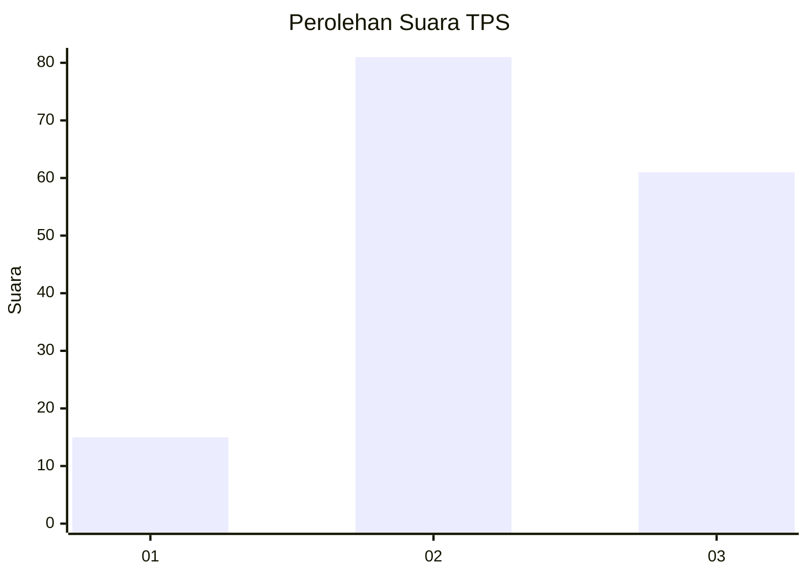
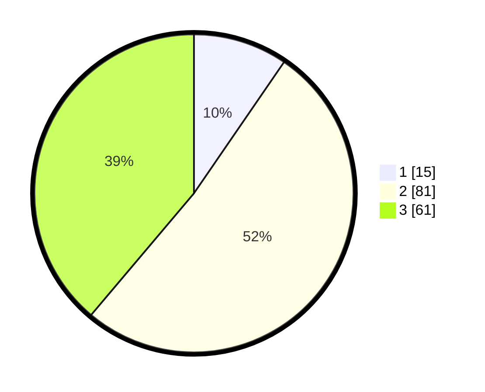

# Hasil

## Grafik

## Tabel

| No. | Nama Paslon    | Suara | Suara (raw) | Persentase |
|:--- |:-------------- | -----:| -----------:| ----------:|
| 1   | ANIES MUHAIMIN | 15    | [15][p-1]   | 9,55       |
| 2   | PRABOWO GIBRAN | 81    | [81][p-2]   | 51,59      |
| 3   | GANJAR MAHFUD  | 61    | [61][p-3]   | 38,85      |

[p-1]: https://github.com/gigit-pemilu/pemilu-2024-16-sumatera-selatan/blob/main/pilpres/hitung-suara/sub/16-sumatera-selatan/sub/06-musi-banyuasin/sub/07-sungai-lilin/sub/2014-bumi-kencana/sub/012-tps/sub/paslon-1.txt
[p-2]: https://github.com/gigit-pemilu/pemilu-2024-16-sumatera-selatan/blob/main/pilpres/hitung-suara/sub/16-sumatera-selatan/sub/06-musi-banyuasin/sub/07-sungai-lilin/sub/2014-bumi-kencana/sub/012-tps/sub/paslon-2.txt
[p-3]: https://github.com/gigit-pemilu/pemilu-2024-16-sumatera-selatan/blob/main/pilpres/hitung-suara/sub/16-sumatera-selatan/sub/06-musi-banyuasin/sub/07-sungai-lilin/sub/2014-bumi-kencana/sub/012-tps/sub/paslon-3.txt

## Foto C Plano

https://sirekap-obj-formc.kpu.go.id/8e63/pemilu/ppwp/16/06/07/20/14/1606072014012-20240218-114957--45e3e483-34b8-400d-b0be-51bea17b16ff.jpg

https://sirekap-obj-formc.kpu.go.id/8e63/pemilu/ppwp/16/06/07/20/14/1606072014012-20240218-115041--8d41fe04-71a8-446c-8b55-79b7d2ac25d0.jpg

https://sirekap-obj-formc.kpu.go.id/8e63/pemilu/ppwp/16/06/07/20/14/1606072014012-20240218-115114--4d7ba6a4-f0c9-4aad-b40c-157d63eca41f.jpg

## Metadata

| Key        | Value               |
| ---------- | ------------------- |
| Time Stamp | 2024-02-25 01:00:00 |

