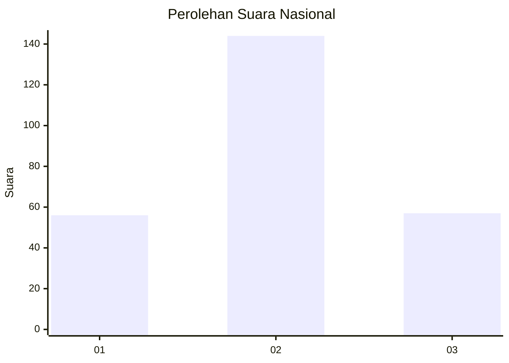
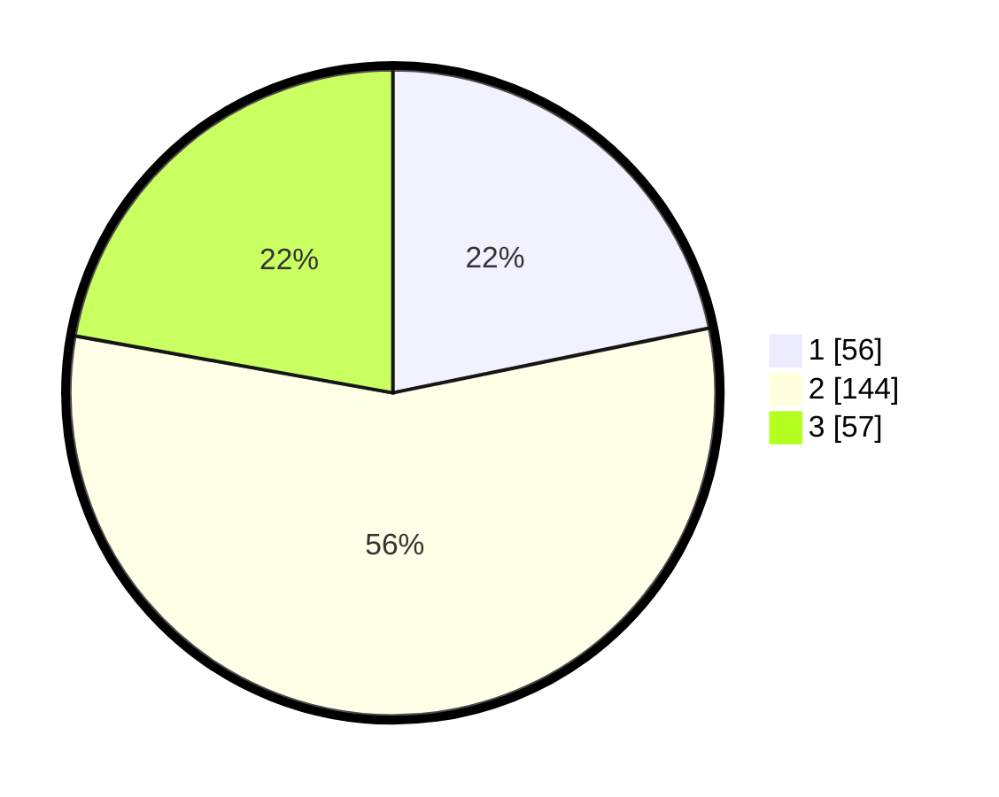

# Hasil

## Grafik

## Tabel

| No. | Nama Paslon    | Suara | Suara (raw) | Persentase |
|:--- |:-------------- | -----:| -----------:| ----------:|
| 1   | ANIES MUHAIMIN | 56    | [56][p-1]   | 21,79      |
| 2   | PRABOWO GIBRAN | 144   | [144][p-2]  | 56,03      |
| 3   | GANJAR MAHFUD  | 57    | [57][p-3]   | 22,18      |

[p-1]: https://github.com/gigit-pemilu/pemilu-2024/blob/main/pilpres/hitung-suara/sub/16-sumatera-selatan/sub/06-musi-banyuasin/sub/07-sungai-lilin/sub/2014-bumi-kencana/sub/013-tps/sub/paslon-1.txt
[p-2]: https://github.com/gigit-pemilu/pemilu-2024/blob/main/pilpres/hitung-suara/sub/16-sumatera-selatan/sub/06-musi-banyuasin/sub/07-sungai-lilin/sub/2014-bumi-kencana/sub/013-tps/sub/paslon-2.txt
[p-3]: https://github.com/gigit-pemilu/pemilu-2024/blob/main/pilpres/hitung-suara/sub/16-sumatera-selatan/sub/06-musi-banyuasin/sub/07-sungai-lilin/sub/2014-bumi-kencana/sub/013-tps/sub/paslon-3.txt

## Foto C Plano

https://sirekap-obj-formc.kpu.go.id/608c/pemilu/ppwp/16/06/07/20/14/1606072014013-20240218-115319--650f6d44-c4e7-4356-adf7-8e4c297e87d0.jpg

https://sirekap-obj-formc.kpu.go.id/608c/pemilu/ppwp/16/06/07/20/14/1606072014013-20240218-115359--88439ed4-408a-4e3e-be86-e6cca7fac88b.jpg

https://sirekap-obj-formc.kpu.go.id/608c/pemilu/ppwp/16/06/07/20/14/1606072014013-20240218-115429--1f432bb1-c3fc-4c54-a42e-797db7beb91e.jpg

## Metadata

| Key        | Value               |
| ---------- | ------------------- |
| Time Stamp | 2024-02-25 21:00:00 |

