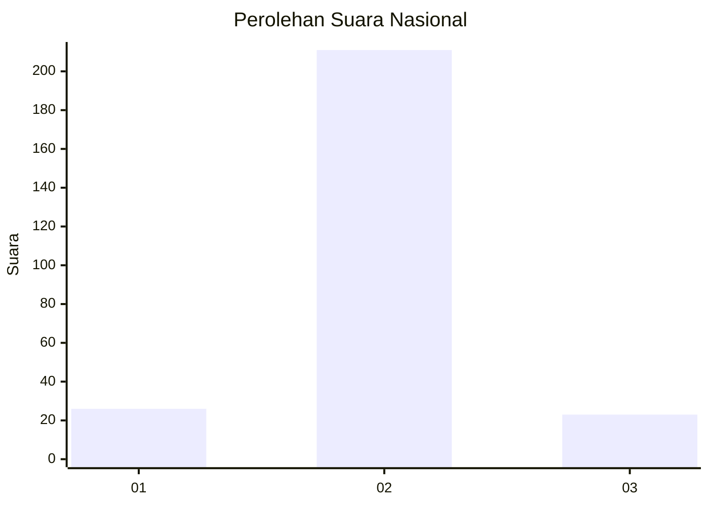
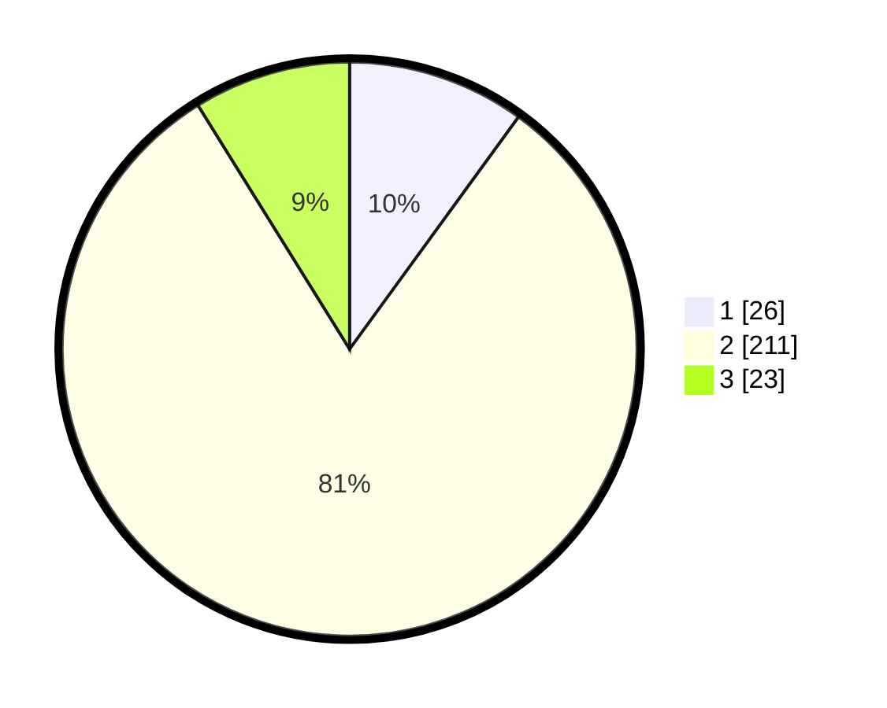

# Hasil

## Grafik

## Tabel

| No. | Nama Paslon    | Suara | Suara (raw) | Persentase |
|:--- |:-------------- | -----:| -----------:| ----------:|
| 1   | ANIES MUHAIMIN | 26    | [26][p-1]   | 10,00      |
| 2   | PRABOWO GIBRAN | 211   | [211][p-2]  | 81,15      |
| 3   | GANJAR MAHFUD  | 23    | [23][p-3]   | 8,85       |

[p-1]: https://github.com/gigit-pemilu/pemilu-2024/blob/main/pilpres/hitung-suara/sub/16-sumatera-selatan/sub/06-musi-banyuasin/sub/07-sungai-lilin/sub/2016-nusa-serasan/sub/005-tps/sub/paslon-1.txt
[p-2]: https://github.com/gigit-pemilu/pemilu-2024/blob/main/pilpres/hitung-suara/sub/16-sumatera-selatan/sub/06-musi-banyuasin/sub/07-sungai-lilin/sub/2016-nusa-serasan/sub/005-tps/sub/paslon-2.txt
[p-3]: https://github.com/gigit-pemilu/pemilu-2024/blob/main/pilpres/hitung-suara/sub/16-sumatera-selatan/sub/06-musi-banyuasin/sub/07-sungai-lilin/sub/2016-nusa-serasan/sub/005-tps/sub/paslon-3.txt

## Foto C Plano

https://sirekap-obj-formc.kpu.go.id/6033/pemilu/ppwp/16/06/07/20/16/1606072016005-20240218-131204--69fd1ed7-605d-4750-853e-e4b8d307b7b3.jpg

https://sirekap-obj-formc.kpu.go.id/6033/pemilu/ppwp/16/06/07/20/16/1606072016005-20240218-131249--9f4bf6ff-8343-4e74-92d8-b5be8d5f2aef.jpg

https://sirekap-obj-formc.kpu.go.id/6033/pemilu/ppwp/16/06/07/20/16/1606072016005-20240218-131333--85a28b96-1efc-43dc-bc49-32ec186c82c8.jpg

## Metadata

| Key        | Value               |
| ---------- | ------------------- |
| Time Stamp | 2024-02-24 22:31:28 |

