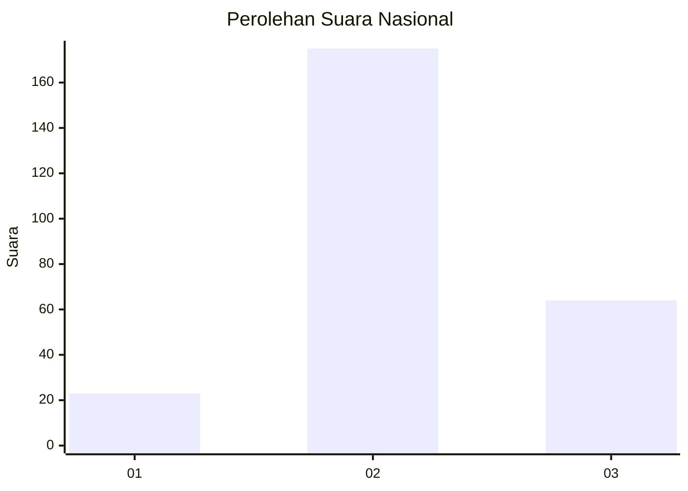
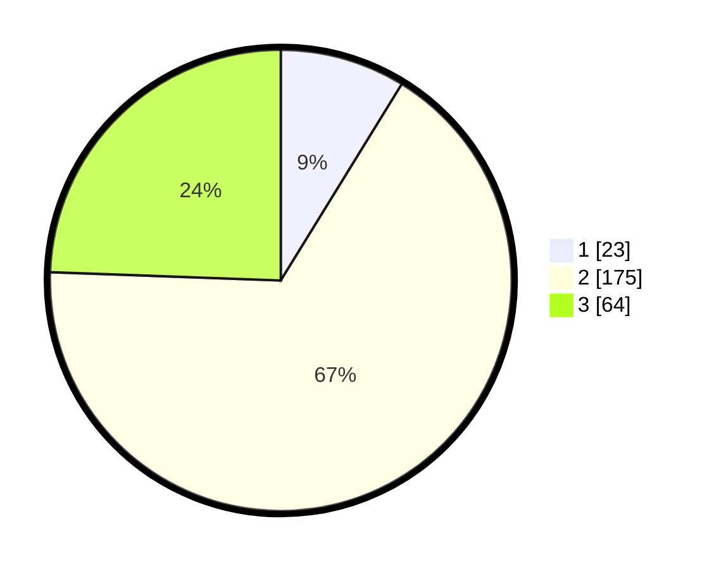

# Hasil

## Grafik

## Tabel

| No. | Nama Paslon    | Suara | Suara (raw) | Persentase |
|:--- |:-------------- | -----:| -----------:| ----------:|
| 1   | ANIES MUHAIMIN | 23    | [23][p-1]   | 8,78       |
| 2   | PRABOWO GIBRAN | 175   | [175][p-2]  | 66,79      |
| 3   | GANJAR MAHFUD  | 64    | [64][p-3]   | 24,43      |

[p-1]: https://github.com/gigit-pemilu/pemilu-2024/blob/main/pilpres/hitung-suara/sub/16-sumatera-selatan/sub/06-musi-banyuasin/sub/07-sungai-lilin/sub/2017-pinang-banjar/sub/009-tps/sub/paslon-1.txt
[p-2]: https://github.com/gigit-pemilu/pemilu-2024/blob/main/pilpres/hitung-suara/sub/16-sumatera-selatan/sub/06-musi-banyuasin/sub/07-sungai-lilin/sub/2017-pinang-banjar/sub/009-tps/sub/paslon-2.txt
[p-3]: https://github.com/gigit-pemilu/pemilu-2024/blob/main/pilpres/hitung-suara/sub/16-sumatera-selatan/sub/06-musi-banyuasin/sub/07-sungai-lilin/sub/2017-pinang-banjar/sub/009-tps/sub/paslon-3.txt

## Foto C Plano

https://sirekap-obj-formc.kpu.go.id/5fa4/pemilu/ppwp/16/06/07/20/17/1606072017009-20240220-111801--1b5ccb4f-4238-44cf-ba8e-2ad6abc93878.jpg

https://sirekap-obj-formc.kpu.go.id/5fa4/pemilu/ppwp/16/06/07/20/17/1606072017009-20240220-111835--7f3f9c6d-f65a-4981-9a10-04415e3fc57b.jpg

https://sirekap-obj-formc.kpu.go.id/5fa4/pemilu/ppwp/16/06/07/20/17/1606072017009-20240220-111902--9a5ddaeb-5265-456a-9d0b-0ee6fe625b83.jpg

## Metadata

| Key        | Value               |
| ---------- | ------------------- |
| Time Stamp | 2024-02-25 21:00:00 |

