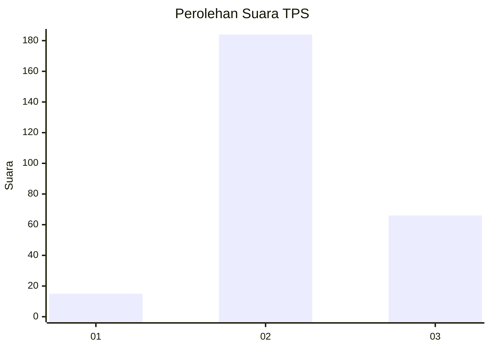
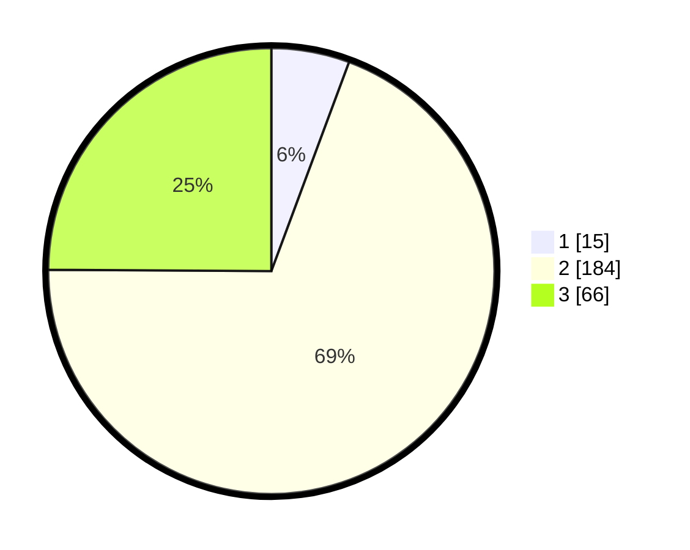

# Hasil

## Grafik

## Tabel

| No. | Nama Paslon    | Suara | Suara (raw) | Persentase |
|:--- |:-------------- | -----:| -----------:| ----------:|
| 1   | ANIES MUHAIMIN | 15    | [15][p-1]   | 5,66       |
| 2   | PRABOWO GIBRAN | 184   | [184][p-2]  | 69,43      |
| 3   | GANJAR MAHFUD  | 66    | [66][p-3]   | 24,91      |

[p-1]: https://github.com/gigit-pemilu/pemilu-2024-16-sumatera-selatan/blob/main/pilpres/hitung-suara/sub/16-sumatera-selatan/sub/06-musi-banyuasin/sub/07-sungai-lilin/sub/2019-panca-tunggal/sub/001-tps/sub/paslon-1.txt
[p-2]: https://github.com/gigit-pemilu/pemilu-2024-16-sumatera-selatan/blob/main/pilpres/hitung-suara/sub/16-sumatera-selatan/sub/06-musi-banyuasin/sub/07-sungai-lilin/sub/2019-panca-tunggal/sub/001-tps/sub/paslon-2.txt
[p-3]: https://github.com/gigit-pemilu/pemilu-2024-16-sumatera-selatan/blob/main/pilpres/hitung-suara/sub/16-sumatera-selatan/sub/06-musi-banyuasin/sub/07-sungai-lilin/sub/2019-panca-tunggal/sub/001-tps/sub/paslon-3.txt

## Foto C Plano

https://sirekap-obj-formc.kpu.go.id/61a7/pemilu/ppwp/16/06/07/20/19/1606072019001-20240220-094945--fa5a2705-3da6-469a-886e-49793f68a887.jpg

https://sirekap-obj-formc.kpu.go.id/61a7/pemilu/ppwp/16/06/07/20/19/1606072019001-20240220-095014--89ea0645-2ad3-442b-894b-f9eff6b03bd9.jpg

https://sirekap-obj-formc.kpu.go.id/61a7/pemilu/ppwp/16/06/07/20/19/1606072019001-20240220-095053--8a0e9e02-5629-4735-8d10-cf723f3bfe5b.jpg

## Metadata

| Key        | Value               |
| ---------- | ------------------- |
| Time Stamp | 2024-02-24 22:31:28 |

