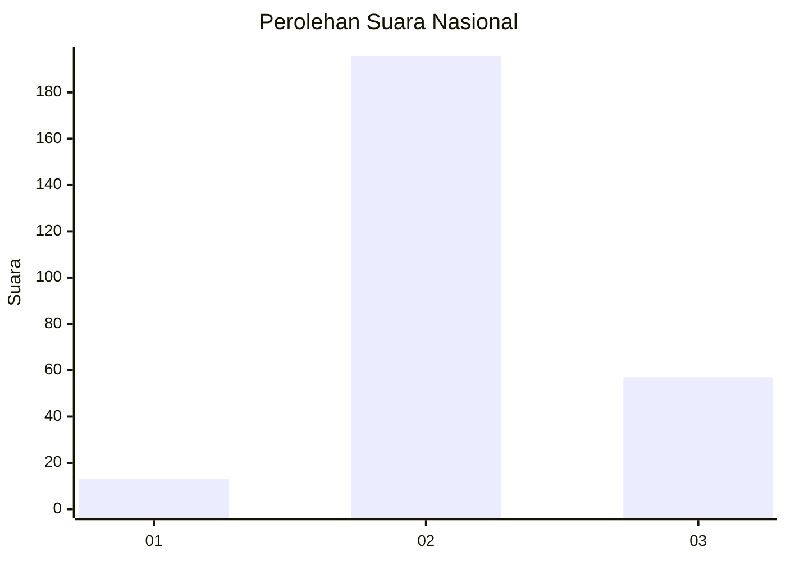

# Hasil

## Grafik

## Tabel

| No. | Nama Paslon    | Suara | Suara (raw) | Persentase |
|:--- |:-------------- | -----:| -----------:| ----------:|
| 1   | ANIES MUHAIMIN | 13    | [13][p-1]   | 4,89       |
| 2   | PRABOWO GIBRAN | 196   | [196][p-2]  | 73,68      |
| 3   | GANJAR MAHFUD  | 57    | [57][p-3]   | 21,43      |

[p-1]: https://github.com/gigit-pemilu/pemilu-2024/blob/main/pilpres/hitung-suara/sub/16-sumatera-selatan/sub/06-musi-banyuasin/sub/07-sungai-lilin/sub/2019-panca-tunggal/sub/004-tps/sub/paslon-1.txt
[p-2]: https://github.com/gigit-pemilu/pemilu-2024/blob/main/pilpres/hitung-suara/sub/16-sumatera-selatan/sub/06-musi-banyuasin/sub/07-sungai-lilin/sub/2019-panca-tunggal/sub/004-tps/sub/paslon-2.txt
[p-3]: https://github.com/gigit-pemilu/pemilu-2024/blob/main/pilpres/hitung-suara/sub/16-sumatera-selatan/sub/06-musi-banyuasin/sub/07-sungai-lilin/sub/2019-panca-tunggal/sub/004-tps/sub/paslon-3.txt

## Foto C Plano

https://sirekap-obj-formc.kpu.go.id/2744/pemilu/ppwp/16/06/07/20/19/1606072019004-20240220-100851--8350e9d1-5256-4461-a7a6-4328a041984b.jpg

https://sirekap-obj-formc.kpu.go.id/2744/pemilu/ppwp/16/06/07/20/19/1606072019004-20240220-100940--2aa0b880-7448-4dae-9bcc-69265653e27f.jpg

https://sirekap-obj-formc.kpu.go.id/2744/pemilu/ppwp/16/06/07/20/19/1606072019004-20240220-101036--31690c5d-32d9-4d50-b139-491906c1254f.jpg

## Metadata

| Key        | Value               |
| ---------- | ------------------- |
| Time Stamp | 2024-02-25 13:00:00 |

