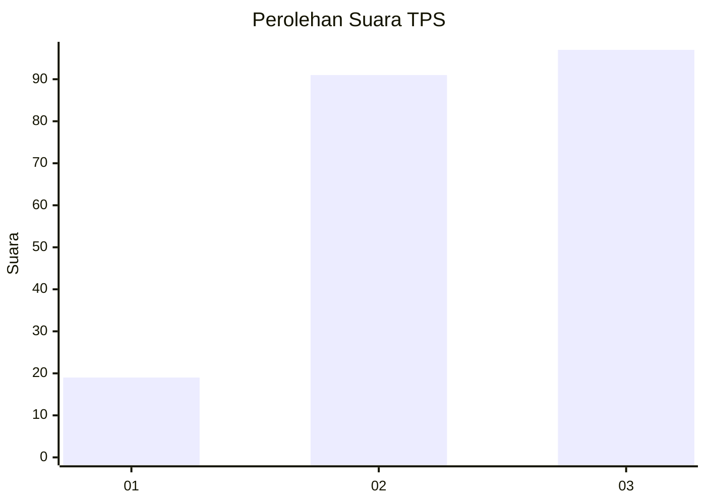
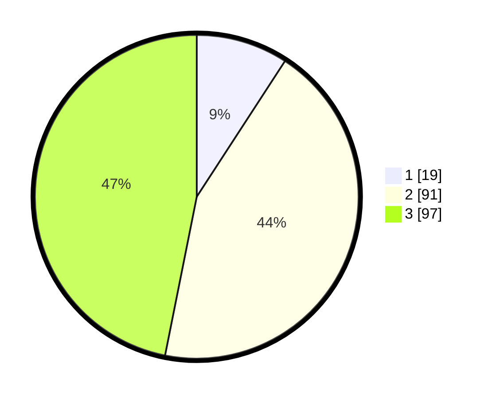

# Hasil

## Grafik

## Tabel

| No. | Nama Paslon    | Suara | Suara (raw) | Persentase |
|:--- |:-------------- | -----:| -----------:| ----------:|
| 1   | ANIES MUHAIMIN | 19    | [19][p-1]   | 9,18       |
| 2   | PRABOWO GIBRAN | 91    | [91][p-2]   | 43,96      |
| 3   | GANJAR MAHFUD  | 97    | [97][p-3]   | 46,86      |

[p-1]: https://github.com/gigit-pemilu/pemilu-2024-16-sumatera-selatan/blob/main/pilpres/hitung-suara/sub/16-sumatera-selatan/sub/06-musi-banyuasin/sub/07-sungai-lilin/sub/2021-bukit-jaya/sub/003-tps/sub/paslon-1.txt
[p-2]: https://github.com/gigit-pemilu/pemilu-2024-16-sumatera-selatan/blob/main/pilpres/hitung-suara/sub/16-sumatera-selatan/sub/06-musi-banyuasin/sub/07-sungai-lilin/sub/2021-bukit-jaya/sub/003-tps/sub/paslon-2.txt
[p-3]: https://github.com/gigit-pemilu/pemilu-2024-16-sumatera-selatan/blob/main/pilpres/hitung-suara/sub/16-sumatera-selatan/sub/06-musi-banyuasin/sub/07-sungai-lilin/sub/2021-bukit-jaya/sub/003-tps/sub/paslon-3.txt

## Foto C Plano

https://sirekap-obj-formc.kpu.go.id/4e55/pemilu/ppwp/16/06/07/20/21/1606072021003-20240220-091548--5f280ba8-608f-47d9-9c93-0bb13d0d2d25.jpg

https://sirekap-obj-formc.kpu.go.id/4e55/pemilu/ppwp/16/06/07/20/21/1606072021003-20240220-091617--2f5366ee-3ff2-4d7d-a32f-ef368ce136ed.jpg

https://sirekap-obj-formc.kpu.go.id/4e55/pemilu/ppwp/16/06/07/20/21/1606072021003-20240220-091648--c38e280f-c1fe-48b3-934d-d47e44c7de5c.jpg

## Metadata

| Key        | Value               |
| ---------- | ------------------- |
| Time Stamp | 2024-02-25 14:00:00 |

