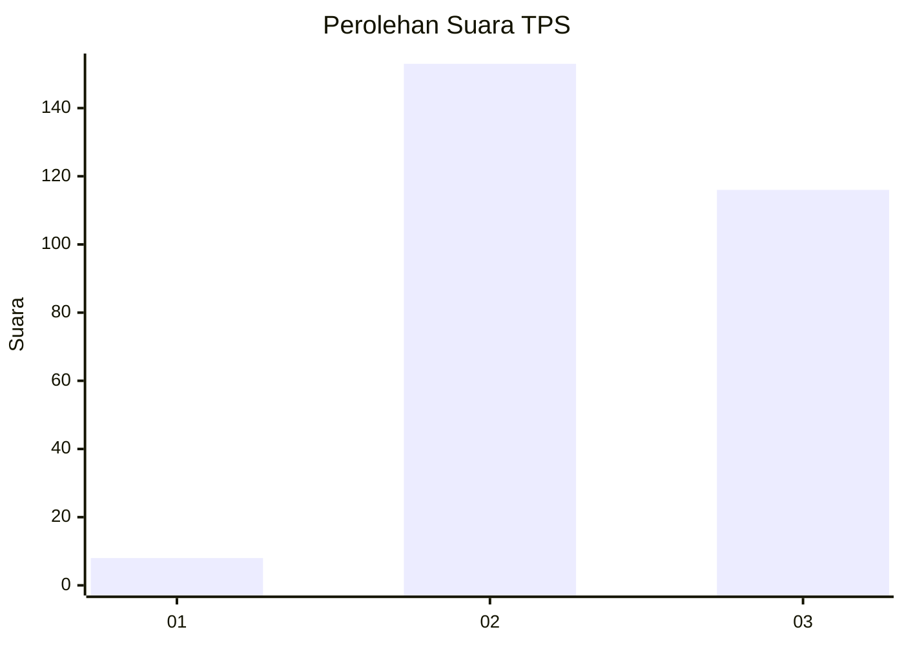
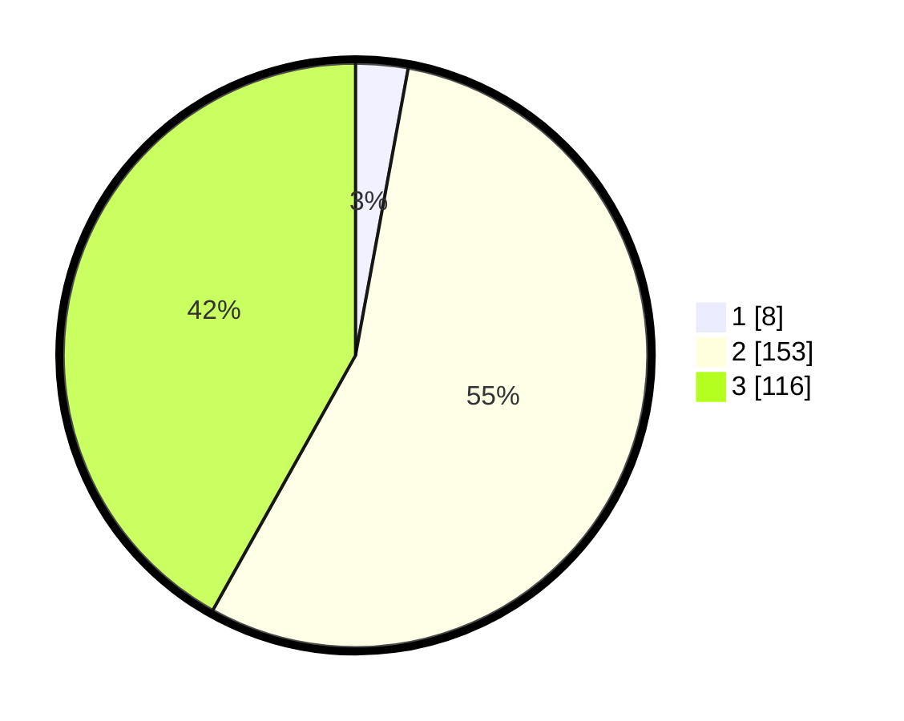

# Hasil

## Grafik

## Tabel

| No. | Nama Paslon    | Suara | Suara (raw) | Persentase |
|:--- |:-------------- | -----:| -----------:| ----------:|
| 1   | ANIES MUHAIMIN | 8     | [8][p-1]    | 2,89       |
| 2   | PRABOWO GIBRAN | 153   | [153][p-2]  | 55,23      |
| 3   | GANJAR MAHFUD  | 116   | [116][p-3]  | 41,88      |

[p-1]: https://github.com/gigit-pemilu/pemilu-2024-16-sumatera-selatan/blob/main/pilpres/hitung-suara/sub/16-sumatera-selatan/sub/06-musi-banyuasin/sub/07-sungai-lilin/sub/2021-bukit-jaya/sub/004-tps/sub/paslon-1.txt
[p-2]: https://github.com/gigit-pemilu/pemilu-2024-16-sumatera-selatan/blob/main/pilpres/hitung-suara/sub/16-sumatera-selatan/sub/06-musi-banyuasin/sub/07-sungai-lilin/sub/2021-bukit-jaya/sub/004-tps/sub/paslon-2.txt
[p-3]: https://github.com/gigit-pemilu/pemilu-2024-16-sumatera-selatan/blob/main/pilpres/hitung-suara/sub/16-sumatera-selatan/sub/06-musi-banyuasin/sub/07-sungai-lilin/sub/2021-bukit-jaya/sub/004-tps/sub/paslon-3.txt

## Foto C Plano

https://sirekap-obj-formc.kpu.go.id/26c1/pemilu/ppwp/16/06/07/20/21/1606072021004-20240220-092111--048d7520-c801-4437-94d5-28de6c8a5814.jpg

https://sirekap-obj-formc.kpu.go.id/26c1/pemilu/ppwp/16/06/07/20/21/1606072021004-20240220-092153--e6fcc082-5b67-4b37-9e74-ecd8c12e267c.jpg

https://sirekap-obj-formc.kpu.go.id/26c1/pemilu/ppwp/16/06/07/20/21/1606072021004-20240220-092225--a809dc16-d332-4a8f-8b51-f85dbd928258.jpg

## Metadata

| Key        | Value               |
| ---------- | ------------------- |
| Time Stamp | 2024-02-24 22:31:28 |

