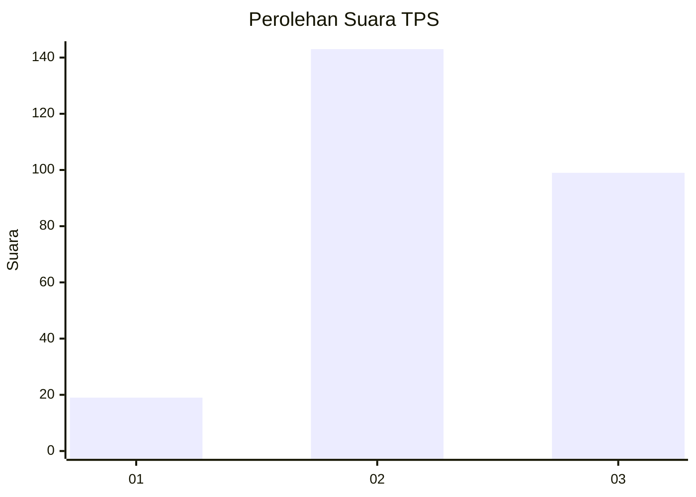
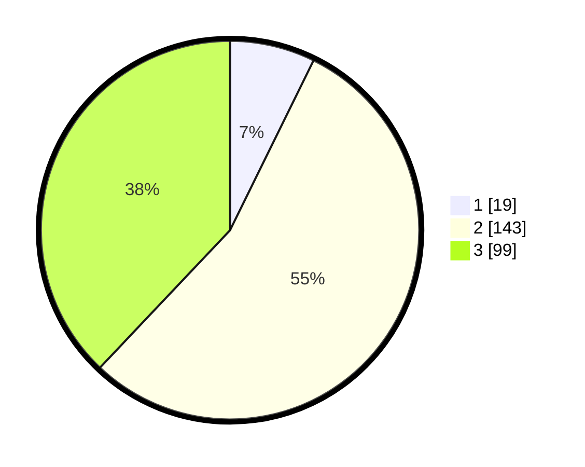

# Hasil

## Grafik

## Tabel

| No. | Nama Paslon    | Suara | Suara (raw) | Persentase |
|:--- |:-------------- | -----:| -----------:| ----------:|
| 1   | ANIES MUHAIMIN | 19    | [19][p-1]   | 7,28       |
| 2   | PRABOWO GIBRAN | 143   | [143][p-2]  | 54,79      |
| 3   | GANJAR MAHFUD  | 99    | [99][p-3]   | 37,93      |

[p-1]: https://github.com/gigit-pemilu/pemilu-2024-16-sumatera-selatan/blob/main/pilpres/hitung-suara/sub/16-sumatera-selatan/sub/06-musi-banyuasin/sub/07-sungai-lilin/sub/2021-bukit-jaya/sub/005-tps/sub/paslon-1.txt
[p-2]: https://github.com/gigit-pemilu/pemilu-2024-16-sumatera-selatan/blob/main/pilpres/hitung-suara/sub/16-sumatera-selatan/sub/06-musi-banyuasin/sub/07-sungai-lilin/sub/2021-bukit-jaya/sub/005-tps/sub/paslon-2.txt
[p-3]: https://github.com/gigit-pemilu/pemilu-2024-16-sumatera-selatan/blob/main/pilpres/hitung-suara/sub/16-sumatera-selatan/sub/06-musi-banyuasin/sub/07-sungai-lilin/sub/2021-bukit-jaya/sub/005-tps/sub/paslon-3.txt

## Foto C Plano

https://sirekap-obj-formc.kpu.go.id/5bfb/pemilu/ppwp/16/06/07/20/21/1606072021005-20240220-092522--57faccdf-d4e8-4c7a-a2c7-477f4149496b.jpg

https://sirekap-obj-formc.kpu.go.id/5bfb/pemilu/ppwp/16/06/07/20/21/1606072021005-20240220-092549--1efa833c-7bdc-4678-b183-8b40c51bbc99.jpg

https://sirekap-obj-formc.kpu.go.id/5bfb/pemilu/ppwp/16/06/07/20/21/1606072021005-20240220-092617--6260dfd1-6325-40dc-8af7-177522e857a4.jpg

## Metadata

| Key        | Value               |
| ---------- | ------------------- |
| Time Stamp | 2024-02-24 22:31:28 |

