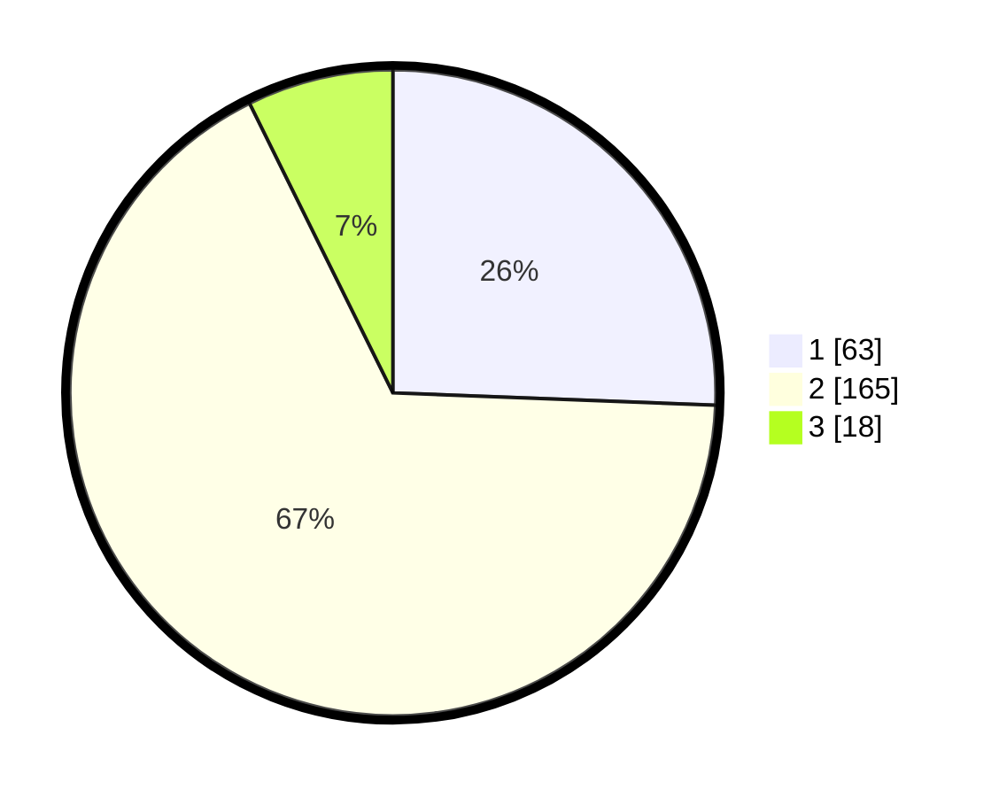

# Hasil

## Grafik

## Tabel

| No. | Nama Paslon    | Suara | Suara (raw) | Persentase |
|:--- |:-------------- | -----:| -----------:| ----------:|
| 1   | ANIES MUHAIMIN | 63    | [63][p-1]   | 25,61      |
| 2   | PRABOWO GIBRAN | 165   | [165][p-2]  | 67,07      |
| 3   | GANJAR MAHFUD  | 18    | [18][p-3]   | 7,32       |

[p-1]: https://github.com/gigit-pemilu/pemilu-2024-16-sumatera-selatan/blob/main/pilpres/hitung-suara/sub/16-sumatera-selatan/sub/06-musi-banyuasin/sub/09-bayung-lencir/sub/1016-bayung-lencir/sub/001-tps/sub/paslon-1.txt
[p-2]: https://github.com/gigit-pemilu/pemilu-2024-16-sumatera-selatan/blob/main/pilpres/hitung-suara/sub/16-sumatera-selatan/sub/06-musi-banyuasin/sub/09-bayung-lencir/sub/1016-bayung-lencir/sub/001-tps/sub/paslon-2.txt
[p-3]: https://github.com/gigit-pemilu/pemilu-2024-16-sumatera-selatan/blob/main/pilpres/hitung-suara/sub/16-sumatera-selatan/sub/06-musi-banyuasin/sub/09-bayung-lencir/sub/1016-bayung-lencir/sub/001-tps/sub/paslon-3.txt

## Foto C Plano

https://sirekap-obj-formc.kpu.go.id/e8ea/pemilu/ppwp/16/06/09/10/16/1606091016001-20240214-220153--042d6722-2d80-473f-8a58-e7d35ba36efe.jpg

https://sirekap-obj-formc.kpu.go.id/e8ea/pemilu/ppwp/16/06/09/10/16/1606091016001-20240216-015024--76c0b1d3-43d5-41eb-8c34-4681635799fc.jpg

https://sirekap-obj-formc.kpu.go.id/e8ea/pemilu/ppwp/16/06/09/10/16/1606091016001-20240216-020804--303cc2b7-abda-4c89-b75f-4d018c02d476.jpg

## Metadata

| Key        | Value               |
| ---------- | ------------------- |
| Time Stamp | 2024-02-16 14:00:34 |

