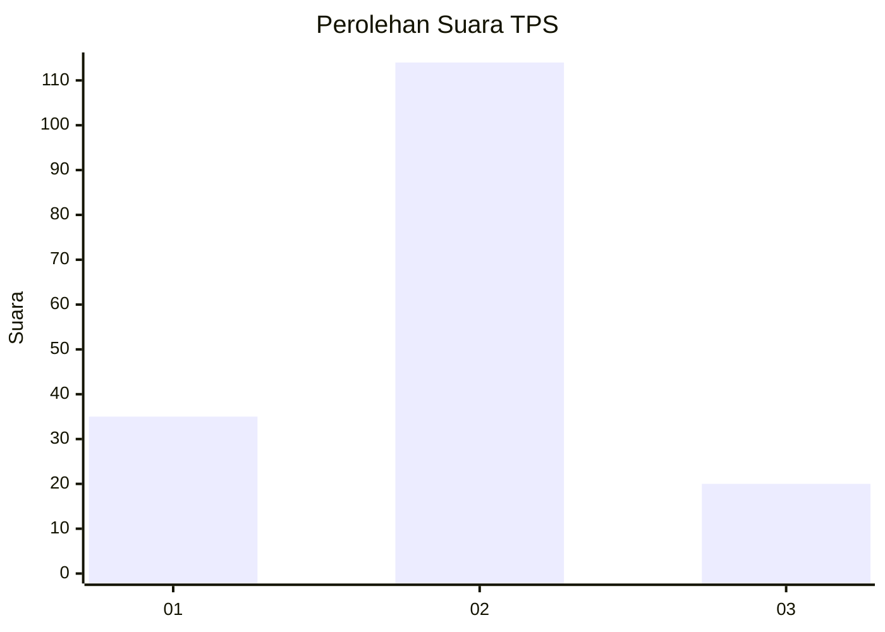
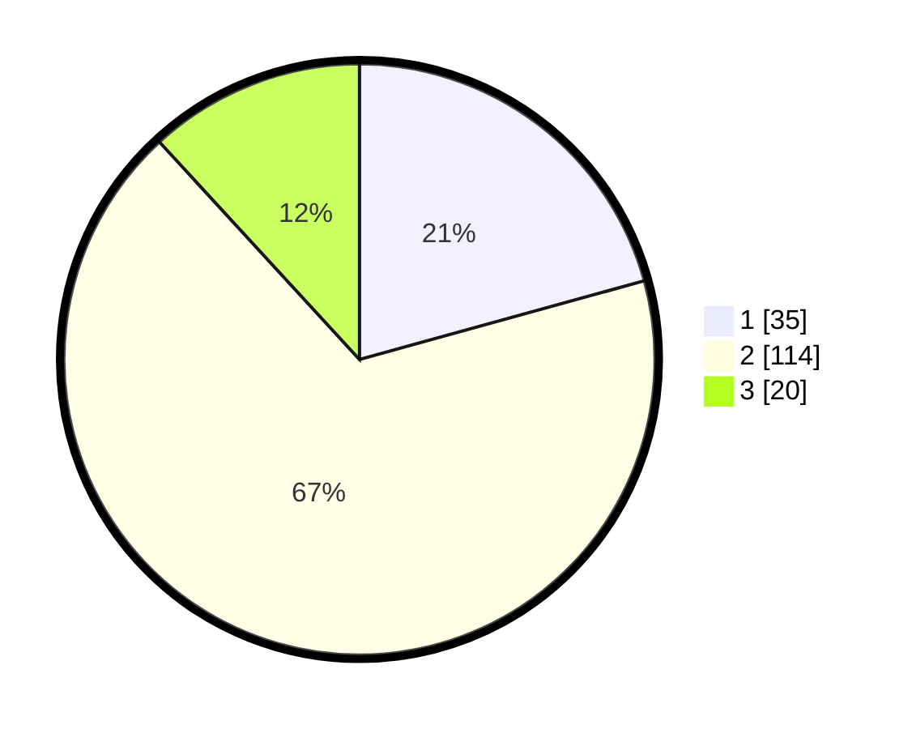

# Hasil

## Grafik

## Tabel

| No. | Nama Paslon    | Suara | Suara (raw) | Persentase |
|:--- |:-------------- | -----:| -----------:| ----------:|
| 1   | ANIES MUHAIMIN | 35    | [35][p-1]   | 20,71      |
| 2   | PRABOWO GIBRAN | 114   | [114][p-2]  | 67,46      |
| 3   | GANJAR MAHFUD  | 20    | [20][p-3]   | 11,83      |

[p-1]: https://github.com/gigit-pemilu/pemilu-2024-16-sumatera-selatan/blob/main/pilpres/hitung-suara/sub/16-sumatera-selatan/sub/06-musi-banyuasin/sub/09-bayung-lencir/sub/1016-bayung-lencir/sub/003-tps/sub/paslon-1.txt
[p-2]: https://github.com/gigit-pemilu/pemilu-2024-16-sumatera-selatan/blob/main/pilpres/hitung-suara/sub/16-sumatera-selatan/sub/06-musi-banyuasin/sub/09-bayung-lencir/sub/1016-bayung-lencir/sub/003-tps/sub/paslon-2.txt
[p-3]: https://github.com/gigit-pemilu/pemilu-2024-16-sumatera-selatan/blob/main/pilpres/hitung-suara/sub/16-sumatera-selatan/sub/06-musi-banyuasin/sub/09-bayung-lencir/sub/1016-bayung-lencir/sub/003-tps/sub/paslon-3.txt

## Foto C Plano

https://sirekap-obj-formc.kpu.go.id/42aa/pemilu/ppwp/16/06/09/10/16/1606091016003-20240214-221511--60a94a0f-b839-4117-b273-ad597bd7113b.jpg

https://sirekap-obj-formc.kpu.go.id/42aa/pemilu/ppwp/16/06/09/10/16/1606091016003-20240215-013249--a6fdeb49-cc95-4e15-99f6-953412a8594f.jpg

https://sirekap-obj-formc.kpu.go.id/42aa/pemilu/ppwp/16/06/09/10/16/1606091016003-20240215-013407--fc144dd0-f1a7-4cac-93a1-ee882e059156.jpg

## Metadata

| Key        | Value               |
| ---------- | ------------------- |
| Time Stamp | 2024-02-16 12:51:22 |

