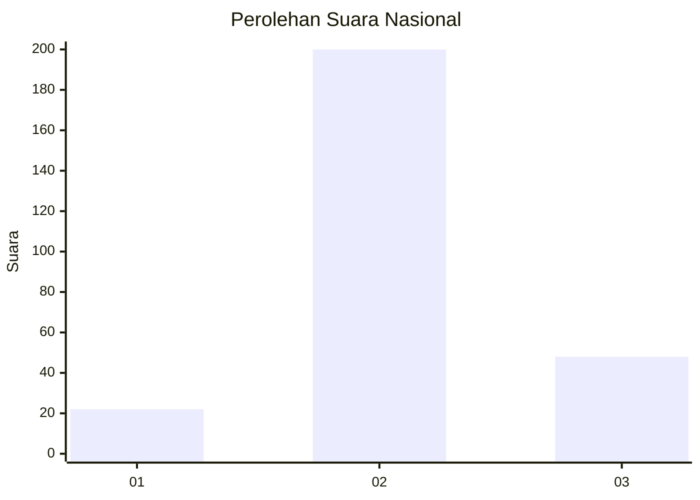

# Hasil

## Grafik

## Tabel

| No. | Nama Paslon    | Suara | Suara (raw) | Persentase |
|:--- |:-------------- | -----:| -----------:| ----------:|
| 1   | ANIES MUHAIMIN | 22    | [22][p-1]   | 8,15       |
| 2   | PRABOWO GIBRAN | 200   | [200][p-2]  | 74,07      |
| 3   | GANJAR MAHFUD  | 48    | [48][p-3]   | 17,78      |

[p-1]: https://github.com/gigit-pemilu/pemilu-2024/blob/main/pilpres/hitung-suara/sub/16-sumatera-selatan/sub/06-musi-banyuasin/sub/09-bayung-lencir/sub/1016-bayung-lencir/sub/019-tps/sub/paslon-1.txt
[p-2]: https://github.com/gigit-pemilu/pemilu-2024/blob/main/pilpres/hitung-suara/sub/16-sumatera-selatan/sub/06-musi-banyuasin/sub/09-bayung-lencir/sub/1016-bayung-lencir/sub/019-tps/sub/paslon-2.txt
[p-3]: https://github.com/gigit-pemilu/pemilu-2024/blob/main/pilpres/hitung-suara/sub/16-sumatera-selatan/sub/06-musi-banyuasin/sub/09-bayung-lencir/sub/1016-bayung-lencir/sub/019-tps/sub/paslon-3.txt

## Foto C Plano

https://sirekap-obj-formc.kpu.go.id/9024/pemilu/ppwp/16/06/09/10/16/1606091016019-20240215-033151--5fd3c2c9-e87f-40b3-a22d-8760cfa2f596.jpg

https://sirekap-obj-formc.kpu.go.id/9024/pemilu/ppwp/16/06/09/10/16/1606091016019-20240215-033303--1f2c41c2-b2ed-4533-a70c-0766cc2e2011.jpg

https://sirekap-obj-formc.kpu.go.id/9024/pemilu/ppwp/16/06/09/10/16/1606091016019-20240215-033417--bcc71ec6-f426-483f-b4a1-51ef0ca614dc.jpg

## Metadata

| Key        | Value               |
| ---------- | ------------------- |
| Time Stamp | 2024-02-16 12:51:22 |

