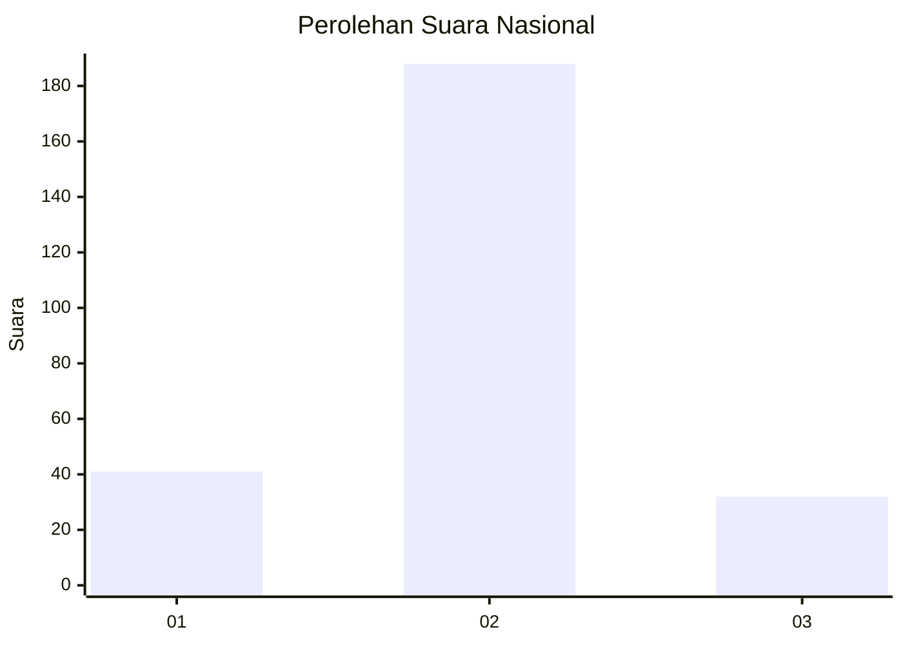
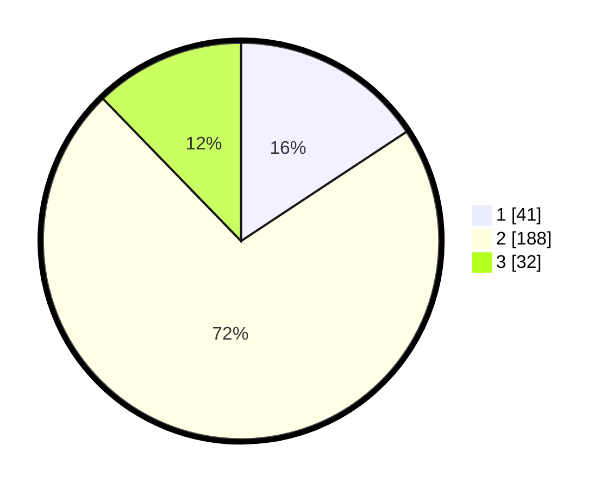

# Hasil

## Grafik

## Tabel

| No. | Nama Paslon    | Suara | Suara (raw) | Persentase |
|:--- |:-------------- | -----:| -----------:| ----------:|
| 1   | ANIES MUHAIMIN | 41    | [41][p-1]   | 15,71      |
| 2   | PRABOWO GIBRAN | 188   | [188][p-2]  | 72,03      |
| 3   | GANJAR MAHFUD  | 32    | [32][p-3]   | 12,26      |

[p-1]: https://github.com/gigit-pemilu/pemilu-2024/blob/main/pilpres/hitung-suara/sub/16-sumatera-selatan/sub/06-musi-banyuasin/sub/09-bayung-lencir/sub/1016-bayung-lencir/sub/024-tps/sub/paslon-1.txt
[p-2]: https://github.com/gigit-pemilu/pemilu-2024/blob/main/pilpres/hitung-suara/sub/16-sumatera-selatan/sub/06-musi-banyuasin/sub/09-bayung-lencir/sub/1016-bayung-lencir/sub/024-tps/sub/paslon-2.txt
[p-3]: https://github.com/gigit-pemilu/pemilu-2024/blob/main/pilpres/hitung-suara/sub/16-sumatera-selatan/sub/06-musi-banyuasin/sub/09-bayung-lencir/sub/1016-bayung-lencir/sub/024-tps/sub/paslon-3.txt

## Foto C Plano

https://sirekap-obj-formc.kpu.go.id/4700/pemilu/ppwp/16/06/09/10/16/1606091016024-20240214-225953--6b924ebc-290b-486d-951c-8c99b2f8ebf7.jpg

https://sirekap-obj-formc.kpu.go.id/4700/pemilu/ppwp/16/06/09/10/16/1606091016024-20240214-230716--9682688d-5428-4798-a9b0-26f499707a65.jpg

https://sirekap-obj-formc.kpu.go.id/4700/pemilu/ppwp/16/06/09/10/16/1606091016024-20240214-230921--c0d57d5b-64a4-4aea-9b68-64adf719fa6d.jpg

## Metadata

| Key        | Value               |
| ---------- | ------------------- |
| Time Stamp | 2024-02-16 12:51:22 |

