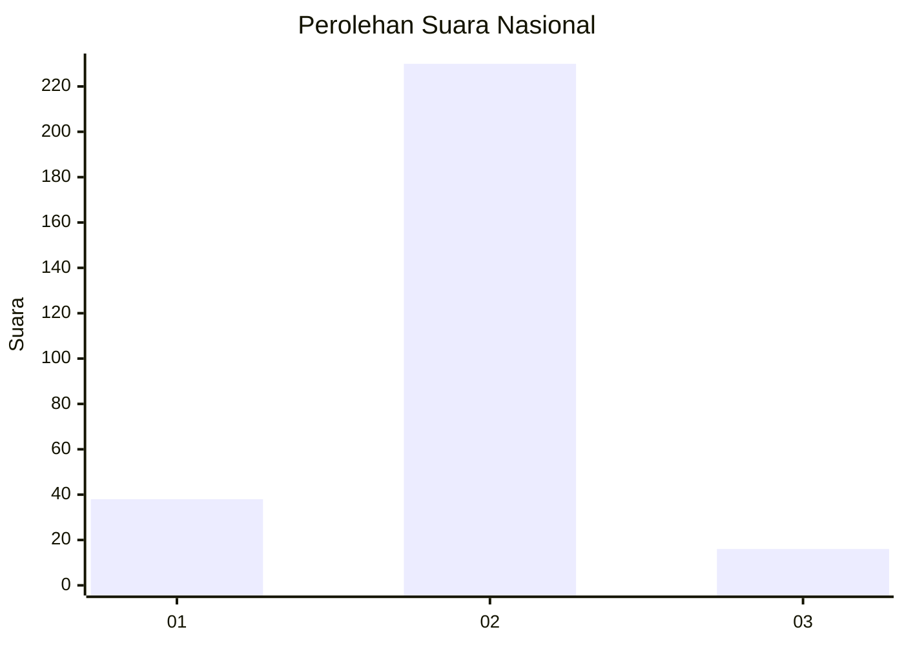
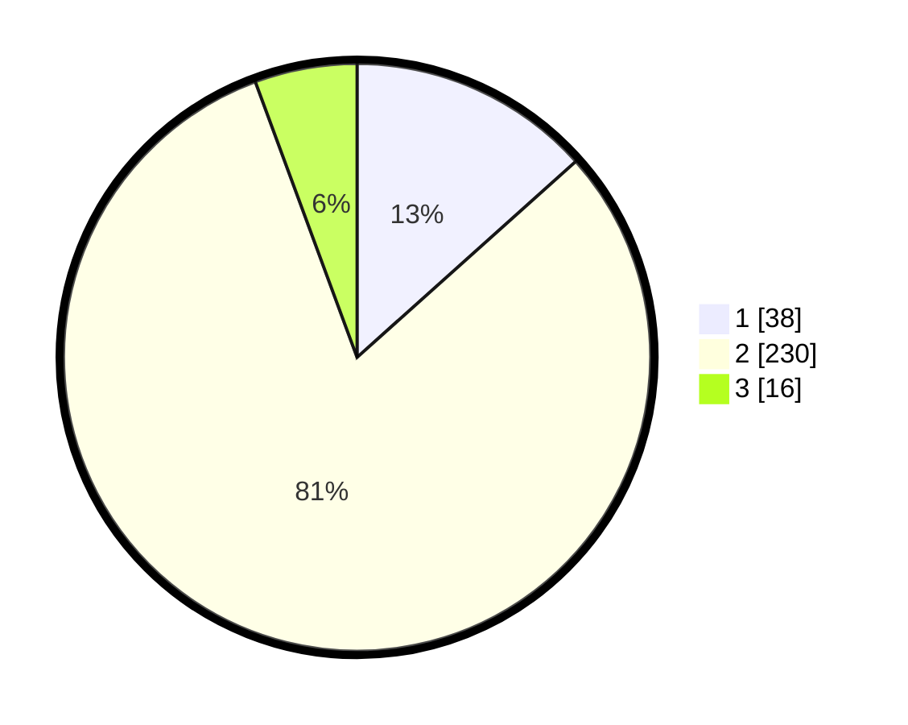

# Hasil

## Grafik

## Tabel

| No. | Nama Paslon    | Suara | Suara (raw) | Persentase |
|:--- |:-------------- | -----:| -----------:| ----------:|
| 1   | ANIES MUHAIMIN | 38    | [38][p-1]   | 13,38      |
| 2   | PRABOWO GIBRAN | 230   | [230][p-2]  | 80,99      |
| 3   | GANJAR MAHFUD  | 16    | [16][p-3]   | 5,63       |

[p-1]: https://github.com/gigit-pemilu/pemilu-2024/blob/main/pilpres/hitung-suara/sub/16-sumatera-selatan/sub/06-musi-banyuasin/sub/09-bayung-lencir/sub/1065-bayung-lencir-indah/sub/002-tps/sub/paslon-1.txt
[p-2]: https://github.com/gigit-pemilu/pemilu-2024/blob/main/pilpres/hitung-suara/sub/16-sumatera-selatan/sub/06-musi-banyuasin/sub/09-bayung-lencir/sub/1065-bayung-lencir-indah/sub/002-tps/sub/paslon-2.txt
[p-3]: https://github.com/gigit-pemilu/pemilu-2024/blob/main/pilpres/hitung-suara/sub/16-sumatera-selatan/sub/06-musi-banyuasin/sub/09-bayung-lencir/sub/1065-bayung-lencir-indah/sub/002-tps/sub/paslon-3.txt

## Foto C Plano

https://sirekap-obj-formc.kpu.go.id/7e61/pemilu/ppwp/16/06/09/10/65/1606091065002-20240217-183509--e88363e9-b13a-43cd-b663-c354d19c9924.jpg

https://sirekap-obj-formc.kpu.go.id/7e61/pemilu/ppwp/16/06/09/10/65/1606091065002-20240217-183511--42f16ab4-710c-424e-b26a-928131e5ecef.jpg

https://sirekap-obj-formc.kpu.go.id/7e61/pemilu/ppwp/16/06/09/10/65/1606091065002-20240217-183510--b2870488-4d31-41ac-8909-a6eac9c8d44a.jpg

## Metadata

| Key        | Value               |
| ---------- | ------------------- |
| Time Stamp | 2024-02-21 16:00:00 |

## DATA PEMILIH TETAP

Jumlah pemilih dalam DPT: **297**.
 * L: **147**.
 * P: **150**.

## DATA PENGGUNA HAK PILIH

Jumlah pengguna hak pilih dalam DPT: **249**.
 * L: **125**.
 * P: **124**.

Jumlah pengguna hak pilih dalam DPTb: **1**.
 * L: **1**.
 * P: **0**.

Jumlah pengguna hak pilih dalam DPK: **38**.
 * L: **14**.
 * P: **24**.

Jumlah pengguna hak pilih: **288**.
 * L: **140**.
 * P: **148**.

## JUMLAH SUARA SAH DAN TIDAK SAH

JUMLAH SELURUH SUARA SAH: **284**.

JUMLAH SUARA TIDAK SAH: **4**.

JUMLAH SELURUH SUARA SAH DAN SUARA TIDAK SAH: **288**.

