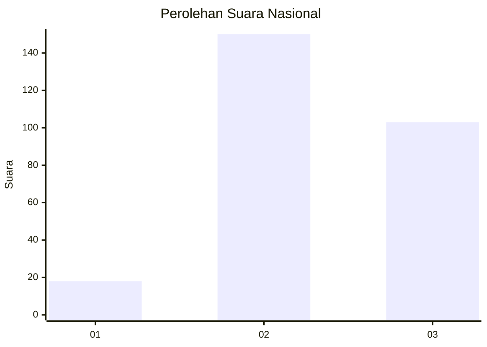
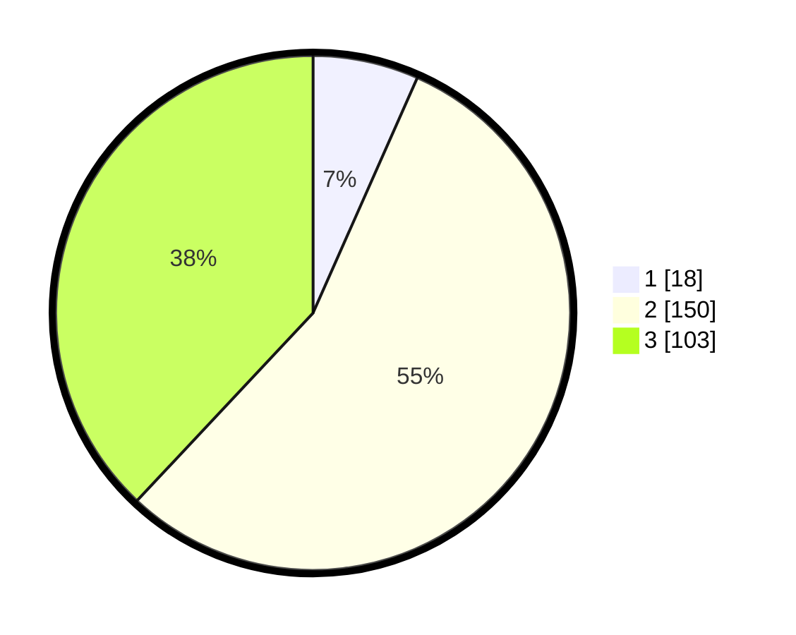

# Hasil

## Grafik

## Tabel

| No. | Nama Paslon    | Suara | Suara (raw) | Persentase |
|:--- |:-------------- | -----:| -----------:| ----------:|
| 1   | ANIES MUHAIMIN | 18    | [18][p-1]   | 6,64       |
| 2   | PRABOWO GIBRAN | 150   | [150][p-2]  | 55,35      |
| 3   | GANJAR MAHFUD  | 103   | [103][p-3]  | 38,01      |

[p-1]: https://github.com/gigit-pemilu/pemilu-2024/blob/main/pilpres/hitung-suara/sub/16-sumatera-selatan/sub/06-musi-banyuasin/sub/09-bayung-lencir/sub/1065-bayung-lencir-indah/sub/008-tps/sub/paslon-1.txt
[p-2]: https://github.com/gigit-pemilu/pemilu-2024/blob/main/pilpres/hitung-suara/sub/16-sumatera-selatan/sub/06-musi-banyuasin/sub/09-bayung-lencir/sub/1065-bayung-lencir-indah/sub/008-tps/sub/paslon-2.txt
[p-3]: https://github.com/gigit-pemilu/pemilu-2024/blob/main/pilpres/hitung-suara/sub/16-sumatera-selatan/sub/06-musi-banyuasin/sub/09-bayung-lencir/sub/1065-bayung-lencir-indah/sub/008-tps/sub/paslon-3.txt

## Foto C Plano

https://sirekap-obj-formc.kpu.go.id/401a/pemilu/ppwp/16/06/09/10/65/1606091065008-20240218-175149--3e486485-b969-4832-8e90-de83345381dc.jpg

https://sirekap-obj-formc.kpu.go.id/401a/pemilu/ppwp/16/06/09/10/65/1606091065008-20240218-175151--7d7f428a-7065-4591-8e26-ac3bcac68944.jpg

https://sirekap-obj-formc.kpu.go.id/401a/pemilu/ppwp/16/06/09/10/65/1606091065008-20240218-175150--3f8e348f-77a0-4db7-b458-d291fc08dbf6.jpg

## Metadata

| Key        | Value               |
| ---------- | ------------------- |
| Time Stamp | 2024-02-24 22:31:28 |

## DATA PEMILIH TETAP

Jumlah pemilih dalam DPT: **238**.
 * L: **131**.
 * P: **107**.

## DATA PENGGUNA HAK PILIH

Jumlah pengguna hak pilih dalam DPT: **238**.
 * L: **131**.
 * P: **107**.

Jumlah pengguna hak pilih dalam DPTb: **6**.
 * L: **6**.
 * P: **0**.

Jumlah pengguna hak pilih dalam DPK: **38**.
 * L: **17**.
 * P: **21**.

Jumlah pengguna hak pilih: **282**.
 * L: **154**.
 * P: **128**.

## JUMLAH SUARA SAH DAN TIDAK SAH

JUMLAH SELURUH SUARA SAH: **271**.

JUMLAH SUARA TIDAK SAH: **11**.

JUMLAH SELURUH SUARA SAH DAN SUARA TIDAK SAH: **282**.

