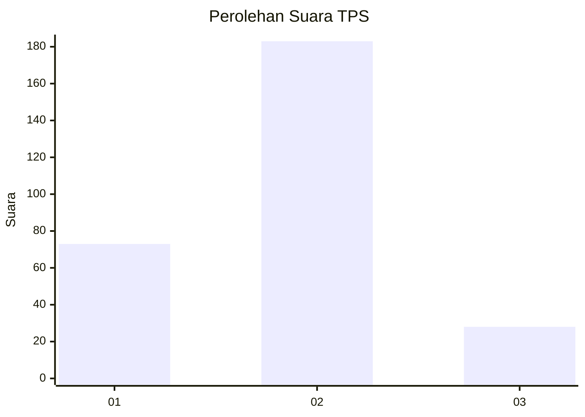
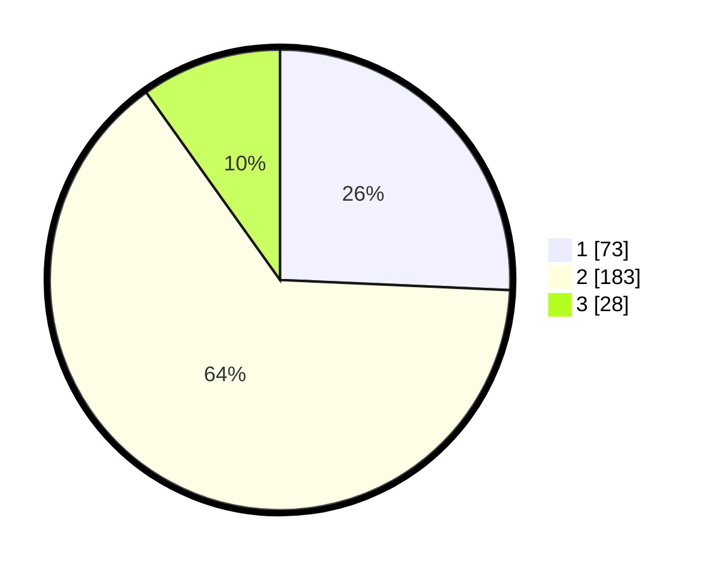

# Hasil

## Grafik

## Tabel

| No. | Nama Paslon    | Suara | Suara (raw) | Persentase |
|:--- |:-------------- | -----:| -----------:| ----------:|
| 1   | ANIES MUHAIMIN | 73    | [73][p-1]   | 25,70      |
| 2   | PRABOWO GIBRAN | 183   | [183][p-2]  | 64,44      |
| 3   | GANJAR MAHFUD  | 28    | [28][p-3]   | 9,86       |

[p-1]: https://github.com/gigit-pemilu/pemilu-2024-16-sumatera-selatan/blob/main/pilpres/hitung-suara/sub/16-sumatera-selatan/sub/06-musi-banyuasin/sub/09-bayung-lencir/sub/2007-mangsang/sub/006-tps/sub/paslon-1.txt
[p-2]: https://github.com/gigit-pemilu/pemilu-2024-16-sumatera-selatan/blob/main/pilpres/hitung-suara/sub/16-sumatera-selatan/sub/06-musi-banyuasin/sub/09-bayung-lencir/sub/2007-mangsang/sub/006-tps/sub/paslon-2.txt
[p-3]: https://github.com/gigit-pemilu/pemilu-2024-16-sumatera-selatan/blob/main/pilpres/hitung-suara/sub/16-sumatera-selatan/sub/06-musi-banyuasin/sub/09-bayung-lencir/sub/2007-mangsang/sub/006-tps/sub/paslon-3.txt

## Foto C Plano

https://sirekap-obj-formc.kpu.go.id/d5b3/pemilu/ppwp/16/06/09/20/07/1606092007006-20240216-142835--a23a88aa-007c-4fa1-bed4-9a3bfc038bff.jpg

https://sirekap-obj-formc.kpu.go.id/d5b3/pemilu/ppwp/16/06/09/20/07/1606092007006-20240216-142836--5121ae60-577a-4862-9e5e-e7c889757568.jpg

https://sirekap-obj-formc.kpu.go.id/d5b3/pemilu/ppwp/16/06/09/20/07/1606092007006-20240216-142835--92b8f1f0-6415-4602-8c1e-edc0cae9b88d.jpg

## Metadata

| Key        | Value               |
| ---------- | ------------------- |
| Time Stamp | 2024-02-16 16:25:10 |

## DATA PEMILIH TETAP

Jumlah pemilih dalam DPT: **283**.
 * L: **143**.
 * P: **140**.

## DATA PENGGUNA HAK PILIH

Jumlah pengguna hak pilih dalam DPT: **245**.
 * L: **127**.
 * P: **118**.

Jumlah pengguna hak pilih dalam DPTb: **7**.
 * L: **5**.
 * P: **2**.

Jumlah pengguna hak pilih dalam DPK: **37**.
 * L: **14**.
 * P: **23**.

Jumlah pengguna hak pilih: **289**.
 * L: **146**.
 * P: **143**.

## JUMLAH SUARA SAH DAN TIDAK SAH

JUMLAH SELURUH SUARA SAH: **284**.

JUMLAH SUARA TIDAK SAH: **5**.

JUMLAH SELURUH SUARA SAH DAN SUARA TIDAK SAH: **289**.

