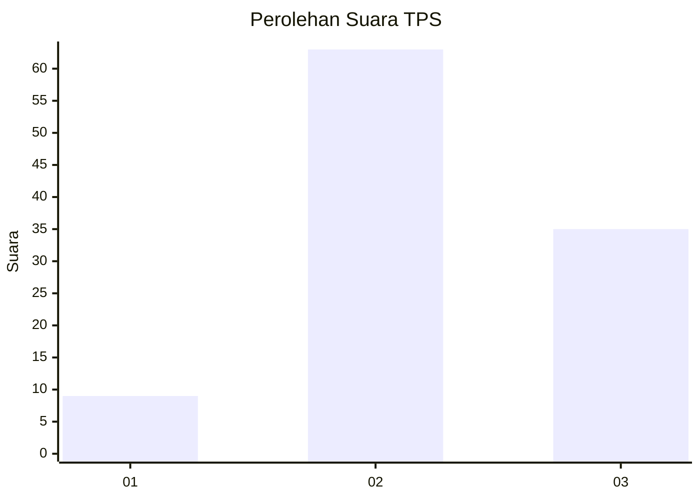
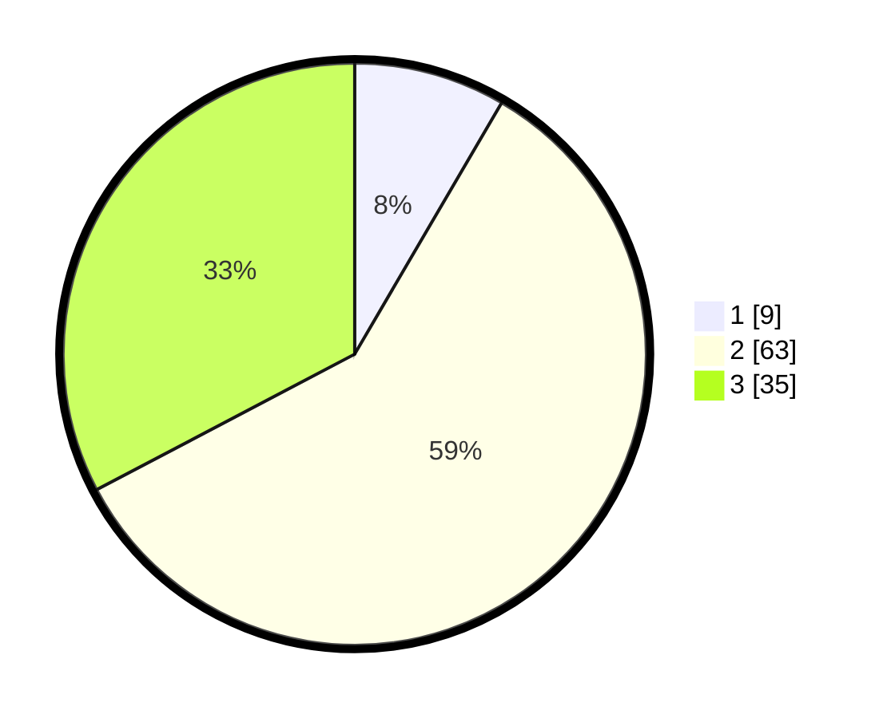

# Hasil

## Grafik

## Tabel

| No. | Nama Paslon    | Suara | Suara (raw) | Persentase |
|:--- |:-------------- | -----:| -----------:| ----------:|
| 1   | ANIES MUHAIMIN | 9     | [9][p-1]    | 8,41       |
| 2   | PRABOWO GIBRAN | 63    | [63][p-2]   | 58,88      |
| 3   | GANJAR MAHFUD  | 35    | [35][p-3]   | 32,71      |

[p-1]: https://github.com/gigit-pemilu/pemilu-2024-16-sumatera-selatan/blob/main/pilpres/hitung-suara/sub/16-sumatera-selatan/sub/06-musi-banyuasin/sub/09-bayung-lencir/sub/2007-mangsang/sub/012-tps/sub/paslon-1.txt
[p-2]: https://github.com/gigit-pemilu/pemilu-2024-16-sumatera-selatan/blob/main/pilpres/hitung-suara/sub/16-sumatera-selatan/sub/06-musi-banyuasin/sub/09-bayung-lencir/sub/2007-mangsang/sub/012-tps/sub/paslon-2.txt
[p-3]: https://github.com/gigit-pemilu/pemilu-2024-16-sumatera-selatan/blob/main/pilpres/hitung-suara/sub/16-sumatera-selatan/sub/06-musi-banyuasin/sub/09-bayung-lencir/sub/2007-mangsang/sub/012-tps/sub/paslon-3.txt

## Foto C Plano

https://sirekap-obj-formc.kpu.go.id/b0a4/pemilu/ppwp/16/06/09/20/07/1606092007012-20240215-104146--be3e412f-3cc8-46cb-9bbc-19ded27dc663.jpg

https://sirekap-obj-formc.kpu.go.id/b0a4/pemilu/ppwp/16/06/09/20/07/1606092007012-20240215-104416--a81065d3-0e97-4d0e-b4af-202eaed7fad4.jpg

https://sirekap-obj-formc.kpu.go.id/b0a4/pemilu/ppwp/16/06/09/20/07/1606092007012-20240215-104651--9c4cfa64-9f8b-431b-a5fd-7f398dc41119.jpg

## Metadata

| Key        | Value               |
| ---------- | ------------------- |
| Time Stamp | 2024-02-16 12:51:22 |

