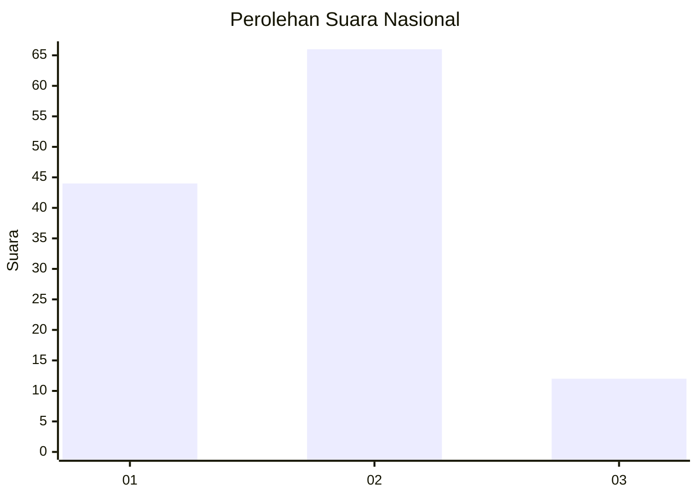
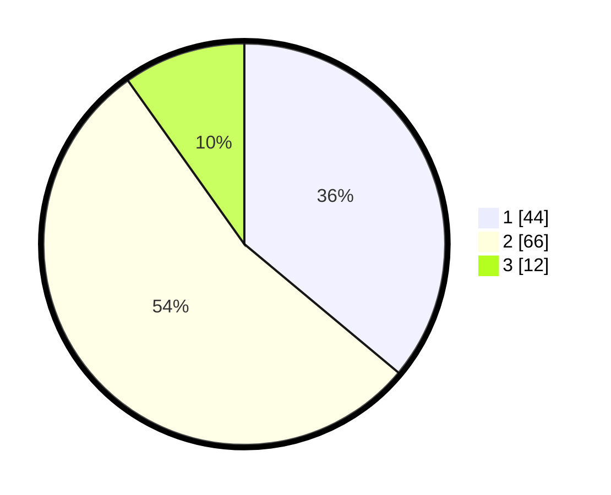

# Hasil

## Grafik

## Tabel

| No. | Nama Paslon    | Suara | Suara (raw) | Persentase |
|:--- |:-------------- | -----:| -----------:| ----------:|
| 1   | ANIES MUHAIMIN | 44    | [44][p-1]   | 36,07      |
| 2   | PRABOWO GIBRAN | 66    | [66][p-2]   | 54,10      |
| 3   | GANJAR MAHFUD  | 12    | [12][p-3]   | 9,84       |

[p-1]: https://github.com/gigit-pemilu/pemilu-2024/blob/main/pilpres/hitung-suara/sub/16-sumatera-selatan/sub/06-musi-banyuasin/sub/09-bayung-lencir/sub/2007-mangsang/sub/014-tps/sub/paslon-1.txt
[p-2]: https://github.com/gigit-pemilu/pemilu-2024/blob/main/pilpres/hitung-suara/sub/16-sumatera-selatan/sub/06-musi-banyuasin/sub/09-bayung-lencir/sub/2007-mangsang/sub/014-tps/sub/paslon-2.txt
[p-3]: https://github.com/gigit-pemilu/pemilu-2024/blob/main/pilpres/hitung-suara/sub/16-sumatera-selatan/sub/06-musi-banyuasin/sub/09-bayung-lencir/sub/2007-mangsang/sub/014-tps/sub/paslon-3.txt

## Foto C Plano

https://sirekap-obj-formc.kpu.go.id/276d/pemilu/ppwp/16/06/09/20/07/1606092007014-20240216-143120--e99d02e6-332e-4022-b682-7b5d43399b5d.jpg

https://sirekap-obj-formc.kpu.go.id/276d/pemilu/ppwp/16/06/09/20/07/1606092007014-20240216-143121--3ce06ea7-a06f-4c63-b3e3-061c5d3d90c9.jpg

https://sirekap-obj-formc.kpu.go.id/276d/pemilu/ppwp/16/06/09/20/07/1606092007014-20240216-143121--2fd61b76-d266-43a0-8b45-3950045c5812.jpg

## Metadata

| Key        | Value               |
| ---------- | ------------------- |
| Time Stamp | 2024-02-16 16:25:10 |

## DATA PEMILIH TETAP

Jumlah pemilih dalam DPT: **121**.
 * L: **66**.
 * P: **55**.

## DATA PENGGUNA HAK PILIH

Jumlah pengguna hak pilih dalam DPT: **94**.
 * L: **51**.
 * P: **43**.

Jumlah pengguna hak pilih dalam DPTb: **3**.
 * L: **2**.
 * P: **1**.

Jumlah pengguna hak pilih dalam DPK: **27**.
 * L: **15**.
 * P: **12**.

Jumlah pengguna hak pilih: **124**.
 * L: **68**.
 * P: **56**.

## JUMLAH SUARA SAH DAN TIDAK SAH

JUMLAH SELURUH SUARA SAH: **122**.

JUMLAH SUARA TIDAK SAH: **2**.

JUMLAH SELURUH SUARA SAH DAN SUARA TIDAK SAH: **124**.

