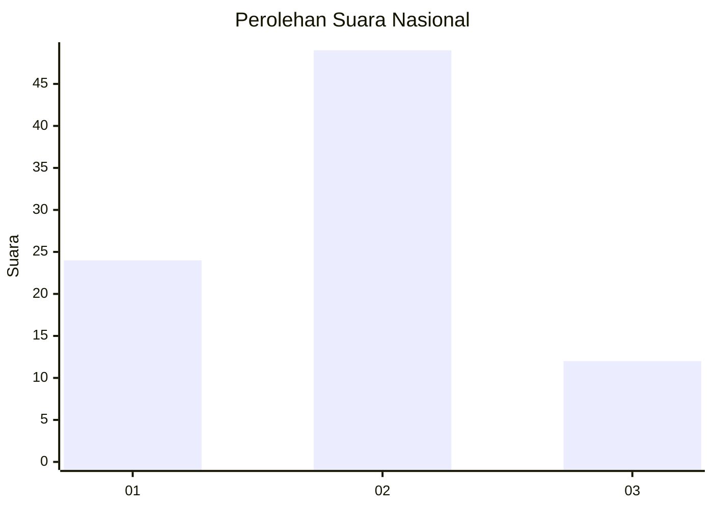
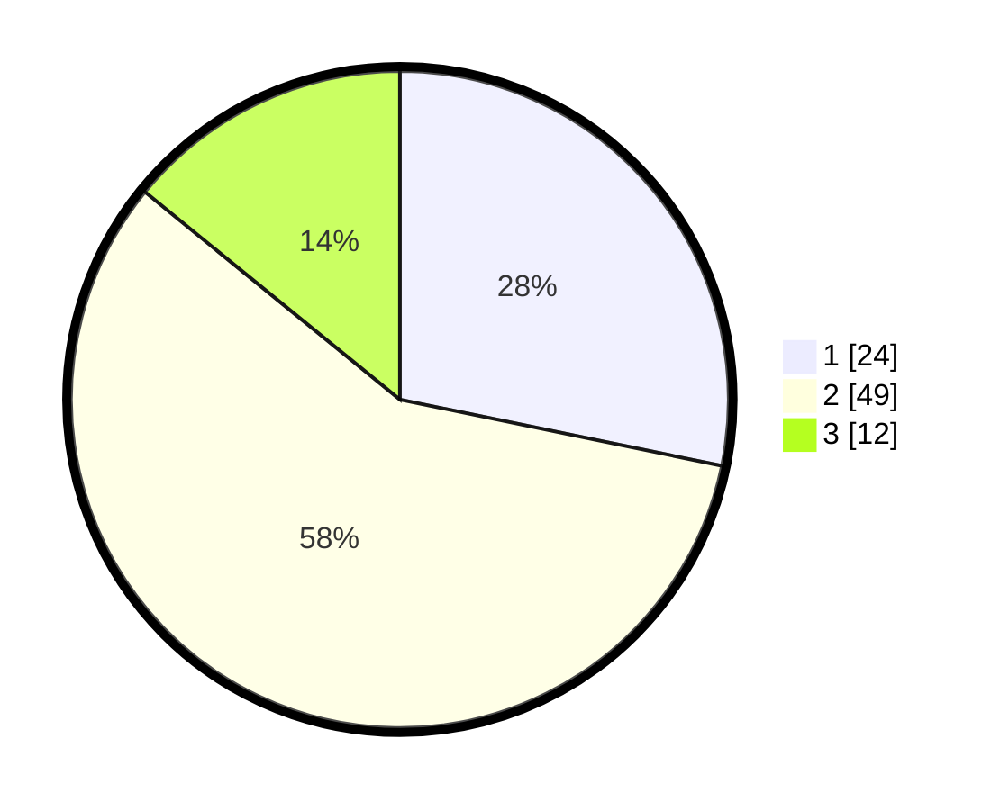

# Hasil

## Grafik

## Tabel

| No. | Nama Paslon    | Suara | Suara (raw) | Persentase |
|:--- |:-------------- | -----:| -----------:| ----------:|
| 1   | ANIES MUHAIMIN | 24    | [24][p-1]   | 28,24      |
| 2   | PRABOWO GIBRAN | 49    | [49][p-2]   | 57,65      |
| 3   | GANJAR MAHFUD  | 12    | [12][p-3]   | 14,12      |

[p-1]: https://github.com/gigit-pemilu/pemilu-2024/blob/main/pilpres/hitung-suara/sub/16-sumatera-selatan/sub/06-musi-banyuasin/sub/09-bayung-lencir/sub/2007-mangsang/sub/015-tps/sub/paslon-1.txt
[p-2]: https://github.com/gigit-pemilu/pemilu-2024/blob/main/pilpres/hitung-suara/sub/16-sumatera-selatan/sub/06-musi-banyuasin/sub/09-bayung-lencir/sub/2007-mangsang/sub/015-tps/sub/paslon-2.txt
[p-3]: https://github.com/gigit-pemilu/pemilu-2024/blob/main/pilpres/hitung-suara/sub/16-sumatera-selatan/sub/06-musi-banyuasin/sub/09-bayung-lencir/sub/2007-mangsang/sub/015-tps/sub/paslon-3.txt

## Foto C Plano

https://sirekap-obj-formc.kpu.go.id/bcc0/pemilu/ppwp/16/06/09/20/07/1606092007015-20240216-075231--71a1d066-b390-47b3-8517-ff612ba764f9.jpg

https://sirekap-obj-formc.kpu.go.id/bcc0/pemilu/ppwp/16/06/09/20/07/1606092007015-20240216-075232--ba8ca341-71d2-4430-8ff5-8fb2b807a6f7.jpg

https://sirekap-obj-formc.kpu.go.id/bcc0/pemilu/ppwp/16/06/09/20/07/1606092007015-20240216-075232--936b5c3a-734b-4c74-81b6-094f7fd49b52.jpg

## Metadata

| Key        | Value               |
| ---------- | ------------------- |
| Time Stamp | 2024-02-16 16:25:10 |

## DATA PEMILIH TETAP

Jumlah pemilih dalam DPT: **83**.
 * L: **45**.
 * P: **38**.

## DATA PENGGUNA HAK PILIH

Jumlah pengguna hak pilih dalam DPT: **42**.
 * L: **27**.
 * P: **15**.

Jumlah pengguna hak pilih dalam DPTb: **2**.
 * L: **2**.
 * P: **0**.

Jumlah pengguna hak pilih dalam DPK: **41**.
 * L: **30**.
 * P: **11**.

Jumlah pengguna hak pilih: **85**.
 * L: **59**.
 * P: **26**.

## JUMLAH SUARA SAH DAN TIDAK SAH

JUMLAH SELURUH SUARA SAH: **85**.

JUMLAH SUARA TIDAK SAH: **0**.

JUMLAH SELURUH SUARA SAH DAN SUARA TIDAK SAH: **85**.

