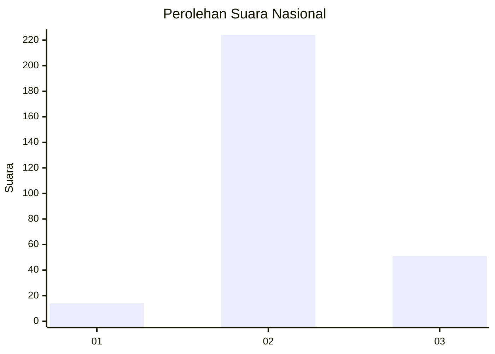

# Hasil

## Grafik

## Tabel

| No. | Nama Paslon    | Suara | Suara (raw) | Persentase |
|:--- |:-------------- | -----:| -----------:| ----------:|
| 1   | ANIES MUHAIMIN | 14    | [14][p-1]   | 4,84       |
| 2   | PRABOWO GIBRAN | 224   | [224][p-2]  | 77,51      |
| 3   | GANJAR MAHFUD  | 51    | [51][p-3]   | 17,65      |

[p-1]: https://github.com/gigit-pemilu/pemilu-2024/blob/main/pilpres/hitung-suara/sub/16-sumatera-selatan/sub/06-musi-banyuasin/sub/09-bayung-lencir/sub/2009-kali-berau/sub/005-tps/sub/paslon-1.txt
[p-2]: https://github.com/gigit-pemilu/pemilu-2024/blob/main/pilpres/hitung-suara/sub/16-sumatera-selatan/sub/06-musi-banyuasin/sub/09-bayung-lencir/sub/2009-kali-berau/sub/005-tps/sub/paslon-2.txt
[p-3]: https://github.com/gigit-pemilu/pemilu-2024/blob/main/pilpres/hitung-suara/sub/16-sumatera-selatan/sub/06-musi-banyuasin/sub/09-bayung-lencir/sub/2009-kali-berau/sub/005-tps/sub/paslon-3.txt

## Foto C Plano

https://sirekap-obj-formc.kpu.go.id/f45e/pemilu/ppwp/16/06/09/20/09/1606092009005-20240216-130120--2d38cce7-d5b8-4100-9f69-36ca06b1402d.jpg

https://sirekap-obj-formc.kpu.go.id/f45e/pemilu/ppwp/16/06/09/20/09/1606092009005-20240216-130121--3377a276-c394-4d3f-8595-13f75d060c00.jpg

https://sirekap-obj-formc.kpu.go.id/f45e/pemilu/ppwp/16/06/09/20/09/1606092009005-20240216-130121--5c72e9bc-48a3-41bb-8cb3-7bfa26b60e1f.jpg

## Metadata

| Key        | Value               |
| ---------- | ------------------- |
| Time Stamp | 2024-02-16 16:25:10 |

## DATA PEMILIH TETAP

Jumlah pemilih dalam DPT: **299**.
 * L: **151**.
 * P: **148**.

## DATA PENGGUNA HAK PILIH

Jumlah pengguna hak pilih dalam DPT: **253**.
 * L: **124**.
 * P: **129**.

Jumlah pengguna hak pilih dalam DPTb: **13**.
 * L: **13**.
 * P: **0**.

Jumlah pengguna hak pilih dalam DPK: **26**.
 * L: **15**.
 * P: **11**.

Jumlah pengguna hak pilih: **292**.
 * L: **152**.
 * P: **140**.

## JUMLAH SUARA SAH DAN TIDAK SAH

JUMLAH SELURUH SUARA SAH: **289**.

JUMLAH SUARA TIDAK SAH: **3**.

JUMLAH SELURUH SUARA SAH DAN SUARA TIDAK SAH: **292**.

