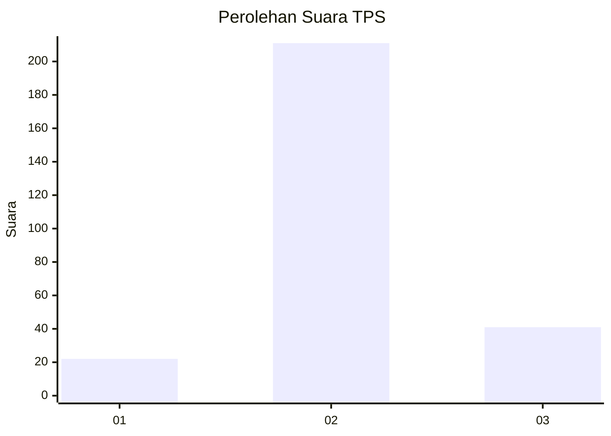

# Hasil

## Grafik

## Tabel

| No. | Nama Paslon    | Suara | Suara (raw) | Persentase |
|:--- |:-------------- | -----:| -----------:| ----------:|
| 1   | ANIES MUHAIMIN | 22    | [22][p-1]   | 8,03       |
| 2   | PRABOWO GIBRAN | 211   | [211][p-2]  | 77,01      |
| 3   | GANJAR MAHFUD  | 41    | [41][p-3]   | 14,96      |

[p-1]: https://github.com/gigit-pemilu/pemilu-2024-16-sumatera-selatan/blob/main/pilpres/hitung-suara/sub/16-sumatera-selatan/sub/06-musi-banyuasin/sub/09-bayung-lencir/sub/2013-mendis/sub/004-tps/sub/paslon-1.txt
[p-2]: https://github.com/gigit-pemilu/pemilu-2024-16-sumatera-selatan/blob/main/pilpres/hitung-suara/sub/16-sumatera-selatan/sub/06-musi-banyuasin/sub/09-bayung-lencir/sub/2013-mendis/sub/004-tps/sub/paslon-2.txt
[p-3]: https://github.com/gigit-pemilu/pemilu-2024-16-sumatera-selatan/blob/main/pilpres/hitung-suara/sub/16-sumatera-selatan/sub/06-musi-banyuasin/sub/09-bayung-lencir/sub/2013-mendis/sub/004-tps/sub/paslon-3.txt

## Foto C Plano

https://sirekap-obj-formc.kpu.go.id/e57c/pemilu/ppwp/16/06/09/20/13/1606092013004-20240216-143820--b171ae91-7f34-4fe6-ad17-31883d6417dd.jpg

https://sirekap-obj-formc.kpu.go.id/e57c/pemilu/ppwp/16/06/09/20/13/1606092013004-20240216-143821--77c1718c-0767-40d4-b2e0-9036813413eb.jpg

https://sirekap-obj-formc.kpu.go.id/e57c/pemilu/ppwp/16/06/09/20/13/1606092013004-20240216-143821--1e1f5d9e-47f0-4b36-b7b5-fb23b9eb8b1f.jpg

## Metadata

| Key        | Value               |
| ---------- | ------------------- |
| Time Stamp | 2024-02-16 16:25:10 |

## DATA PEMILIH TETAP

Jumlah pemilih dalam DPT: **296**.
 * L: **158**.
 * P: **138**.

## DATA PENGGUNA HAK PILIH

Jumlah pengguna hak pilih dalam DPT: **241**.
 * L: **133**.
 * P: **108**.

Jumlah pengguna hak pilih dalam DPTb: **17**.
 * L: **14**.
 * P: **3**.

Jumlah pengguna hak pilih dalam DPK: **21**.
 * L: **8**.
 * P: **13**.

Jumlah pengguna hak pilih: **279**.
 * L: **155**.
 * P: **124**.

## JUMLAH SUARA SAH DAN TIDAK SAH

JUMLAH SELURUH SUARA SAH: **274**.

JUMLAH SUARA TIDAK SAH: **5**.

JUMLAH SELURUH SUARA SAH DAN SUARA TIDAK SAH: **279**.

