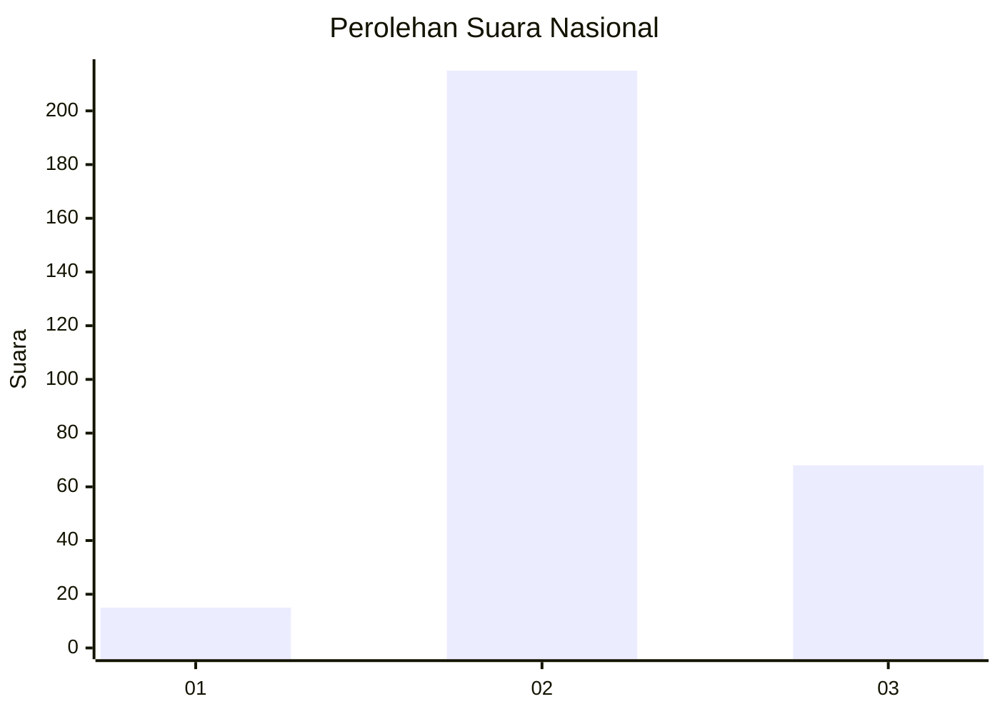
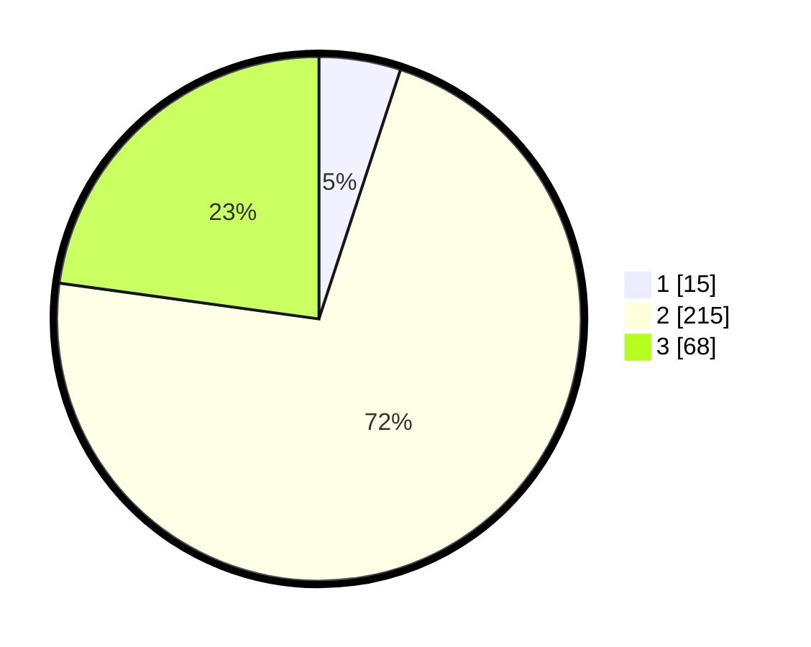

# Hasil

## Grafik

## Tabel

| No. | Nama Paslon    | Suara | Suara (raw) | Persentase |
|:--- |:-------------- | -----:| -----------:| ----------:|
| 1   | ANIES MUHAIMIN | 15    | [15][p-1]   | 5,03       |
| 2   | PRABOWO GIBRAN | 215   | [215][p-2]  | 72,15      |
| 3   | GANJAR MAHFUD  | 68    | [68][p-3]   | 22,82      |

[p-1]: https://github.com/gigit-pemilu/pemilu-2024/blob/main/pilpres/hitung-suara/sub/16-sumatera-selatan/sub/06-musi-banyuasin/sub/09-bayung-lencir/sub/2013-mendis/sub/007-tps/sub/paslon-1.txt
[p-2]: https://github.com/gigit-pemilu/pemilu-2024/blob/main/pilpres/hitung-suara/sub/16-sumatera-selatan/sub/06-musi-banyuasin/sub/09-bayung-lencir/sub/2013-mendis/sub/007-tps/sub/paslon-2.txt
[p-3]: https://github.com/gigit-pemilu/pemilu-2024/blob/main/pilpres/hitung-suara/sub/16-sumatera-selatan/sub/06-musi-banyuasin/sub/09-bayung-lencir/sub/2013-mendis/sub/007-tps/sub/paslon-3.txt

## Foto C Plano

https://sirekap-obj-formc.kpu.go.id/5f50/pemilu/ppwp/16/06/09/20/13/1606092013007-20240215-205414--0de36567-42e5-4a55-a215-267fe0ade981.jpg

https://sirekap-obj-formc.kpu.go.id/5f50/pemilu/ppwp/16/06/09/20/13/1606092013007-20240215-205416--7b309df8-866b-4ae2-9a4c-19e815802300.jpg

https://sirekap-obj-formc.kpu.go.id/5f50/pemilu/ppwp/16/06/09/20/13/1606092013007-20240215-205415--e5790f36-f9d9-4084-bae7-e70768831206.jpg

## Metadata

| Key        | Value               |
| ---------- | ------------------- |
| Time Stamp | 2024-02-16 16:30:00 |

## DATA PEMILIH TETAP

Jumlah pemilih dalam DPT: **300**.
 * L: **162**.
 * P: **138**.

## DATA PENGGUNA HAK PILIH

Jumlah pengguna hak pilih dalam DPT: **282**.
 * L: **145**.
 * P: **137**.

Jumlah pengguna hak pilih dalam DPTb: **7**.
 * L: **7**.
 * P: **0**.

Jumlah pengguna hak pilih dalam DPK: **17**.
 * L: **10**.
 * P: **7**.

Jumlah pengguna hak pilih: **306**.
 * L: **162**.
 * P: **144**.

## JUMLAH SUARA SAH DAN TIDAK SAH

JUMLAH SELURUH SUARA SAH: **298**.

JUMLAH SUARA TIDAK SAH: **8**.

JUMLAH SELURUH SUARA SAH DAN SUARA TIDAK SAH: **306**.

