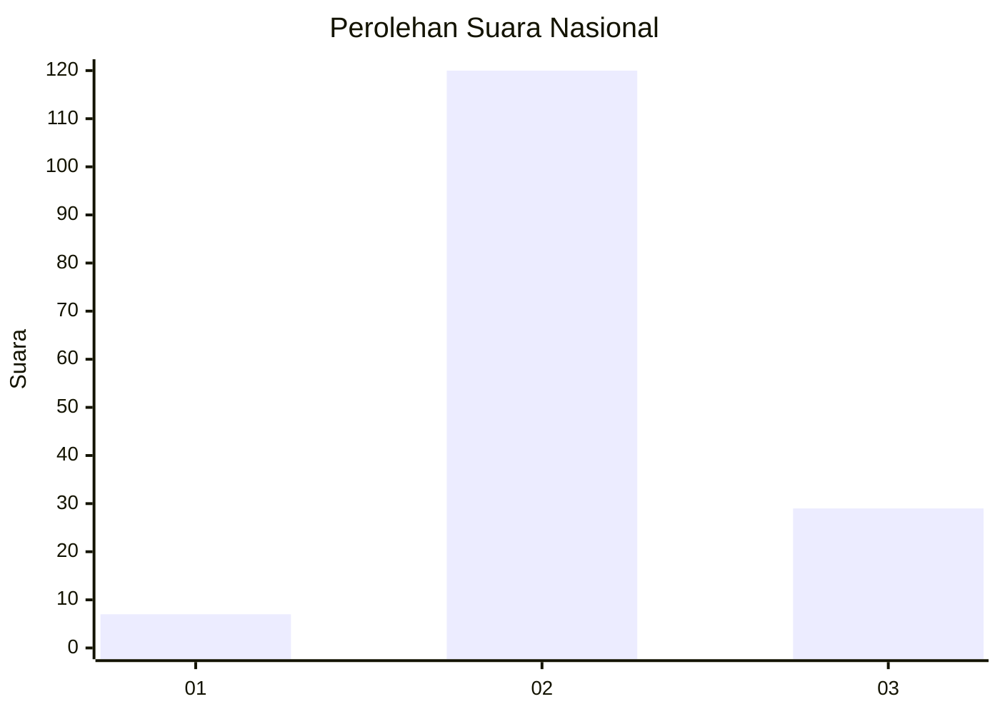
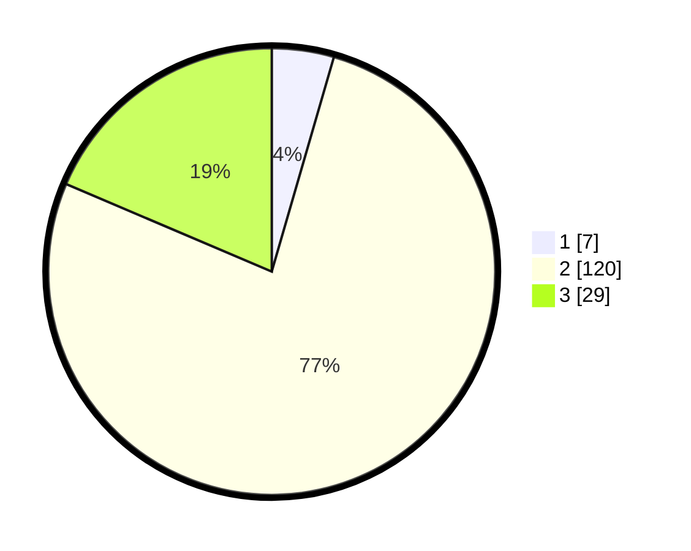

# Hasil

## Grafik

## Tabel

| No. | Nama Paslon    | Suara | Suara (raw) | Persentase |
|:--- |:-------------- | -----:| -----------:| ----------:|
| 1   | ANIES MUHAIMIN | 7     | [7][p-1]    | 4,49       |
| 2   | PRABOWO GIBRAN | 120   | [120][p-2]  | 76,92      |
| 3   | GANJAR MAHFUD  | 29    | [29][p-3]   | 18,59      |

[p-1]: https://github.com/gigit-pemilu/pemilu-2024/blob/main/pilpres/hitung-suara/sub/16-sumatera-selatan/sub/06-musi-banyuasin/sub/09-bayung-lencir/sub/2015-muara-medak/sub/002-tps/sub/paslon-1.txt
[p-2]: https://github.com/gigit-pemilu/pemilu-2024/blob/main/pilpres/hitung-suara/sub/16-sumatera-selatan/sub/06-musi-banyuasin/sub/09-bayung-lencir/sub/2015-muara-medak/sub/002-tps/sub/paslon-2.txt
[p-3]: https://github.com/gigit-pemilu/pemilu-2024/blob/main/pilpres/hitung-suara/sub/16-sumatera-selatan/sub/06-musi-banyuasin/sub/09-bayung-lencir/sub/2015-muara-medak/sub/002-tps/sub/paslon-3.txt

## Foto C Plano

https://sirekap-obj-formc.kpu.go.id/5b5f/pemilu/ppwp/16/06/09/20/15/1606092015002-20240214-221102--5644423f-e254-4547-9871-ab71eb5eab4e.jpg

https://sirekap-obj-formc.kpu.go.id/5b5f/pemilu/ppwp/16/06/09/20/15/1606092015002-20240215-115637--0f091dab-9890-4920-b3b9-b689360959cb.jpg

https://sirekap-obj-formc.kpu.go.id/5b5f/pemilu/ppwp/16/06/09/20/15/1606092015002-20240215-115717--2e2cf4f5-5b3e-449d-8a3b-541c326d3f11.jpg

## Metadata

| Key        | Value               |
| ---------- | ------------------- |
| Time Stamp | 2024-02-16 12:51:22 |

