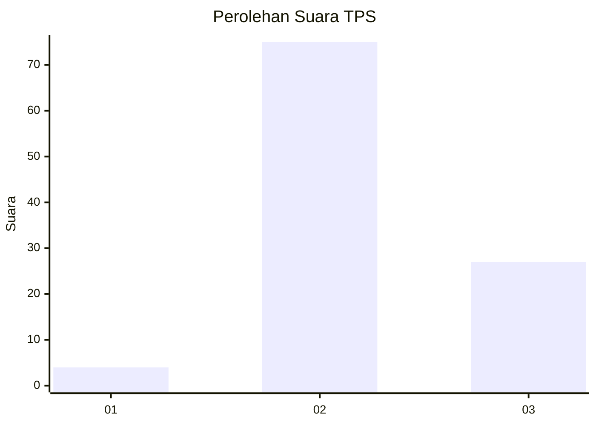
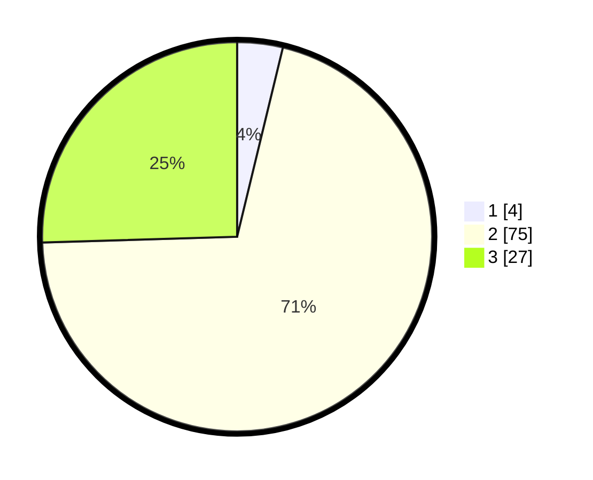

# Hasil

## Grafik

## Tabel

| No. | Nama Paslon    | Suara | Suara (raw) | Persentase |
|:--- |:-------------- | -----:| -----------:| ----------:|
| 1   | ANIES MUHAIMIN | 4     | [4][p-1]    | 3,77       |
| 2   | PRABOWO GIBRAN | 75    | [75][p-2]   | 70,75      |
| 3   | GANJAR MAHFUD  | 27    | [27][p-3]   | 25,47      |

[p-1]: https://github.com/gigit-pemilu/pemilu-2024-16-sumatera-selatan/blob/main/pilpres/hitung-suara/sub/16-sumatera-selatan/sub/06-musi-banyuasin/sub/09-bayung-lencir/sub/2015-muara-medak/sub/017-tps/sub/paslon-1.txt
[p-2]: https://github.com/gigit-pemilu/pemilu-2024-16-sumatera-selatan/blob/main/pilpres/hitung-suara/sub/16-sumatera-selatan/sub/06-musi-banyuasin/sub/09-bayung-lencir/sub/2015-muara-medak/sub/017-tps/sub/paslon-2.txt
[p-3]: https://github.com/gigit-pemilu/pemilu-2024-16-sumatera-selatan/blob/main/pilpres/hitung-suara/sub/16-sumatera-selatan/sub/06-musi-banyuasin/sub/09-bayung-lencir/sub/2015-muara-medak/sub/017-tps/sub/paslon-3.txt

## Foto C Plano

https://sirekap-obj-formc.kpu.go.id/01b7/pemilu/ppwp/16/06/09/20/15/1606092015017-20240218-210625--e63ba87d-fb47-468a-9638-0f08d3cb9446.jpg

https://sirekap-obj-formc.kpu.go.id/01b7/pemilu/ppwp/16/06/09/20/15/1606092015017-20240215-092831--367b3084-0d93-4867-936b-07ab26bfa3f9.jpg

https://sirekap-obj-formc.kpu.go.id/01b7/pemilu/ppwp/16/06/09/20/15/1606092015017-20240215-092914--2abd597d-e27a-4cbb-87f5-07cd49644fa8.jpg

## Metadata

| Key        | Value               |
| ---------- | ------------------- |
| Time Stamp | 2024-02-19 06:16:00 |

