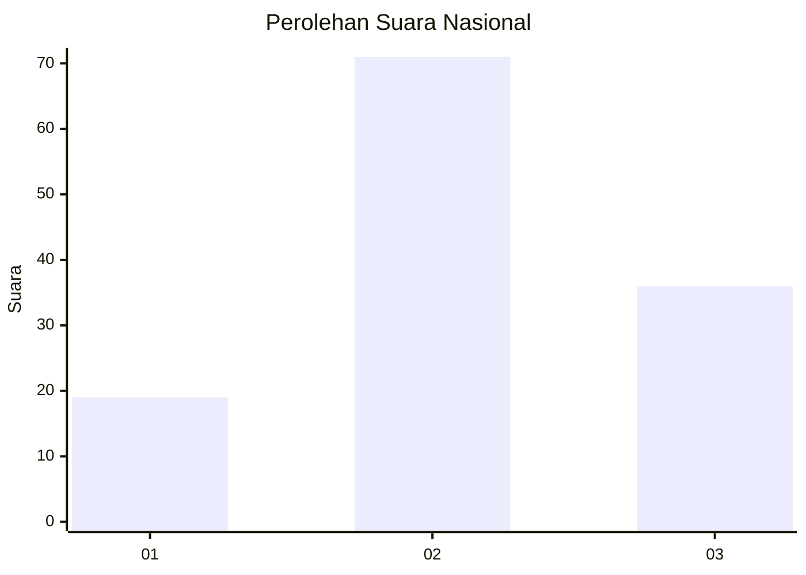
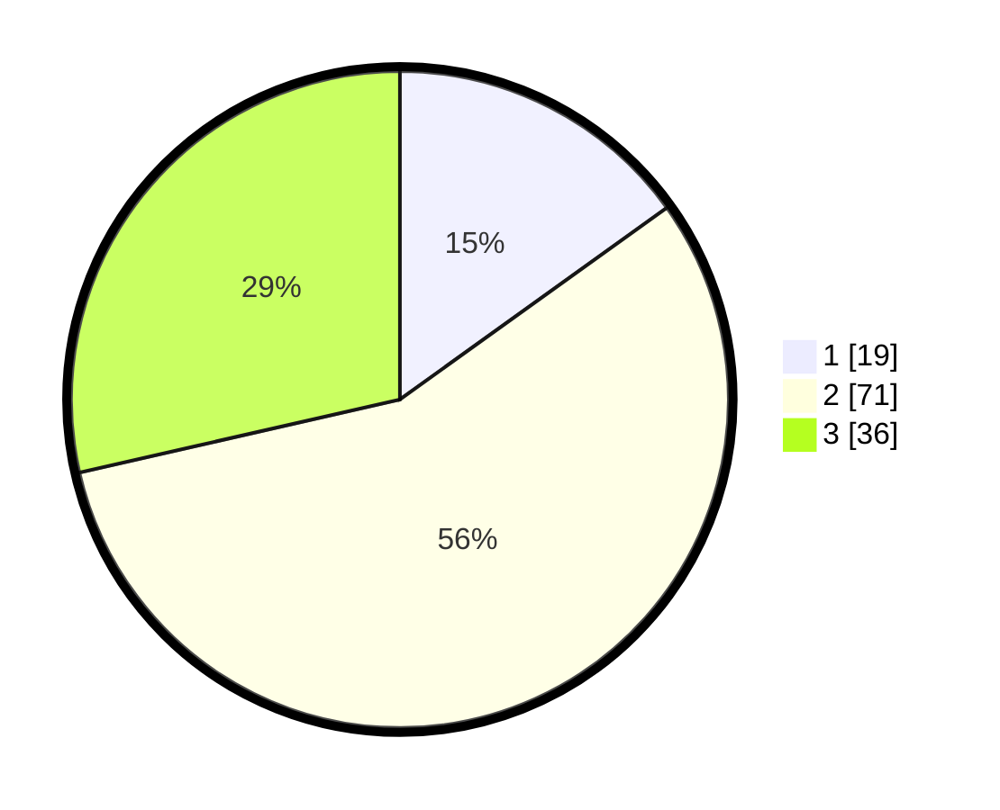

# Hasil

## Grafik

## Tabel

| No. | Nama Paslon    | Suara | Suara (raw) | Persentase |
|:--- |:-------------- | -----:| -----------:| ----------:|
| 1   | ANIES MUHAIMIN | 19    | [19][p-1]   | 15,08      |
| 2   | PRABOWO GIBRAN | 71    | [71][p-2]   | 56,35      |
| 3   | GANJAR MAHFUD  | 36    | [36][p-3]   | 28,57      |

[p-1]: https://github.com/gigit-pemilu/pemilu-2024/blob/main/pilpres/hitung-suara/sub/16-sumatera-selatan/sub/06-musi-banyuasin/sub/09-bayung-lencir/sub/2050-pangkalan-bayat/sub/004-tps/sub/paslon-1.txt
[p-2]: https://github.com/gigit-pemilu/pemilu-2024/blob/main/pilpres/hitung-suara/sub/16-sumatera-selatan/sub/06-musi-banyuasin/sub/09-bayung-lencir/sub/2050-pangkalan-bayat/sub/004-tps/sub/paslon-2.txt
[p-3]: https://github.com/gigit-pemilu/pemilu-2024/blob/main/pilpres/hitung-suara/sub/16-sumatera-selatan/sub/06-musi-banyuasin/sub/09-bayung-lencir/sub/2050-pangkalan-bayat/sub/004-tps/sub/paslon-3.txt

## Foto C Plano

https://sirekap-obj-formc.kpu.go.id/df11/pemilu/ppwp/16/06/09/20/50/1606092050004-20240215-005719--cf210103-b763-4fa8-a984-9b28a8e83e6b.jpg

https://sirekap-obj-formc.kpu.go.id/df11/pemilu/ppwp/16/06/09/20/50/1606092050004-20240215-005936--51746dd3-a9d0-439b-81ac-6b136da77c19.jpg

https://sirekap-obj-formc.kpu.go.id/df11/pemilu/ppwp/16/06/09/20/50/1606092050004-20240215-010335--830ead50-fe54-478c-8d41-78f0fae7077e.jpg

## Metadata

| Key        | Value               |
| ---------- | ------------------- |
| Time Stamp | 2024-02-16 12:51:22 |

