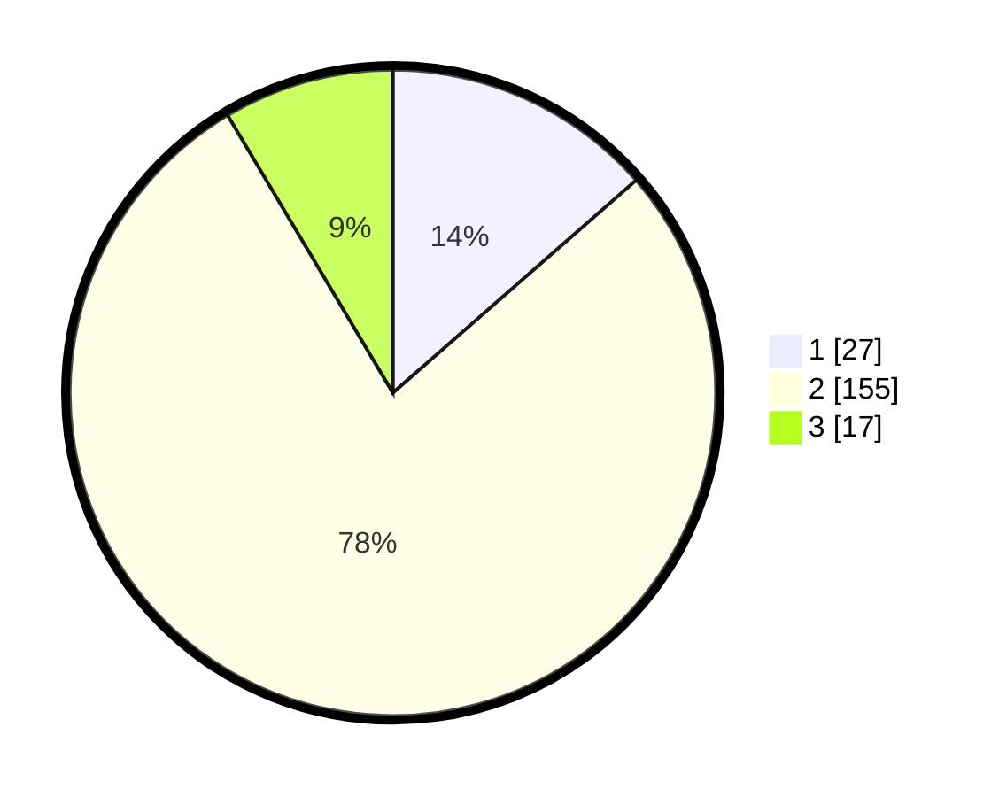

# Hasil

## Grafik

## Tabel

| No. | Nama Paslon    | Suara | Suara (raw) | Persentase |
|:--- |:-------------- | -----:| -----------:| ----------:|
| 1   | ANIES MUHAIMIN | 27    | [27][p-1]   | 13,57      |
| 2   | PRABOWO GIBRAN | 155   | [155][p-2]  | 77,89      |
| 3   | GANJAR MAHFUD  | 17    | [17][p-3]   | 8,54       |

[p-1]: https://github.com/gigit-pemilu/pemilu-2024/blob/main/pilpres/hitung-suara/sub/16-sumatera-selatan/sub/06-musi-banyuasin/sub/10-plakat-tinggi/sub/2001-sido-mukti/sub/001-tps/sub/paslon-1.txt
[p-2]: https://github.com/gigit-pemilu/pemilu-2024/blob/main/pilpres/hitung-suara/sub/16-sumatera-selatan/sub/06-musi-banyuasin/sub/10-plakat-tinggi/sub/2001-sido-mukti/sub/001-tps/sub/paslon-2.txt
[p-3]: https://github.com/gigit-pemilu/pemilu-2024/blob/main/pilpres/hitung-suara/sub/16-sumatera-selatan/sub/06-musi-banyuasin/sub/10-plakat-tinggi/sub/2001-sido-mukti/sub/001-tps/sub/paslon-3.txt

## Foto C Plano

https://sirekap-obj-formc.kpu.go.id/0a25/pemilu/ppwp/16/06/10/20/01/1606102001001-20240214-233408--5350fe24-de36-4f28-8ffe-c8027880b1c6.jpg

https://sirekap-obj-formc.kpu.go.id/0a25/pemilu/ppwp/16/06/10/20/01/1606102001001-20240214-233634--27df7d34-290f-48fc-bbc3-e1686646ef94.jpg

https://sirekap-obj-formc.kpu.go.id/0a25/pemilu/ppwp/16/06/10/20/01/1606102001001-20240215-163022--066715f2-fc97-408f-a5dc-df566c91f1e2.jpg

## Metadata

| Key        | Value               |
| ---------- | ------------------- |
| Time Stamp | 2024-02-17 16:36:25 |

