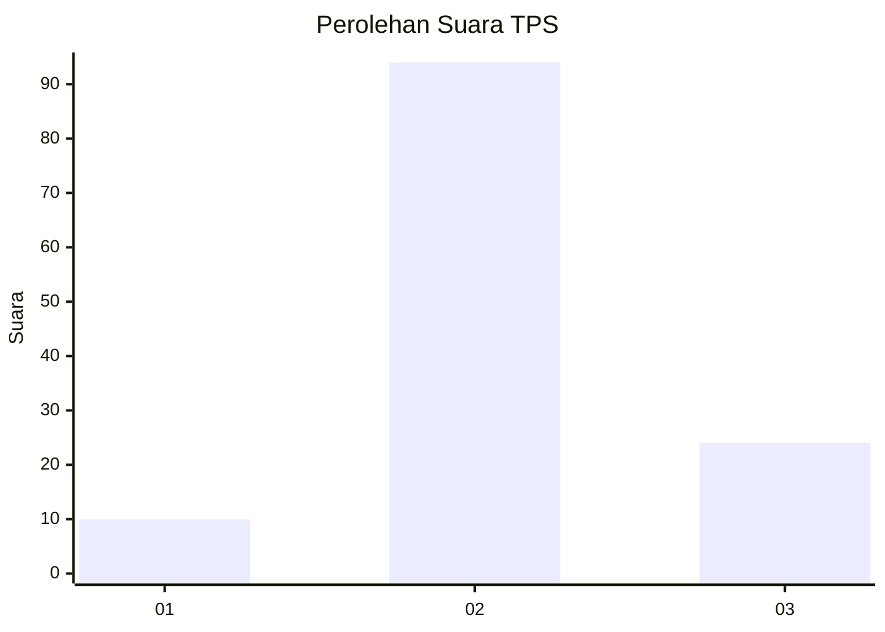
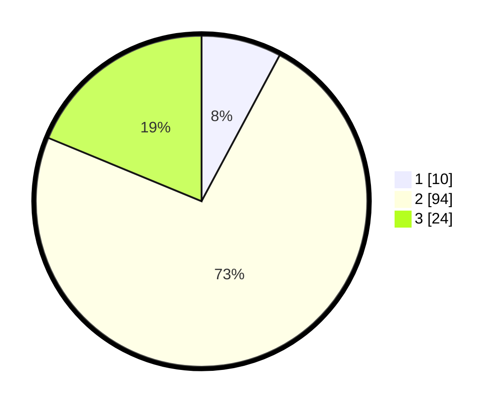

# Hasil

## Grafik

## Tabel

| No. | Nama Paslon    | Suara | Suara (raw) | Persentase |
|:--- |:-------------- | -----:| -----------:| ----------:|
| 1   | ANIES MUHAIMIN | 10    | [10][p-1]   | 7,81       |
| 2   | PRABOWO GIBRAN | 94    | [94][p-2]   | 73,44      |
| 3   | GANJAR MAHFUD  | 24    | [24][p-3]   | 18,75      |

[p-1]: https://github.com/gigit-pemilu/pemilu-2024-16-sumatera-selatan/blob/main/pilpres/hitung-suara/sub/16-sumatera-selatan/sub/06-musi-banyuasin/sub/11-lalan/sub/2001-karang-agung/sub/002-tps/sub/paslon-1.txt
[p-2]: https://github.com/gigit-pemilu/pemilu-2024-16-sumatera-selatan/blob/main/pilpres/hitung-suara/sub/16-sumatera-selatan/sub/06-musi-banyuasin/sub/11-lalan/sub/2001-karang-agung/sub/002-tps/sub/paslon-2.txt
[p-3]: https://github.com/gigit-pemilu/pemilu-2024-16-sumatera-selatan/blob/main/pilpres/hitung-suara/sub/16-sumatera-selatan/sub/06-musi-banyuasin/sub/11-lalan/sub/2001-karang-agung/sub/002-tps/sub/paslon-3.txt

## Foto C Plano

https://sirekap-obj-formc.kpu.go.id/9c82/pemilu/ppwp/16/06/11/20/01/1606112001002-20240214-224820--e75e5501-e70b-4cdf-af3a-e11f6823ed71.jpg

https://sirekap-obj-formc.kpu.go.id/9c82/pemilu/ppwp/16/06/11/20/01/1606112001002-20240214-232142--78b32d8f-0873-469d-aed8-3b1719d3f05f.jpg

https://sirekap-obj-formc.kpu.go.id/9c82/pemilu/ppwp/16/06/11/20/01/1606112001002-20240214-232312--549b77f0-9e96-4933-ac4d-ac5a5dbc7980.jpg

## Metadata

| Key        | Value               |
| ---------- | ------------------- |
| Time Stamp | 2024-02-15 09:00:24 |

