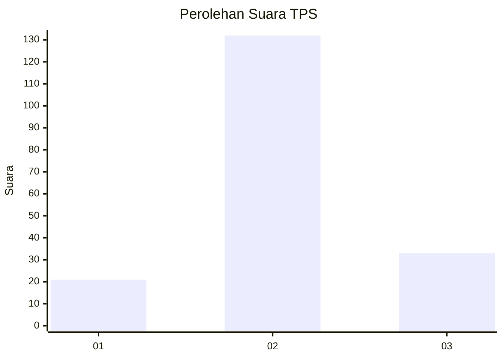
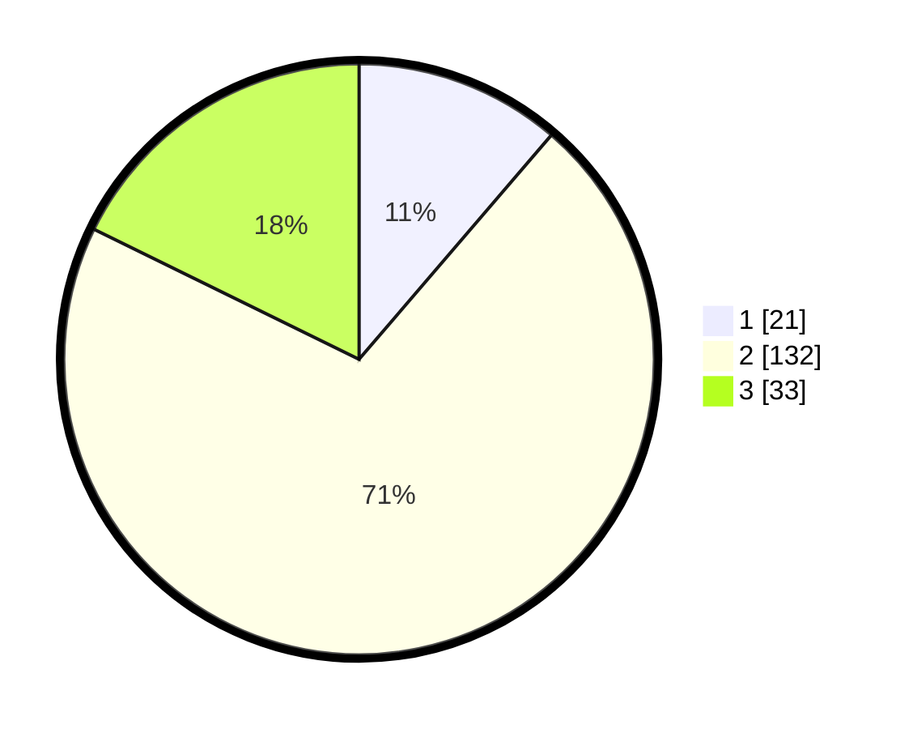

# Hasil

## Grafik

## Tabel

| No. | Nama Paslon    | Suara | Suara (raw) | Persentase |
|:--- |:-------------- | -----:| -----------:| ----------:|
| 1   | ANIES MUHAIMIN | 21    | [21][p-1]   | 11,29      |
| 2   | PRABOWO GIBRAN | 132   | [132][p-2]  | 70,97      |
| 3   | GANJAR MAHFUD  | 33    | [33][p-3]   | 17,74      |

[p-1]: https://github.com/gigit-pemilu/pemilu-2024-16-sumatera-selatan/blob/main/pilpres/hitung-suara/sub/16-sumatera-selatan/sub/06-musi-banyuasin/sub/11-lalan/sub/2001-karang-agung/sub/005-tps/sub/paslon-1.txt
[p-2]: https://github.com/gigit-pemilu/pemilu-2024-16-sumatera-selatan/blob/main/pilpres/hitung-suara/sub/16-sumatera-selatan/sub/06-musi-banyuasin/sub/11-lalan/sub/2001-karang-agung/sub/005-tps/sub/paslon-2.txt
[p-3]: https://github.com/gigit-pemilu/pemilu-2024-16-sumatera-selatan/blob/main/pilpres/hitung-suara/sub/16-sumatera-selatan/sub/06-musi-banyuasin/sub/11-lalan/sub/2001-karang-agung/sub/005-tps/sub/paslon-3.txt

## Foto C Plano

https://sirekap-obj-formc.kpu.go.id/025a/pemilu/ppwp/16/06/11/20/01/1606112001005-20240215-114616--061b8e86-4702-413f-b9b1-2af73fa4d462.jpg

https://sirekap-obj-formc.kpu.go.id/025a/pemilu/ppwp/16/06/11/20/01/1606112001005-20240215-115330--0b7cf231-4a45-4e41-8b9a-5f131d663ef7.jpg

https://sirekap-obj-formc.kpu.go.id/025a/pemilu/ppwp/16/06/11/20/01/1606112001005-20240215-115506--97bf07f0-09c6-4a05-8b78-faa6381dd14b.jpg

## Metadata

| Key        | Value               |
| ---------- | ------------------- |
| Time Stamp | 2024-02-19 06:16:00 |

