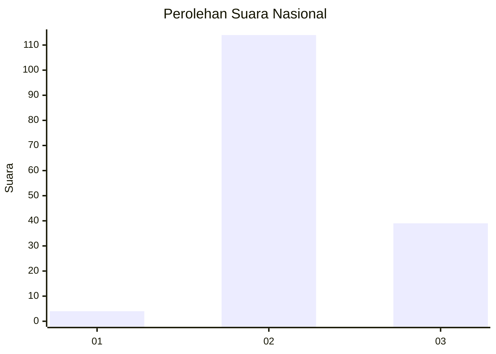
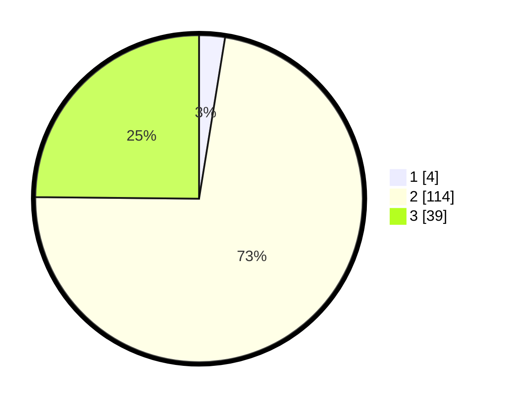

# Hasil

## Grafik

## Tabel

| No. | Nama Paslon    | Suara | Suara (raw) | Persentase |
|:--- |:-------------- | -----:| -----------:| ----------:|
| 1   | ANIES MUHAIMIN | 4     | [4][p-1]    | 2,55       |
| 2   | PRABOWO GIBRAN | 114   | [114][p-2]  | 72,61      |
| 3   | GANJAR MAHFUD  | 39    | [39][p-3]   | 24,84      |

[p-1]: https://github.com/gigit-pemilu/pemilu-2024/blob/main/pilpres/hitung-suara/sub/16-sumatera-selatan/sub/06-musi-banyuasin/sub/12-tungkal-jaya/sub/2005-pangkalan-tungkal/sub/002-tps/sub/paslon-1.txt
[p-2]: https://github.com/gigit-pemilu/pemilu-2024/blob/main/pilpres/hitung-suara/sub/16-sumatera-selatan/sub/06-musi-banyuasin/sub/12-tungkal-jaya/sub/2005-pangkalan-tungkal/sub/002-tps/sub/paslon-2.txt
[p-3]: https://github.com/gigit-pemilu/pemilu-2024/blob/main/pilpres/hitung-suara/sub/16-sumatera-selatan/sub/06-musi-banyuasin/sub/12-tungkal-jaya/sub/2005-pangkalan-tungkal/sub/002-tps/sub/paslon-3.txt

## Foto C Plano

https://sirekap-obj-formc.kpu.go.id/9d15/pemilu/ppwp/16/06/12/20/05/1606122005002-20240218-152013--c497f09d-aef4-43b4-ad9d-86837ba6bb07.jpg

https://sirekap-obj-formc.kpu.go.id/9d15/pemilu/ppwp/16/06/12/20/05/1606122005002-20240218-151151--b3a8ef66-827e-4e7a-9d3f-555bfeada675.jpg

https://sirekap-obj-formc.kpu.go.id/9d15/pemilu/ppwp/16/06/12/20/05/1606122005002-20240218-152412--f5efd0b7-b9cc-453f-9afc-11d1f05b3eeb.jpg

## Metadata

| Key        | Value               |
| ---------- | ------------------- |
| Time Stamp | 2024-02-26 12:00:00 |

