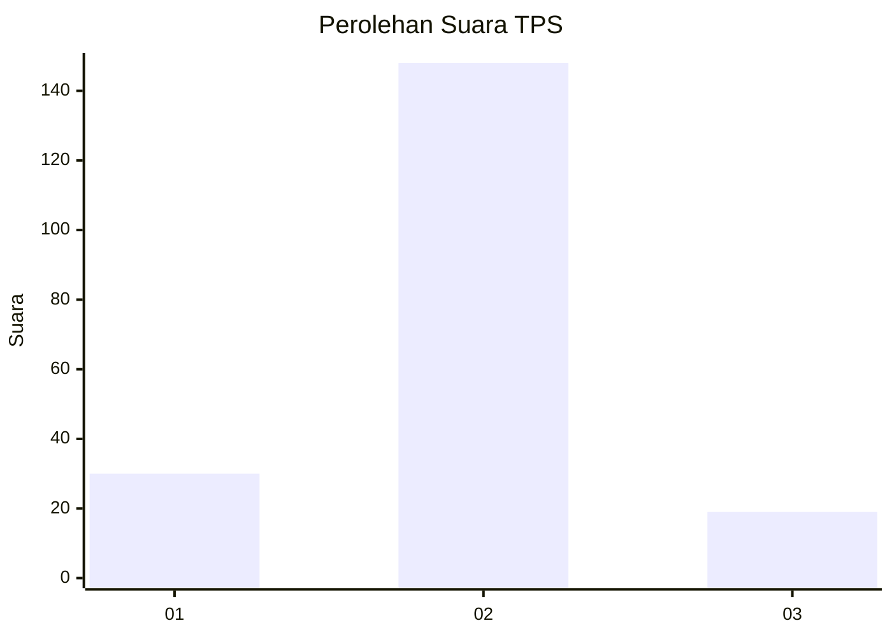
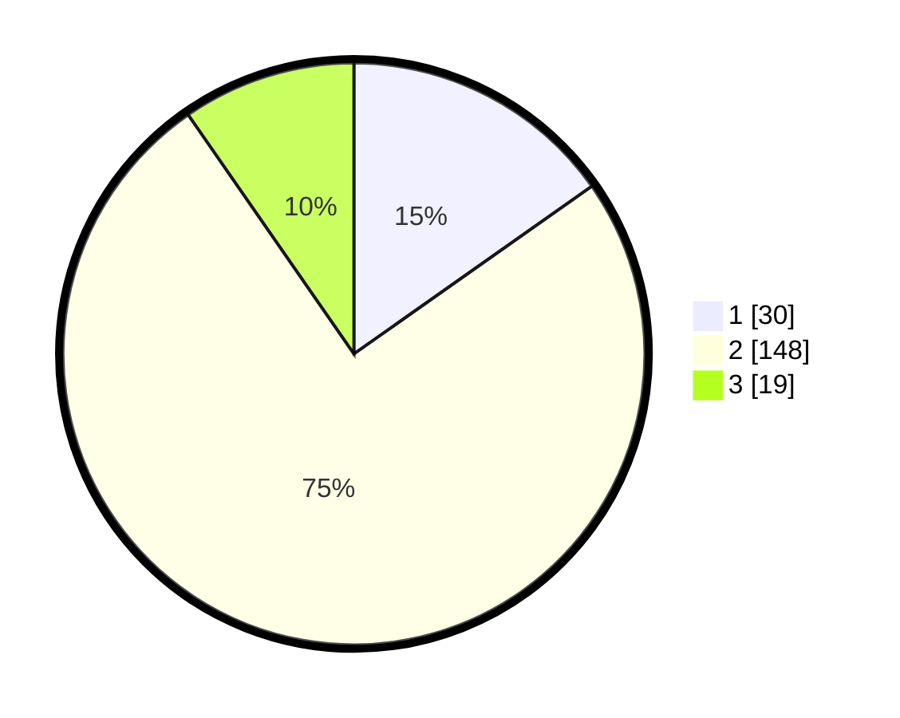

# Hasil

## Grafik

## Tabel

| No. | Nama Paslon    | Suara | Suara (raw) | Persentase |
|:--- |:-------------- | -----:| -----------:| ----------:|
| 1   | ANIES MUHAIMIN | 30    | [30][p-1]   | 15,23      |
| 2   | PRABOWO GIBRAN | 148   | [148][p-2]  | 75,13      |
| 3   | GANJAR MAHFUD  | 19    | [19][p-3]   | 9,64       |

[p-1]: https://github.com/gigit-pemilu/pemilu-2024-16-sumatera-selatan/blob/main/pilpres/hitung-suara/sub/16-sumatera-selatan/sub/06-musi-banyuasin/sub/13-lawang-wetan/sub/2001-ulak-paceh/sub/001-tps/sub/paslon-1.txt
[p-2]: https://github.com/gigit-pemilu/pemilu-2024-16-sumatera-selatan/blob/main/pilpres/hitung-suara/sub/16-sumatera-selatan/sub/06-musi-banyuasin/sub/13-lawang-wetan/sub/2001-ulak-paceh/sub/001-tps/sub/paslon-2.txt
[p-3]: https://github.com/gigit-pemilu/pemilu-2024-16-sumatera-selatan/blob/main/pilpres/hitung-suara/sub/16-sumatera-selatan/sub/06-musi-banyuasin/sub/13-lawang-wetan/sub/2001-ulak-paceh/sub/001-tps/sub/paslon-3.txt

## Foto C Plano

https://sirekap-obj-formc.kpu.go.id/8aaa/pemilu/ppwp/16/06/13/20/01/1606132001001-20240220-093335--834ffaa9-5455-404f-a413-26c63e152d29.jpg

https://sirekap-obj-formc.kpu.go.id/8aaa/pemilu/ppwp/16/06/13/20/01/1606132001001-20240220-093417--d4ccac8d-e5bf-4d9d-9da8-cc76caa50798.jpg

https://sirekap-obj-formc.kpu.go.id/8aaa/pemilu/ppwp/16/06/13/20/01/1606132001001-20240220-093455--a9856785-4d8f-4a1c-a3f8-2f5e8e372768.jpg

## Metadata

| Key        | Value               |
| ---------- | ------------------- |
| Time Stamp | 2024-02-24 23:00:00 |

