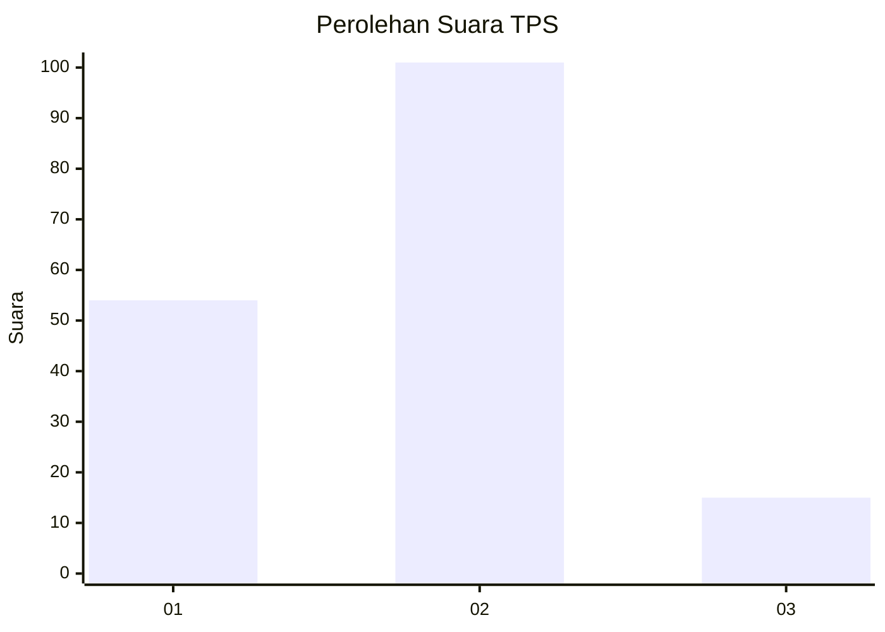
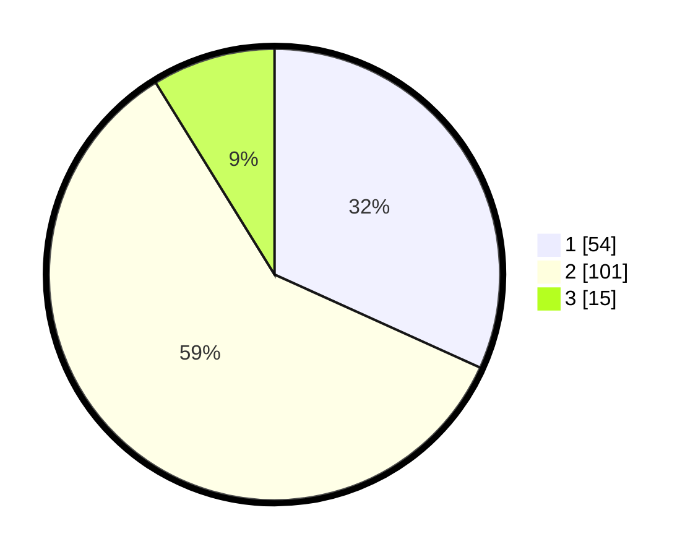

# Hasil

## Grafik

## Tabel

| No. | Nama Paslon    | Suara | Suara (raw) | Persentase |
|:--- |:-------------- | -----:| -----------:| ----------:|
| 1   | ANIES MUHAIMIN | 54    | [54][p-1]   | 31,76      |
| 2   | PRABOWO GIBRAN | 101   | [101][p-2]  | 59,41      |
| 3   | GANJAR MAHFUD  | 15    | [15][p-3]   | 8,82       |

[p-1]: https://github.com/gigit-pemilu/pemilu-2024-16-sumatera-selatan/blob/main/pilpres/hitung-suara/sub/16-sumatera-selatan/sub/06-musi-banyuasin/sub/13-lawang-wetan/sub/2001-ulak-paceh/sub/003-tps/sub/paslon-1.txt
[p-2]: https://github.com/gigit-pemilu/pemilu-2024-16-sumatera-selatan/blob/main/pilpres/hitung-suara/sub/16-sumatera-selatan/sub/06-musi-banyuasin/sub/13-lawang-wetan/sub/2001-ulak-paceh/sub/003-tps/sub/paslon-2.txt
[p-3]: https://github.com/gigit-pemilu/pemilu-2024-16-sumatera-selatan/blob/main/pilpres/hitung-suara/sub/16-sumatera-selatan/sub/06-musi-banyuasin/sub/13-lawang-wetan/sub/2001-ulak-paceh/sub/003-tps/sub/paslon-3.txt

## Foto C Plano

https://sirekap-obj-formc.kpu.go.id/d1f5/pemilu/ppwp/16/06/13/20/01/1606132001003-20240215-023602--14b75507-59c9-4461-b55c-807c9e5295f1.jpg

https://sirekap-obj-formc.kpu.go.id/d1f5/pemilu/ppwp/16/06/13/20/01/1606132001003-20240215-025333--efe05776-6860-4e66-b906-0146ad8967f7.jpg

https://sirekap-obj-formc.kpu.go.id/d1f5/pemilu/ppwp/16/06/13/20/01/1606132001003-20240215-025547--e238c3d9-7945-4c6e-8338-4fd7d97840f9.jpg

## Metadata

| Key        | Value               |
| ---------- | ------------------- |
| Time Stamp | 2024-02-26 14:00:00 |

