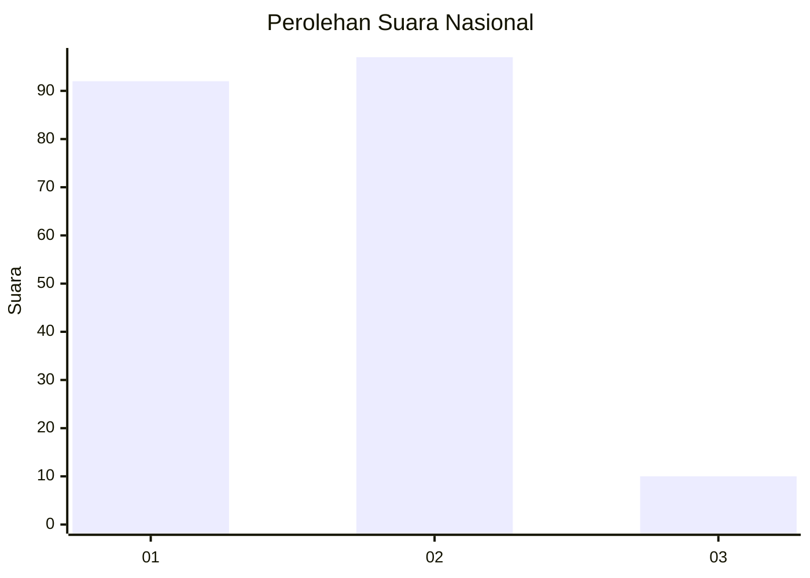
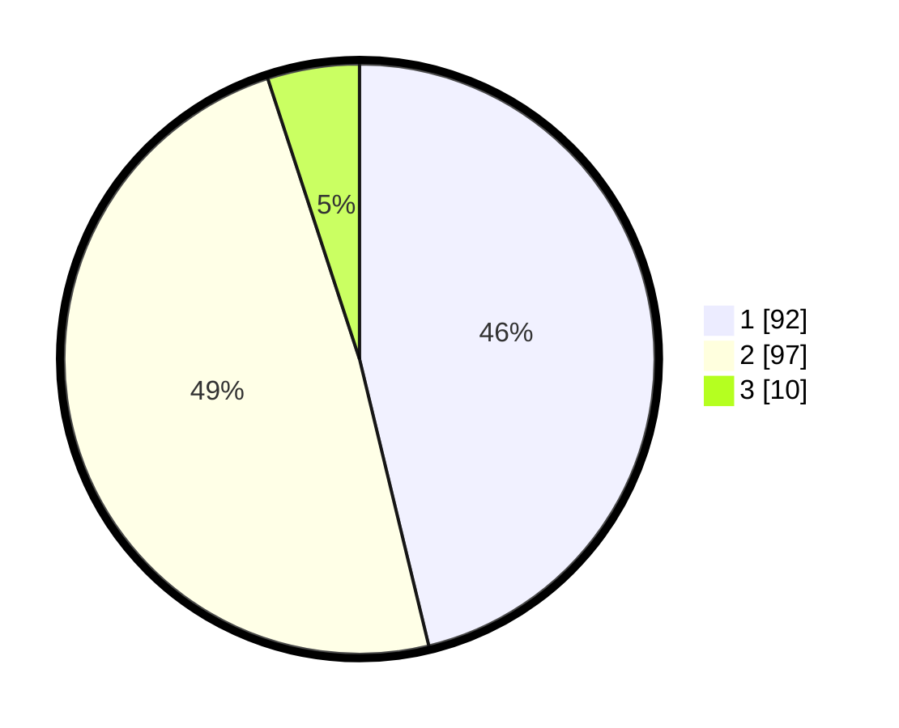

# Hasil

## Grafik

## Tabel

| No. | Nama Paslon    | Suara | Suara (raw) | Persentase |
|:--- |:-------------- | -----:| -----------:| ----------:|
| 1   | ANIES MUHAIMIN | 92    | [92][p-1]   | 46,23      |
| 2   | PRABOWO GIBRAN | 97    | [97][p-2]   | 48,74      |
| 3   | GANJAR MAHFUD  | 10    | [10][p-3]   | 5,03       |

[p-1]: https://github.com/gigit-pemilu/pemilu-2024/blob/main/pilpres/hitung-suara/sub/16-sumatera-selatan/sub/06-musi-banyuasin/sub/13-lawang-wetan/sub/2002-ulak-paceh-jaya/sub/006-tps/sub/paslon-1.txt
[p-2]: https://github.com/gigit-pemilu/pemilu-2024/blob/main/pilpres/hitung-suara/sub/16-sumatera-selatan/sub/06-musi-banyuasin/sub/13-lawang-wetan/sub/2002-ulak-paceh-jaya/sub/006-tps/sub/paslon-2.txt
[p-3]: https://github.com/gigit-pemilu/pemilu-2024/blob/main/pilpres/hitung-suara/sub/16-sumatera-selatan/sub/06-musi-banyuasin/sub/13-lawang-wetan/sub/2002-ulak-paceh-jaya/sub/006-tps/sub/paslon-3.txt

## Foto C Plano

https://sirekap-obj-formc.kpu.go.id/3242/pemilu/ppwp/16/06/13/20/02/1606132002006-20240218-141226--74640f0e-134d-4ba6-8d92-0c639d83e570.jpg

https://sirekap-obj-formc.kpu.go.id/3242/pemilu/ppwp/16/06/13/20/02/1606132002006-20240218-141320--9b33ff69-bc5b-4911-9819-1b62981a7609.jpg

https://sirekap-obj-formc.kpu.go.id/3242/pemilu/ppwp/16/06/13/20/02/1606132002006-20240218-141350--e487ae1c-b5f4-44bf-9d46-711c30af5809.jpg

## Metadata

| Key        | Value               |
| ---------- | ------------------- |
| Time Stamp | 2024-02-25 00:00:00 |

