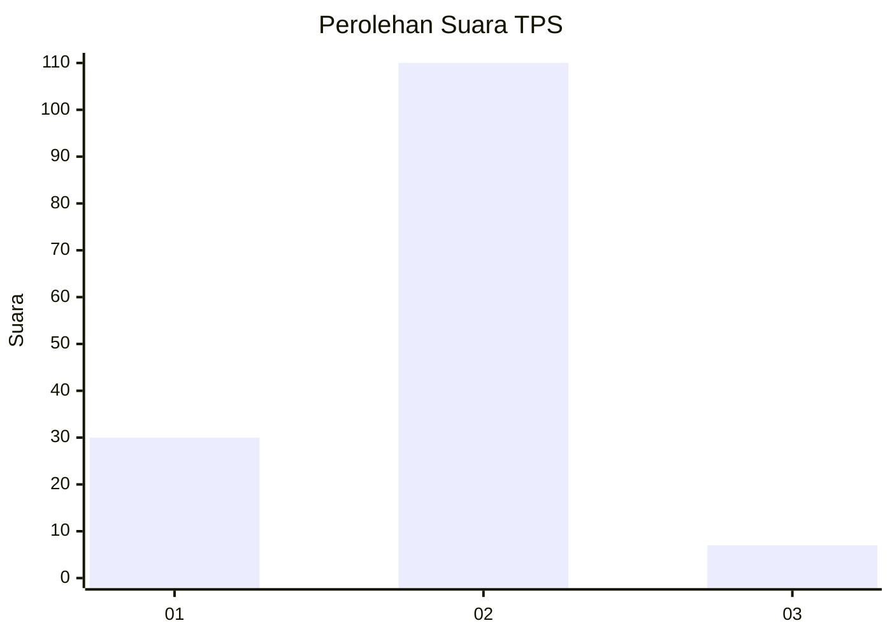
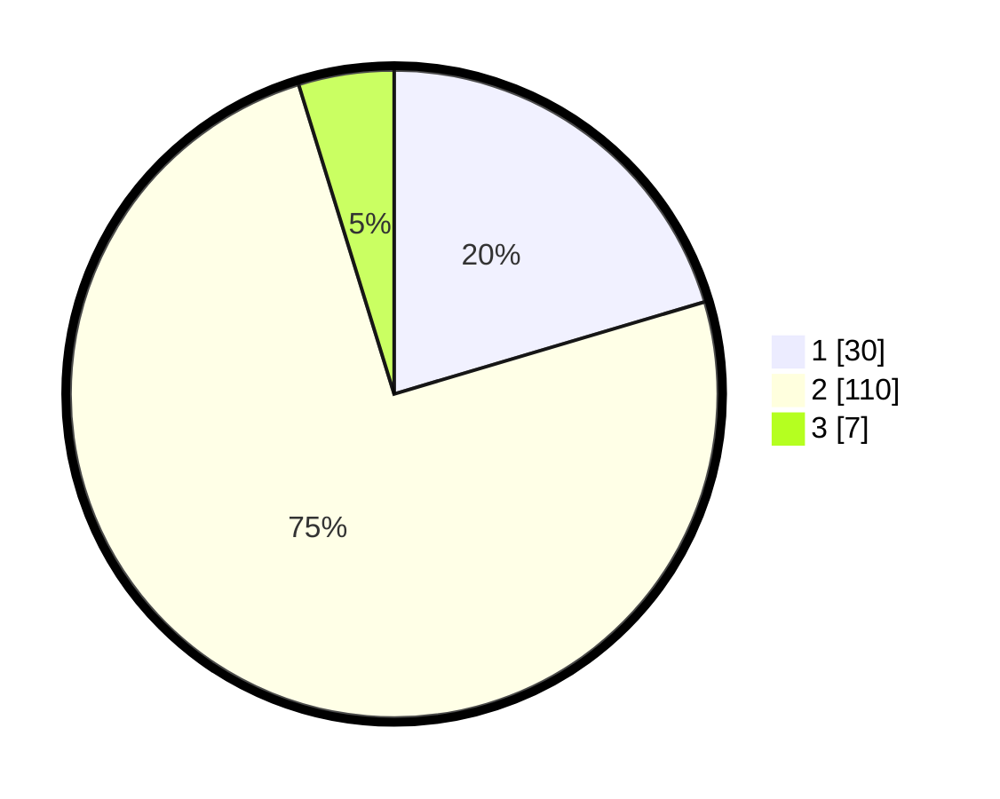

# Hasil

## Grafik

## Tabel

| No. | Nama Paslon    | Suara | Suara (raw) | Persentase |
|:--- |:-------------- | -----:| -----------:| ----------:|
| 1   | ANIES MUHAIMIN | 30    | [30][p-1]   | 20,41      |
| 2   | PRABOWO GIBRAN | 110   | [110][p-2]  | 74,83      |
| 3   | GANJAR MAHFUD  | 7     | [7][p-3]    | 4,76       |

[p-1]: https://github.com/gigit-pemilu/pemilu-2024-16-sumatera-selatan/blob/main/pilpres/hitung-suara/sub/16-sumatera-selatan/sub/06-musi-banyuasin/sub/13-lawang-wetan/sub/2013-simpang-sari/sub/001-tps/sub/paslon-1.txt
[p-2]: https://github.com/gigit-pemilu/pemilu-2024-16-sumatera-selatan/blob/main/pilpres/hitung-suara/sub/16-sumatera-selatan/sub/06-musi-banyuasin/sub/13-lawang-wetan/sub/2013-simpang-sari/sub/001-tps/sub/paslon-2.txt
[p-3]: https://github.com/gigit-pemilu/pemilu-2024-16-sumatera-selatan/blob/main/pilpres/hitung-suara/sub/16-sumatera-selatan/sub/06-musi-banyuasin/sub/13-lawang-wetan/sub/2013-simpang-sari/sub/001-tps/sub/paslon-3.txt

## Foto C Plano

https://sirekap-obj-formc.kpu.go.id/7e25/pemilu/ppwp/16/06/13/20/13/1606132013001-20240218-150307--acded7a9-3bd9-4408-adf4-f96239cc23ad.jpg

https://sirekap-obj-formc.kpu.go.id/7e25/pemilu/ppwp/16/06/13/20/13/1606132013001-20240218-150349--af432f71-d931-42e1-93e7-78a2ce87a58f.jpg

https://sirekap-obj-formc.kpu.go.id/7e25/pemilu/ppwp/16/06/13/20/13/1606132013001-20240218-145908--ed11238d-1033-40fc-b164-eab72da4790a.jpg

## Metadata

| Key        | Value               |
| ---------- | ------------------- |
| Time Stamp | 2024-02-25 18:00:00 |

