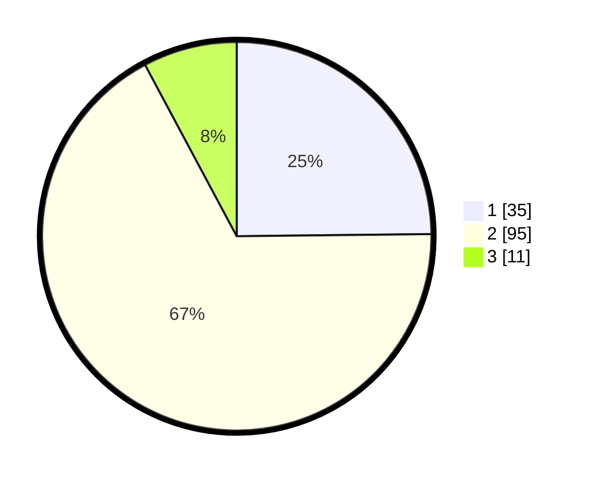

# Hasil

## Grafik

## Tabel

| No. | Nama Paslon    | Suara | Suara (raw) | Persentase |
|:--- |:-------------- | -----:| -----------:| ----------:|
| 1   | ANIES MUHAIMIN | 35    | [35][p-1]   | 24,82      |
| 2   | PRABOWO GIBRAN | 95    | [95][p-2]   | 67,38      |
| 3   | GANJAR MAHFUD  | 11    | [11][p-3]   | 7,80       |

[p-1]: https://github.com/gigit-pemilu/pemilu-2024-16-sumatera-selatan/blob/main/pilpres/hitung-suara/sub/16-sumatera-selatan/sub/06-musi-banyuasin/sub/13-lawang-wetan/sub/2015-pandan-dulang/sub/001-tps/sub/paslon-1.txt
[p-2]: https://github.com/gigit-pemilu/pemilu-2024-16-sumatera-selatan/blob/main/pilpres/hitung-suara/sub/16-sumatera-selatan/sub/06-musi-banyuasin/sub/13-lawang-wetan/sub/2015-pandan-dulang/sub/001-tps/sub/paslon-2.txt
[p-3]: https://github.com/gigit-pemilu/pemilu-2024-16-sumatera-selatan/blob/main/pilpres/hitung-suara/sub/16-sumatera-selatan/sub/06-musi-banyuasin/sub/13-lawang-wetan/sub/2015-pandan-dulang/sub/001-tps/sub/paslon-3.txt

## Foto C Plano

https://sirekap-obj-formc.kpu.go.id/8ba6/pemilu/ppwp/16/06/13/20/15/1606132015001-20240218-121405--d16689bc-d8f9-4b1d-936c-29d9f67cb0e6.jpg

https://sirekap-obj-formc.kpu.go.id/8ba6/pemilu/ppwp/16/06/13/20/15/1606132015001-20240218-121440--f1221238-a946-43eb-b3cf-e8af6d51d17c.jpg

https://sirekap-obj-formc.kpu.go.id/8ba6/pemilu/ppwp/16/06/13/20/15/1606132015001-20240218-121522--96e20902-f3b8-4a04-b027-b842f0fb70b0.jpg

## Metadata

| Key        | Value               |
| ---------- | ------------------- |
| Time Stamp | 2024-02-25 21:00:00 |

