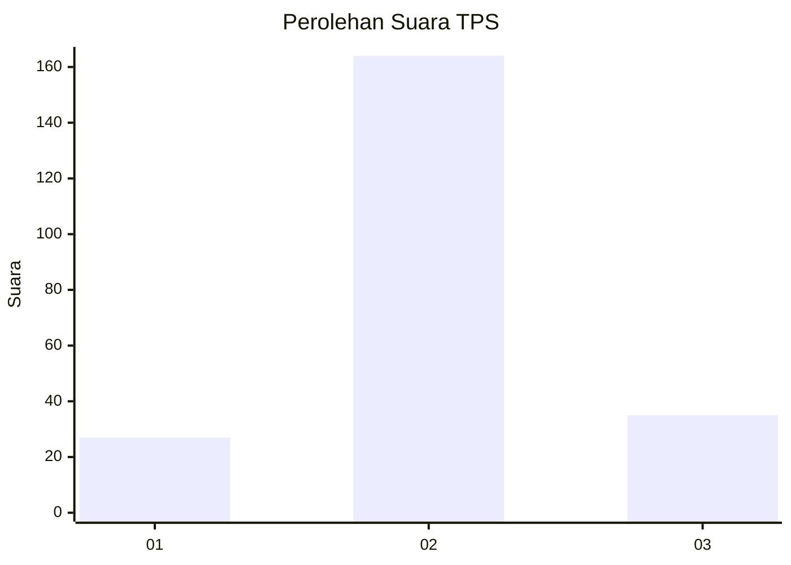
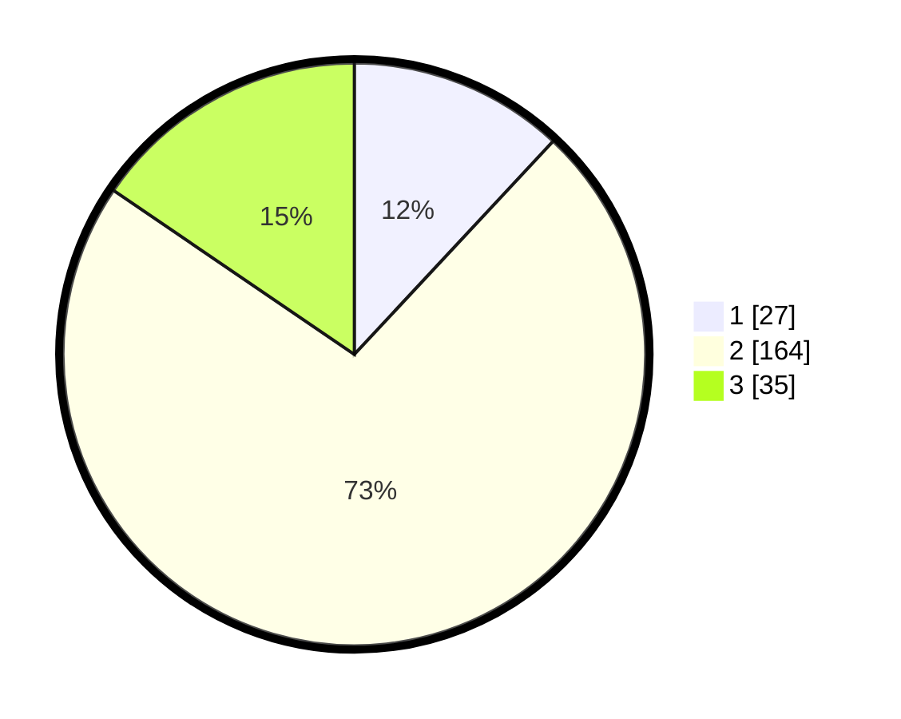

# Hasil

## Grafik

## Tabel

| No. | Nama Paslon    | Suara | Suara (raw) | Persentase |
|:--- |:-------------- | -----:| -----------:| ----------:|
| 1   | ANIES MUHAIMIN | 27    | [27][p-1]   | 11,95      |
| 2   | PRABOWO GIBRAN | 164   | [164][p-2]  | 72,57      |
| 3   | GANJAR MAHFUD  | 35    | [35][p-3]   | 15,49      |

[p-1]: https://github.com/gigit-pemilu/pemilu-2024-16-sumatera-selatan/blob/main/pilpres/hitung-suara/sub/16-sumatera-selatan/sub/06-musi-banyuasin/sub/14-babat-supat/sub/2001-suka-maju/sub/004-tps/sub/paslon-1.txt
[p-2]: https://github.com/gigit-pemilu/pemilu-2024-16-sumatera-selatan/blob/main/pilpres/hitung-suara/sub/16-sumatera-selatan/sub/06-musi-banyuasin/sub/14-babat-supat/sub/2001-suka-maju/sub/004-tps/sub/paslon-2.txt
[p-3]: https://github.com/gigit-pemilu/pemilu-2024-16-sumatera-selatan/blob/main/pilpres/hitung-suara/sub/16-sumatera-selatan/sub/06-musi-banyuasin/sub/14-babat-supat/sub/2001-suka-maju/sub/004-tps/sub/paslon-3.txt

## Foto C Plano

https://sirekap-obj-formc.kpu.go.id/ec0d/pemilu/ppwp/16/06/14/20/01/1606142001004-20240215-033520--c59a39d9-9386-4ab9-abb6-1927dce9b5fd.jpg

https://sirekap-obj-formc.kpu.go.id/ec0d/pemilu/ppwp/16/06/14/20/01/1606142001004-20240215-032154--0c6a2bd1-69ae-48a9-86cc-0286421a151e.jpg

https://sirekap-obj-formc.kpu.go.id/ec0d/pemilu/ppwp/16/06/14/20/01/1606142001004-20240215-032408--64dc07de-857c-4cf3-b485-cbd0eeb7cd0a.jpg

## Metadata

| Key        | Value               |
| ---------- | ------------------- |
| Time Stamp | 2024-02-17 18:00:00 |

