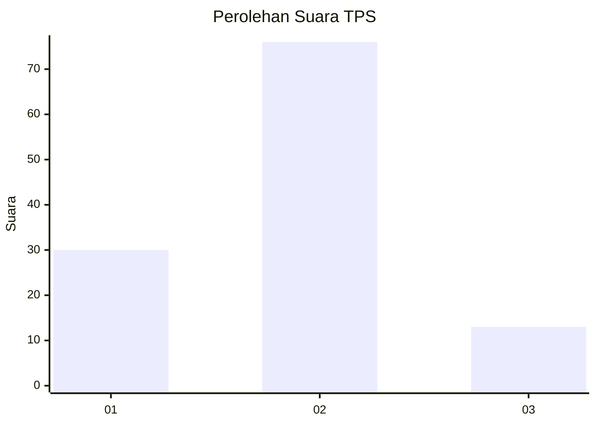

# Hasil

## Grafik

## Tabel

| No. | Nama Paslon    | Suara | Suara (raw) | Persentase |
|:--- |:-------------- | -----:| -----------:| ----------:|
| 1   | ANIES MUHAIMIN | 30    | [30][p-1]   | 25,21      |
| 2   | PRABOWO GIBRAN | 76    | [76][p-2]   | 63,87      |
| 3   | GANJAR MAHFUD  | 13    | [13][p-3]   | 10,92      |

[p-1]: https://github.com/gigit-pemilu/pemilu-2024-16-sumatera-selatan/blob/main/pilpres/hitung-suara/sub/16-sumatera-selatan/sub/06-musi-banyuasin/sub/14-babat-supat/sub/2003-supat/sub/005-tps/sub/paslon-1.txt
[p-2]: https://github.com/gigit-pemilu/pemilu-2024-16-sumatera-selatan/blob/main/pilpres/hitung-suara/sub/16-sumatera-selatan/sub/06-musi-banyuasin/sub/14-babat-supat/sub/2003-supat/sub/005-tps/sub/paslon-2.txt
[p-3]: https://github.com/gigit-pemilu/pemilu-2024-16-sumatera-selatan/blob/main/pilpres/hitung-suara/sub/16-sumatera-selatan/sub/06-musi-banyuasin/sub/14-babat-supat/sub/2003-supat/sub/005-tps/sub/paslon-3.txt

## Foto C Plano

https://sirekap-obj-formc.kpu.go.id/f6ff/pemilu/ppwp/16/06/14/20/03/1606142003005-20240217-164943--db2b5feb-ead9-49cc-b1dc-4dde4f37152d.jpg

https://sirekap-obj-formc.kpu.go.id/f6ff/pemilu/ppwp/16/06/14/20/03/1606142003005-20240217-164944--bcebf7da-ae00-4cba-9b78-f066b854cdda.jpg

https://sirekap-obj-formc.kpu.go.id/f6ff/pemilu/ppwp/16/06/14/20/03/1606142003005-20240217-164943--0b5222d5-c246-4260-bea5-3552cda023dc.jpg

## Metadata

| Key        | Value               |
| ---------- | ------------------- |
| Time Stamp | 2024-02-17 18:00:00 |

## DATA PEMILIH TETAP

Jumlah pemilih dalam DPT: **132**.
 * L: **65**.
 * P: **67**.

## DATA PENGGUNA HAK PILIH

Jumlah pengguna hak pilih dalam DPT: **118**.
 * L: **58**.
 * P: **60**.

Jumlah pengguna hak pilih dalam DPTb: **2**.
 * L: **2**.
 * P: **0**.

Jumlah pengguna hak pilih dalam DPK: **0**.
 * L: **0**.
 * P: **0**.

Jumlah pengguna hak pilih: **120**.
 * L: **60**.
 * P: **60**.

## JUMLAH SUARA SAH DAN TIDAK SAH

JUMLAH SELURUH SUARA SAH: **30**.

JUMLAH SUARA TIDAK SAH: **76**.

JUMLAH SELURUH SUARA SAH DAN SUARA TIDAK SAH: **13**.

