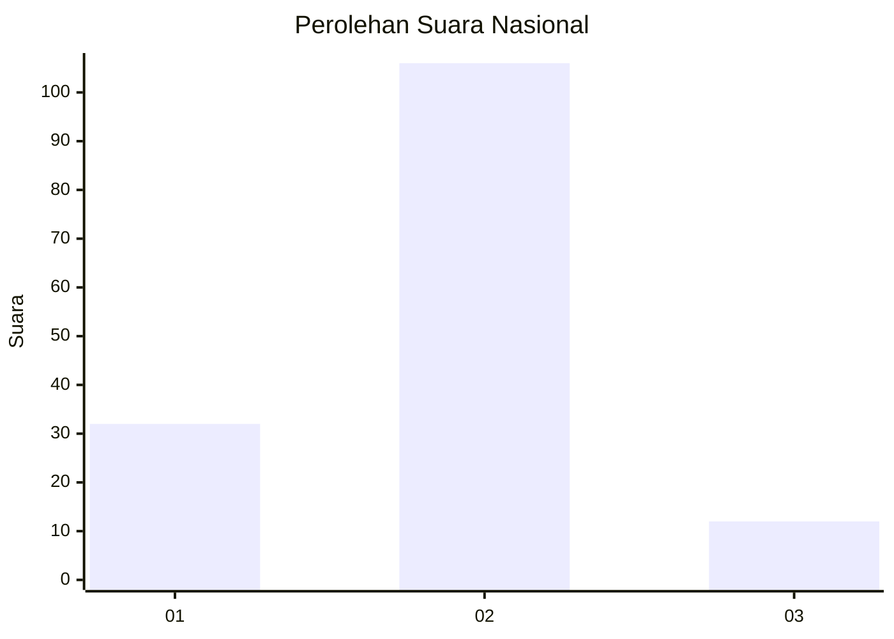
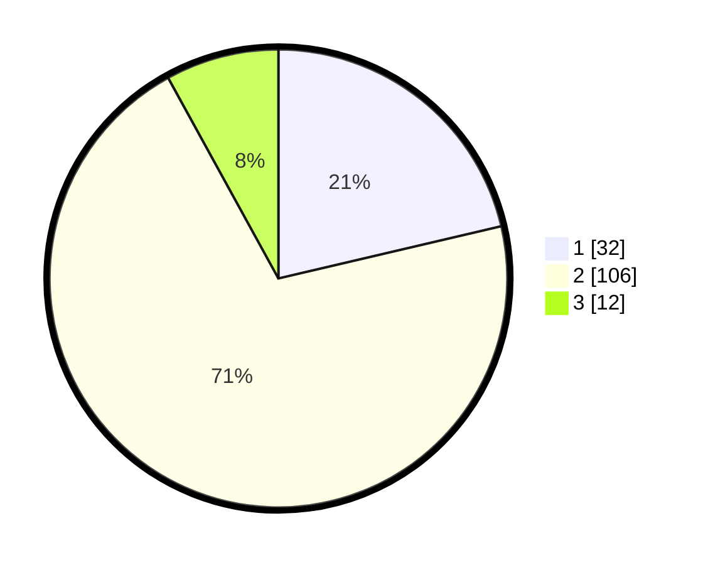

# Hasil

## Grafik

## Tabel

| No. | Nama Paslon    | Suara | Suara (raw) | Persentase |
|:--- |:-------------- | -----:| -----------:| ----------:|
| 1   | ANIES MUHAIMIN | 32    | [32][p-1]   | 21,33      |
| 2   | PRABOWO GIBRAN | 106   | [106][p-2]  | 70,67      |
| 3   | GANJAR MAHFUD  | 12    | [12][p-3]   | 8,00       |

[p-1]: https://github.com/gigit-pemilu/pemilu-2024/blob/main/pilpres/hitung-suara/sub/16-sumatera-selatan/sub/06-musi-banyuasin/sub/14-babat-supat/sub/2015-babat-ramba-jaya/sub/001-tps/sub/paslon-1.txt
[p-2]: https://github.com/gigit-pemilu/pemilu-2024/blob/main/pilpres/hitung-suara/sub/16-sumatera-selatan/sub/06-musi-banyuasin/sub/14-babat-supat/sub/2015-babat-ramba-jaya/sub/001-tps/sub/paslon-2.txt
[p-3]: https://github.com/gigit-pemilu/pemilu-2024/blob/main/pilpres/hitung-suara/sub/16-sumatera-selatan/sub/06-musi-banyuasin/sub/14-babat-supat/sub/2015-babat-ramba-jaya/sub/001-tps/sub/paslon-3.txt

## Foto C Plano

https://sirekap-obj-formc.kpu.go.id/637d/pemilu/ppwp/16/06/14/20/15/1606142015001-20240217-150819--9485448f-03a2-4acb-9450-9e050b824eb5.jpg

https://sirekap-obj-formc.kpu.go.id/637d/pemilu/ppwp/16/06/14/20/15/1606142015001-20240217-151009--e9c146ec-f2de-428a-ba97-af74ad97d351.jpg

https://sirekap-obj-formc.kpu.go.id/637d/pemilu/ppwp/16/06/14/20/15/1606142015001-20240217-151131--8583ec85-30bf-4ddb-b39a-d9b33d74d4a0.jpg

## Metadata

| Key        | Value               |
| ---------- | ------------------- |
| Time Stamp | 2024-02-17 18:30:00 |

